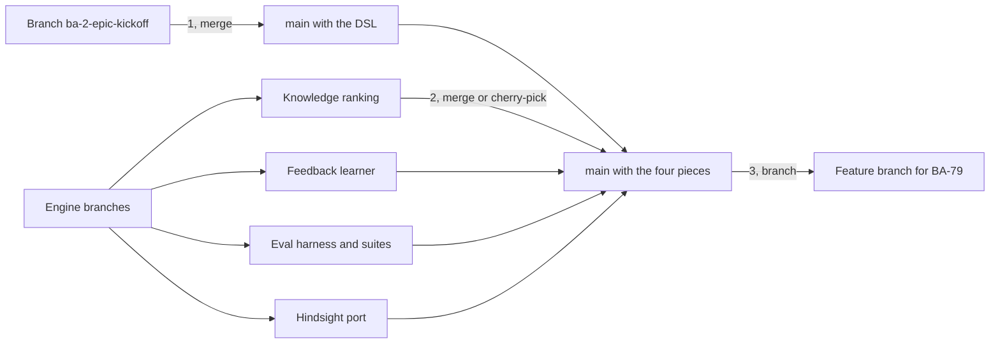
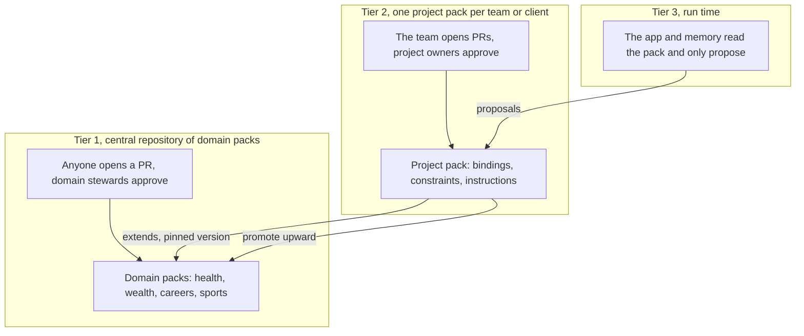
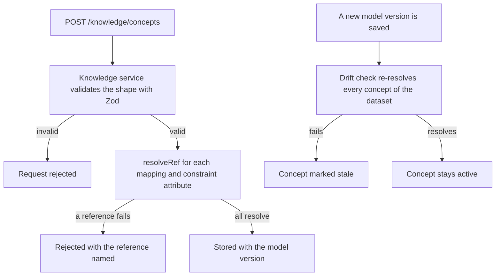
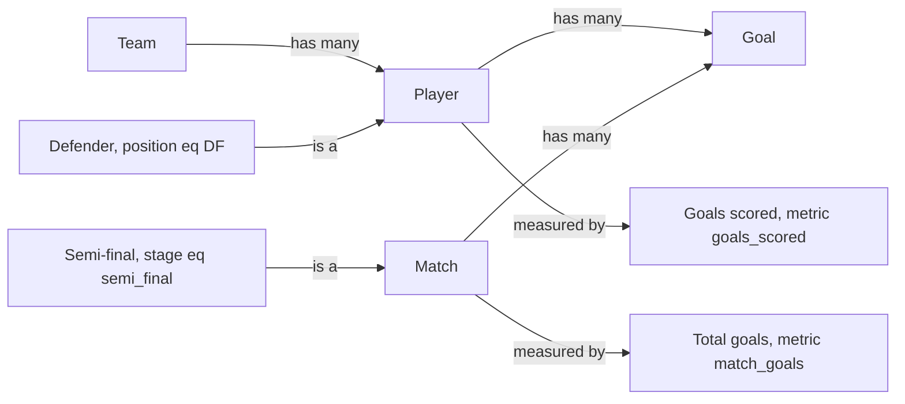
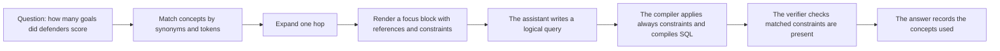
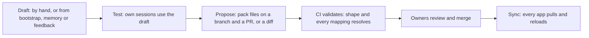

# BA-4 — Knowledge Store: execution plan (technical)

- **Jira:** [BA-124](https://halo-powered.atlassian.net/browse/BA-124) · **Epic:** [BA-4](https://halo-powered.atlassian.net/browse/BA-4) · **Roadmap:** feature 1.3.6 in [roadmap.md](../../roadmap.md) · **Epic spec:** [specs/epics/BA-4/spec.md](../../specs/epics/BA-4/spec.md) · **Status:** Draft, for team review · **Source:** [Knowledge Store Ontology](https://claude.ai/artifact/Q4DtSwSqv7yi8VBqjrn9BN), version 3, 2026-10-07 · **Baseline:** `main` at 3012e34 (v0.24.2), checked 2026-10-07 · **Companions:** [BA-4.md](BA-4.md) (functional plan), [../research/BA-4.md](../research/BA-4.md) (research)

## 1. Scope and how to use this file

This is the technical half of the BA-124 deliverable: for each step of the epic, the technical documentation the artifact gives (pack format, record shapes, validation schema, endpoints, flows, migration, agent prompt rules and output, matching and expansion, compiler and verifier changes, logging and provenance shapes, eval arms, the screen, conflict rules, feedback drafts, Gherkin). Goals, what a user can do, order and dependencies, the Part 4 story, the full have/need inventory and the open questions are in the functional plan, [BA-4.md](BA-4.md); the theory and the evidence are in the research, [../research/BA-4.md](../research/BA-4.md). Artifact content is kept verbatim; where this plan adds where something goes in this repository, the text is marked *placement (this plan)*.

The plan is written against `main` only. Anything on another branch counts as not shipped: section 3 lists it as a prerequisite with the decision still to make (merge, cherry-pick or rebuild) and says which step cannot start on `main` without it. No merge has been done and this document does not do one. The house conventions are in [CLAUDE.md](../../CLAUDE.md), *Code rules*: feature modules, `COLLECTIONS` and the doc-store tokens, `LEGACY_TABLE_NAMES` and `LEGACY_DOC_FIELDS` migrations, agent registration, and Gherkin plus the Playwright spec before code. Each step updates its specs before code: [data-model.md](../../specs/system/data-model.md), [api.md](../../specs/system/api.md), [agents.md](../../specs/system/agents.md), [ui.md](../../specs/system/ui.md), [knowledge/spec.md](../../specs/capabilities/knowledge/spec.md) (Rules and Gherkin Flows) and the Playwright spec under `frontend/e2e/` the Feature names. Section 9 holds status check notes: concrete things to grep for at each review.

## 2. Baseline on `main`, technically

Every path was verified on `main` at 3012e34.

| Area | On `main` today | Where in the code | What this plan changes |
|---|---|---|---|
| Snippets module and routes | Kinds `instruction`, `term`, `default_filter`; global or dataset scope (`scope.datasetId` is a dataset name); `synonyms`; `entities` as physical `catalog.schema.table` names; `enabled`; `source` `user` or `mined`. Six handlers: `GET /knowledge`, `POST /knowledge`, `PATCH /knowledge/:id`, `DELETE /knowledge/:id`, `POST /knowledge/bootstrap`, `POST /knowledge/bootstrap/stream`. Rules R1 to R28. | `backend/src/modules/knowledge/` (`knowledge.controller.ts`, `knowledge.service.ts`, `repositories/knowledge.repository.ts`, `entities/knowledge-snippet.entity.ts`, `dto/`); `frontend/src/app/features/knowledge/` (`components/knowledge-list`, `components/knowledge-form`, `models/knowledge.model.ts`, `services/knowledge-api.service.ts`), mounted from `frontend/src/app/app.html` | Step 1 adds concepts, relations and packs beside the snippets and migrates terms and filters (1d); instructions keep today's routes. Step 3 adds the Concepts view next to the list. |
| Knowledge block and `knowledgeUsed` | `contextFor(datasetIds)` builds one 2,000-character block (`KNOWLEDGE_BLOCK_CHARS = 2_000`), dataset-scoped first then newest first, sent as a system message; the snippets that fit travel on the request context key `knowledge-used` and are persisted on the answer as `knowledge` (`KnowledgeUse`: `id`, `kind`, `title`, `body`, `datasetId?`); the chat shows "Knowledge in context (n)". | `backend/src/modules/knowledge/knowledge.service.ts` (`contextFor`, `definitionBlock`); `backend/src/modules/sessions/sessions.service.ts` (`KNOWLEDGE_USED_CONTEXT_KEY`, `knowledgeUsed()`); `KnowledgeUse` in `backend/src/modules/knowledge/entities/knowledge-snippet.entity.ts` and `frontend/src/app/features/sessions/models/session.model.ts`; rendered in `frontend/src/app/features/sessions/components/session-chat/session-chat.html` | Step 2 replaces newest-first with a focus block matched to the question (2b), logs retrieval per turn and extends `KnowledgeUse` (2d). Step 3 renders the extended shape (3e). |
| Bootstrap agent | `knowledge-bootstrap` reads a schema snapshot and sample rows and returns up to 15 text drafts (`drafts: Draft[]`), one structured step, no tools; drafts saved disabled with `source: 'mined'`. | `backend/src/mastra/agents/knowledge-bootstrap.agent.ts` (`MAX_BOOTSTRAP_DRAFTS = 15`, `knowledgeDraftSchema`, `knowledgeBootstrapOutputSchema`); key `knowledge-bootstrap` in `backend/src/mastra/index.ts`; called from `KnowledgeService.bootstrap` | Step 1e: input becomes the rendered data model, output becomes concepts, constraints and relations, resolved before save. |
| `sql-verifier` and `sql-fixer` | Both work on SQL text (repair from the engine error; independent re-derivation in careful mode). | `backend/src/mastra/agents/sql-fixer.agent.ts`, `backend/src/mastra/agents/sql-verifier.agent.ts`; repair loop in `sessions.service.ts` | Untouched. Step 2c changes the logical-query compiler, `query-verifier` and `query-fixer`, which are not on `main` (section 3). |
| Evals and the Agents → Evals tab | 24 World Cup questions with expected substrings and a result-set check, no category labels; runs, reports and run-to-run regression; the knowledge block is computed once per run and always sent when snippets exist. | `backend/src/mastra/evals/assistant.evals.ts`, `run-assistant-evals.ts`, `result-set-check.ts`, `assistant-eval-datasets.ts`; `backend/src/modules/agents/eval-runs.service.ts` (calls `definitionBlock`), `eval-report.ts`, `eval-regression.ts` | Step 2e adds the lever `knowledge: off \| on`, two arms and a per-concept attribution column. The categorised 38-question suite and the harness with arms are not on `main`. |
| Verified queries | `VerifiedQueryDoc`: `question`, `sql`, `datasourceId?`, `entities: string[]` (physical names), `sourceSessionId`, `sourceMessageAt`; created on thumbs-up; retrieved by lexical similarity through a module-private `tokenize`; no HTTP surface. | `backend/src/modules/verified-queries/entities/verified-query.entity.ts`, `verified-queries.service.ts`, `repositories/verified-queries.repository.ts` | Step 1 adds an optional `concepts[]` (artifact 3.2, "Need (small)"); the pack carries `verified-queries.yaml`. |
| Collections and migrations | `COLLECTIONS` holds nine `{ token, table }` pairs, the last `{ token: KNOWLEDGE_STORE, table: 'knowledge_snippets' }`; tokens are `DOC_STORE_<name>`; renames go through `LEGACY_TABLE_NAMES` and `LEGACY_DOC_FIELDS` (raw SQL, `updatedAt` not restamped), covered by `database.module.spec.ts`. App data dir files: `app.sqlite`, `developer-settings.json`, `.app-secret`, `workspaces/`. | `backend/src/infrastructure/database/database.module.ts`, `backend/src/infrastructure/database/doc-store.ts` | Step 1a registers `knowledge_concepts` and `knowledge_relations`; 1d adds `knowledge-pack/` in the app data dir and `migratedTo` on snippets. |
| Encrypted settings storage | The LLM key is sealed with AES-256-GCM (`CryptoService.encrypt` / `decrypt`, key from `APP_SECRET` or `.app-secret`) and stored as `apiKeyCiphertext` in the `settings` document keyed `llm`. | `backend/src/infrastructure/crypto/crypto.service.ts`, `backend/src/modules/llm/llm.types.ts`, `backend/src/modules/llm/repositories/llm-settings.repository.ts` | The pack token (1c) and the GitHub token (section 7) are stored the same way. |

No source file on `main` mentions concept, ontology or Hindsight.

## 3. Prerequisites not on `main`

Code that exists only on a branch in this workspace on 2026-10-07. The decision column is open; it is made in Step 0.

| Piece | Branch | Symbols and files the plan relies on | Needed by | Decision |
|---|---|---|---|---|
| Data Model DSL (epic [BA-2](../../specs/epics/BA-2/spec.md), roadmap 1.2.1): one versioned model per dataset with entities, attributes with roles and sample values, relationships with cardinality, metrics with a predicate `where`; logical references (`goals`, `goals.goal_type`, `metric:goals_scored`, `rel:goals.scorer_player_id->players.id`); `resolveRef`, `listRefs`, the drift check on re-scan | `origin/ba-2-epic-kickoff` (5 ahead, 44 behind `main` on 2026-10-06) | `resolveRef`, `listRefs`, `parseRef`, `predicateSchema` (reused by a constraint), the model version number; the artifact names `backend/src/modules/data-models/dsl/references.ts` and `schema/data-model.schema.ts` on that branch (not verifiable on `main`) | Step 1 (1a, 1b, 1d, 1e), Step 2 | Merge, cherry-pick or rebuild. The artifact proposes a full merge first and expects conflicts in `changelog.md`, `retrospective.md` and the specs. |
| Logical query compiler for Postgres, Databricks SQL and SQLite (`query_entities`), `query-verifier`, `query-fixer` | `origin/ba-2-epic-kickoff` | The compiler's pre-compile pass, the verifier's structured error and the one-round fixer loop (2c) | Step 2c | Same decision as the DSL row; the compiler cannot be cherry-picked without the DSL. |
| Relevance ranking by token overlap with a kind prior and a default-filter floor, and `tokenize` (lowercase, split on non-letters, light plural stemming) | `feat/engine-eval-loop` (local, not on origin) | `backend/src/modules/knowledge/knowledge-ranking.ts` (branch path per the artifact); `tokenize`. On `main` a module-private `tokenize` exists in `backend/src/modules/verified-queries/verified-queries.service.ts` (no plural stemming, not exported). | Step 2b | Cherry-pick the helper, or extract `main`'s tokenizer into a shared helper and add plural stemming. The branch also adds a `column` field on snippets that the artifact marks "not needed, replaced by attribute mappings": leave it out. |
| The categorised 38-question World Cup suite and the harness running the production turn with named arms of engine levers | `feat/engine-eval-loop` (local) | `backend/src/mastra/evals/suites/world-cup.json` (branch path per the artifact); the arm mechanism the lever `knowledge: off \| on` plugs into | Step 2e | Cherry-pick, or build an equivalent on `main` from `assistant.evals.ts` and `eval-runs.service.ts`. 2e also needs BA-9 (roadmap 1.1.1, Planned). |
| Feedback learner agent (a reviewer's comment becomes a knowledge draft with provenance) | `feat/business-expert-learning` (local) | `backend/src/mastra/agents/feedback-learner.agent.ts`, ADR-0009 (branch names per the artifact) | Step 3d | Cherry-pick and change its output to concept edit drafts, or rebuild against the Step 1 shapes. |
| Hindsight memory: `LearningStore` port, lever `memory` off by default, retain only user signals, recall per question with a 2.5 s cut-off, three mental models (`known-pitfalls`, `table-guide`, `learned-glossary`), one bank per datasource, compose `hindsight` service, ADR-0013, knowledge rules R36 to R44 | `feat/hindsight-memory` (local) | `learned-glossary` and `known-pitfalls` as bootstrap input (1e, lever on only); observations with three or more facts as drafts (3d); the "Memory" badge (3e) | Step 1e (optional), Step 3d, 3e | Merge or cherry-pick. Two collisions to resolve: the branch's roadmap numbers its feature 1.3.6, which on `main` is BA-124; ADR-0013 sits above `main`'s next free number, 0007 (section 10). |

**What Step 1 cannot do on `main` without the DSL.** A concept's `binding.mappings` are logical references, and 1b rejects any reference `resolveRef` cannot find in the dataset's current model version. On `main` there is no model, no logical reference and no `resolveRef`, so the mapping target does not exist: the schema could be written and the collections registered, but nothing could be validated, loaded from a pack, migrated (1d looks entity names up among the model's bindings) or bootstrapped (1e resolves every reference before saving). The interim option is to bind concepts to physical `catalog.schema.table.column` names, as today's `entities` field does. This plan rejects it: the BA-2 decision record calls logical references "the Knowledge Store's mapping target", and the research's layer separation keeps layer 3 (meaning) free of table names, which belong to layer 2 (structure). Every concept bound physically would need a migration once the DSL lands. Step 1 therefore starts after the DSL merge of Step 0, and 2c after the compiler is on `main`.

The merge order the artifact proposes for Step 0 (no merge has been done):



Nothing in steps 1 to 3 can start on `main` before the first merge, because `resolveRef` and the compiler live on the DSL branch. Step 0 is done when the docs are merged, the epic spec is Confirmed and the DSL is on `main` with the E2E suite green. The steps, from the artifact's timeline figure:

| Step | Stories | Date | Depends on |
|---|---|---|---|
| Step 0, paperwork and merges | BA-123, BA-124, (BA-78) | this week | — |
| Step 1, model, storage, migration, bootstrap | BA-79 (1.3.2) | by October 16 | the DSL merged |
| Step 2, retrieval, enforcement, evals | BA-80 (1.3.3) | by October 16 | Step 1 and the eval harness |
| Step 3, curation screen, feedback, provenance | BA-81 (1.3.4) | by October 23 | Step 2 |

The central domain repository, the team memory server and learning from conversations come after the beta (section 8).

## 4. Where knowledge lives: packs

One rule shapes the whole execution: **business meaning is code**. It lives in a git repository, it changes only through a pull request that named people approve, a check validates it before anyone reviews it, and the app reads it but never writes it. This is how Looker, dbt, Cube and Snowflake treat their semantic layers, how Palantir reviews ontology changes (it calls them proposals), and how public ontologies such as FIBO are maintained. Sources are in the research's further reading.

Two levels of repository, because words and mappings have different owners:



Words are shared, mappings are local. A domain pack says what "Defender" means and how people say it; a project pack says which column holds it in this project. The app sits below both and only proposes. The domain pack holds concept words, synonyms, relations and rules; the project pack extends a pinned domain version and adds bindings to its own data model, constraints with real values, instructions and verified queries.

| | Domain pack (central) | Project pack |
|---|---|---|
| Holds | Concept names, descriptions, synonyms, relations (is-a, has-many, measured-by), rules in words, example questions | Mappings to this project's logical references, constraints with real values, instructions, verified queries, concepts only this project has |
| Knows about | The business domain | One project's datasets |
| Example | **Member**: synonyms insured, policyholder, beneficiary. Member has many Claims. **Active member** is a Member. | Client A: Member → `members`, Active member → `members.status = 'active'`. Client B: Member → `policy_holders`, Active member → `policy_holders.end_date IS NULL`. |
| Who approves | Domain stewards in CODEOWNERS | Project owners in CODEOWNERS |
| CI checks | Shape; no two concepts share a synonym; no mappings present | Shape; every mapping and constraint attribute resolves against the pack's own data model |
| When | After the beta; the format allows it from day one | Step 1 |

What a project pack looks like on disk. One pack can hold several datasets. The World Cup pack ships inside the app repository as the sample everyone can try; real projects get their own repository.

```text
halo-knowledge-world-cup/
  pack.yaml                        # name, datasets, extends: sports@0.1, app version it was validated with
  datasets/
    world-cup/
      model.yaml                   # the Data Model DSL (structure), exported by the app
      concepts.yaml                # concepts: words (may come from the domain pack) + this project's binding
      relations.yaml               # is_a, has_many (with via), measured_by
      instructions.yaml            # standing rules
      verified-queries.yaml        # approved question → SQL pairs
      memory.yaml                  # Hindsight seed: directives and the three mental-model questions
  CODEOWNERS                       # the few members who may approve
  .github/workflows/validate.yml   # runs: npx questions-to-insights knowledge validate .
```

One concept in `concepts.yaml`. The `words` part is what a domain pack can supply; the `binding` part always belongs to the project:

```yaml
# datasets/world-cup/concepts.yaml
- name: Defender
  words:
    from: sports@0.1                           # present when the words come from a domain pack
    description: A player whose registered position is defence.
    synonyms: [defenders, DF, back line, centre-back, full-back]
    is_a: Player
    examples: ["How many goals did defenders score?"]
  binding:
    mappings: [players, players.position]
    constraints:
      - { attr: players.position, op: eq, value: DF, apply: on_match }
  enabled: true

# the same concept in the central domain pack, halo-ontologies/sports/concepts.yaml: words only
- name: Defender
  description: A player whose registered position is defence.
  synonyms: [defenders, DF, back line, centre-back, full-back]
  is_a: Player
  examples: ["How many goals did defenders score?"]
```

How the app uses a pack:

- **Point.** In the project settings a person enters the pack's repository URL, branch and a read token, or a local folder path. The app pulls on start and on demand and shows the pack version it loaded.
- **Read.** The loader validates the files (the same check CI runs), resolves every mapping against `model.yaml`, and fills the concept store. Concepts that fail resolution load as `stale` and are not injected.
- **Propose.** Drafts from the bootstrap, from memory and from reviewer feedback stay on the person's machine. "Propose change" turns the selected drafts into a branch and a pull request (GitHub API, with the person's token) or, for someone without repository rights, into a YAML diff they can hand to an owner.
- **Never write.** Nothing in the app edits the merged pack. An accepted proposal reaches everyone on their next pull.

The desktop app stays single-user and keeps sessions local; the pack is what becomes shared. Memory is shared only once the Hindsight team server exists (later story).

*Placement (this plan):* the sample pack's path in the app repository is chosen in Step 1 (to be created) and recorded in data-model.md section 4, files on disk.

## 5. Step 1 — Ontology model, storage, migration and bootstrap (BA-79, roadmap 1.3.2)

**Goal.** Concepts and relations exist as records, every mapping is checked against the data model, today's snippets are migrated, and the bootstrap drafts an ontology for a dataset in one run. Blocked on `main` until the DSL merge (section 3).

### 1a. The records

The pack files of section 4 are the source of truth. Inside the app, the loader fills two collections in the document store, registered like every other one (`COLLECTIONS` in `database.module.ts`, a token in `doc-store.ts`); drafts and proposals live in the same collections with `origin: "draft"`. The concept Defender as loaded from the pack:

```json
// knowledge_concepts
{
  "id": "7c1e…",
  "name": "Defender",
  "scope": { "datasetId": "World Cup" },
  "words": {                                    // shareable: may come from a domain pack
    "from": "sports@0.1",                       // absent when the words are local to this project
    "description": "A player whose registered position is defence.",
    "synonyms": ["defenders", "DF", "back line", "centre-back", "full-back"],
    "examples": ["How many goals did defenders score?"]
  },
  "binding": {                                  // this project only
    "mappings": [
      { "ref": "players" },                     // the entity this word denotes
      { "ref": "players.position" }             // the attribute that decides membership
    ],
    "constraints": [
      { "attr": "players.position", "op": "eq", "value": "DF", "apply": "on_match" }
    ]
  },
  "origin": "pack",                             // pack | draft (bootstrap, feedback, memory, user)
  "pack": { "version": "v3", "commit": "a1b2c3d" },
  "enabled": true,
  "status": "active",                           // active | stale
  "modelVersion": 3,                            // the data model version the mappings were checked against
  "createdAt": "…", "updatedAt": "…"
}

// knowledge_relations
{ "id": "…", "datasetId": "World Cup", "from": "7c1e…", "type": "is_a",        "to": "<Player id>" }
{ "id": "…", "datasetId": "World Cup", "from": "<Player id>", "type": "has_many",    "to": "<Goal id>",         "via": "rel:goals.scorer_player_id->players.id" }
{ "id": "…", "datasetId": "World Cup", "from": "<Player id>", "type": "measured_by", "to": "<Goals scored id>" }
```

The validation schema, in outline. It reuses the data model's predicate schema so a constraint is exactly what a metric's `where` already is, plus one field:

```ts
// knowledge-concept.schema.ts (Zod, outline)
const constraintSchema = predicateSchema.and(z.object({ apply: z.enum(['on_match', 'always']) }));
const mappingSchema    = z.object({ ref: z.string().min(1) });           // checked by resolveRef on save
const wordsSchema      = z.strictObject({
  from: z.string().optional(),                                            // domain pack and version
  description: z.string().optional(), synonyms: z.array(z.string()).default([]),
  examples: z.array(z.string()).default([]),
});
const bindingSchema    = z.strictObject({
  mappings: z.array(mappingSchema).min(1), constraints: z.array(constraintSchema).default([]),
});
const conceptSchema    = z.strictObject({
  name: z.string().min(1), scope: scopeSchema, words: wordsSchema, binding: bindingSchema,
  origin: z.enum(['pack', 'draft']), pack: packRefSchema.optional(),
  enabled: z.boolean(), status: z.enum(['active', 'stale']), modelVersion: z.number().int(),
});
// the same schemas validate the YAML files: a domain pack file allows `words` only and rejects `binding`
const relationSchema   = z.strictObject({
  datasetId: z.string(), from: z.string(), to: z.string(),
  type: z.enum(['is_a', 'has_many', 'measured_by']),
  via: z.string().optional(),                                             // required when type = has_many
});
```

`predicateSchema` comes from the DSL branch's data model schema; `scopeSchema` and `packRefSchema` are not spelled out in the outline and are written next to it.

*Placement (this plan), verified paths:* `{ token: KNOWLEDGE_CONCEPTS_STORE, table: 'knowledge_concepts' }` and `{ token: KNOWLEDGE_RELATIONS_STORE, table: 'knowledge_relations' }` in `COLLECTIONS` (`backend/src/infrastructure/database/database.module.ts`; new collections, no `LEGACY_*` entry) with their tokens in `backend/src/infrastructure/database/doc-store.ts`; `backend/src/modules/knowledge/knowledge-concept.schema.ts` (to be created; `zod` 4.6.5 is already a dependency); entities and repositories for both records under the knowledge module (to be created; inject the tokens, never the db handle); an optional `concepts[]` on `VerifiedQueryDoc` in `backend/src/modules/verified-queries/entities/verified-query.entity.ts`. data-model.md section 3 gains the two collection rows (`scripts/check-specs.py` fails otherwise), the field tables above and the relation rules in 3.12.

### 1b. Loading a pack or saving a draft: validate, resolve, store

One check, run in three places: in CI on every pull request, in the app when it loads a pack, and in the app when a person saves a draft. The CLI command `npx questions-to-insights knowledge validate <folder>` wraps the same code.



A concept can only point at something that exists. The check runs in CI, on load, on draft, and again whenever the data model changes. The service calls the data models service's `resolveRef` against the dataset's current model version; the second flow is the drift check on a new model version.

*Placement (this plan):* the validator is one function over parsed files plus a model, with no Nest dependency, so the CLI can import it without starting the server. `backend/src/cli.ts` parses flags only today (`--port`, `--host`, `--data-dir`, `--no-open`, `--help`, `--version`, through `parseArgs`); `knowledge validate <folder>` is its first sub-command and exits before the app is imported (the app reads `APP_DATA_DIR` at import time). Loader, sync and validator sit in the knowledge module (for example `backend/src/modules/knowledge/pack/`, to be created). The CLI change goes into [delivery.md](../../specs/system/delivery.md) and api.md's CLI section.

### 1c. Endpoints

| Route | Does | Notes |
|---|---|---|
| `GET /knowledge/packs`, `PUT /knowledge/packs` | Show or set the project's pack: repository URL, branch, path or local folder, loaded version, last sync | Token stored encrypted like the LLM key |
| `POST /knowledge/packs/sync` | Pull the pack and reload it (1b) | Also runs on start; a failed pull keeps the last good version |
| `GET /knowledge/concepts?datasetId=&status=&origin=&enabled=` | List concepts (pack and drafts) with their relations | Same lenient filters as today's snippet list |
| `POST /knowledge/concepts`, `PATCH /knowledge/concepts/:id`, `DELETE /knowledge/concepts/:id` | Create, edit or discard a **draft** | Pack concepts are read-only; editing one creates a draft copy that overrides it locally until proposed |
| `POST /knowledge/relations`, `DELETE /knowledge/relations/:id` | Add or remove a draft relation | `via` resolved like a mapping |
| `POST /knowledge/concepts/bootstrap/stream` `{ datasetId }` | Draft concepts and relations for a dataset (server-sent progress) | Replaces today's snippet bootstrap for terms and filters |
| `POST /knowledge/proposals` `{ draftIds, title }` | Turn selected drafts into pack files on a branch and open a pull request | GitHub API with the person's token; returns the PR link |
| `POST /knowledge/proposals/export` `{ draftIds }` | The same change as a YAML diff to hand to an owner | For people without repository rights |
| `GET /knowledge/refs?datasetId=` | Every logical reference of the dataset's current model | Autocomplete in the editor; wraps `listRefs` |
| Today's `/knowledge` routes | Keep working for instructions, which also become a pack file | Terms and filters are read-only after migration |

*Placement (this plan):* the new literal segments do not collide with today's `PATCH /knowledge/:id` and `DELETE /knowledge/:id`; a controller per resource under `backend/src/modules/knowledge/` keeps `knowledge.controller.ts` readable. The pack token is sealed with `CryptoService.encrypt`, like `apiKeyCiphertext`. Every handler must appear in api.md section 2.8 as `METHOD /path` (the CI check greps for it). The proposals routes are this step's API; the "Propose" button is Step 3.

### 1d. Migrating today's snippets

A one-time migration runs at start-up, after the data model bootstrap, dataset by dataset. It writes the result as pack files into a local pack folder in the app's data directory (`knowledge-pack/`), and loads them from there, so an install with no repository yet keeps working exactly as before. When the project gets a repository, the owner pushes that folder as the first pull request. Every snippet keeps its row and gains a `migratedTo` field, so nothing is deleted and a re-run is harmless.

| Snippet kind | Becomes | How | Needs a reviewer when |
|---|---|---|---|
| `term` | A concept | Title and synonyms copied; each physical entity name is looked up among the data model bindings; found becomes a mapping, not found marks the concept stale | A table no entity binds |
| `default_filter` | A constraint with `apply: always` | The SQL predicate is parsed; simple shapes become predicates; anything else keeps the SQL text in an escape hatch and is marked stale | A filter the small parser cannot read |
| `instruction` | An instruction, unchanged | Gains concept links | Never |

Scope, enabled, source and dates are copied. Three paths, one per kind. Only two things can need a reviewer: a table no entity binds, and a filter the small parser cannot read.

The filter parser is deliberately small. It reads `col = 'x'`, `col <> 'x'`, `col > 10`, `col IN ('a','b')`, `col IS [NOT] NULL`, joined by `AND`, and nothing else. Example: today's snippet "Exclude test accounts: `account_type <> 'test'`" becomes `{ attr: "accounts.account_type", op: "ne", value: "test", apply: "always" }` on the concept Account, after confirming that exactly one entity in the dataset has an attribute `account_type`.

*Placement (this plan):* a one-time start-up step of the knowledge module, ordered after the DSL branch's data model bootstrap; `migratedTo` is an added optional field on `KnowledgeSnippet` in `entities/knowledge-snippet.entity.ts` (not a rename, so no `LEGACY_DOC_FIELDS` entry); `knowledge-pack/` joins `app.sqlite`, `developer-settings.json` and `.app-secret` in data-model.md's table of files in the app data dir; the migration gets a row in data-model.md's migrations table.

### 1e. The bootstrap agent, extended

Today's agent reads a schema snapshot and sample rows and returns up to 15 text snippets. The extended agent reads the rendered data model (entity names, attributes with roles and sample values, relationships, metrics), the enum-like sample values, and, when the memory lever is on, the `learned-glossary` and `known-pitfalls` mental models. It returns concepts, constraints and relations instead of text. Drafts arrive disabled, as today, in the person's local queue; they reach the pack only through a proposal.

```json
// bootstrap output (structured, no tools, one step), excerpt for the World Cup dataset
{
  "concepts": [
    { "name": "Defender", "synonyms": ["defenders", "DF"], "mappings": ["players", "players.position"],
      "constraints": [{ "attr": "players.position", "op": "eq", "value": "DF", "apply": "on_match" }],
      "isA": "Player", "examples": ["How many goals did defenders score?"] },
    { "name": "Semi-final", "synonyms": ["semi-finals", "semis"], "mappings": ["matches", "matches.stage"],
      "constraints": [{ "attr": "matches.stage", "op": "eq", "value": "semi_final", "apply": "on_match" }],
      "isA": "Match" },
    { "name": "Goals scored", "synonyms": ["goals", "scored"], "mappings": ["metric:goals_scored"],
      "measures": "Player", "description": "Count of goals excluding own goals." }
  ],
  "relations": [
    { "from": "Match", "type": "has_many", "to": "Goal", "via": "rel:goals.match_id->matches.id" }
  ]
}
```

Rules the prompt gives the agent, in plain words: one concept per entity, named in business English; one sub-concept per enum value that people are likely to call by another word (`DF` → Defender, `semi_final` → Semi-final), none for plain values; one concept per metric; a `has_many` relation per declared relationship; synonyms only for abbreviations and codes, never for ordinary column names; never invent a rule the data does not show. Every reference it outputs is resolved before the draft is saved; an unresolvable draft is dropped and counted in the progress event.

*Placement (this plan):* the change lands in `backend/src/mastra/agents/knowledge-bootstrap.agent.ts` (today `knowledgeBootstrapOutputSchema` is `{ drafts: Draft[] }`, `MAX_BOOTSTRAP_DRAFTS = 15`, one structured step, `toolChoice: 'none'`); the registry key `knowledge-bootstrap` in `backend/src/mastra/index.ts` stays, so the Agents catalogue and `GET /agents/:key` keep working; the model stays `async () => resolveAgentModel()`. The memory input exists only with the Hindsight branch; without it the agent reads the model and the sample values. The streamed run keeps the progress protocol of api.md section 3.4 and adds the dropped-draft count. agents.md section 2.5 is rewritten (input template, output schema, prompt, post-processing).

The target graph for the Done criterion, from the research's section 2.6 figure (solid nodes map to DSL entities, the dashed ones are subsets defined by a constraint, the metric nodes map to DSL metrics; a has-many edge names the DSL relationship it uses and defines no join of its own):



The World Cup ontology after bootstrap and review.

**Specs to update before code:** [data-model.md](../../specs/system/data-model.md) (two collections, `migratedTo`, `knowledge-pack/`, the migration row, `concepts[]` on verified queries), [api.md](../../specs/system/api.md) (section 2.8 routes, the concepts bootstrap stream, the CLI command, the route total), [agents.md](../../specs/system/agents.md) (section 2.5), [knowledge/spec.md](../../specs/capabilities/knowledge/spec.md) (rules for concepts, relations, packs and migration; a Gherkin Feature for the pack and bootstrap flows naming its Playwright spec), [delivery.md](../../specs/system/delivery.md) (the CLI sub-command), the ADR in [architecture.md](../../specs/system/architecture.md) if Step 0 has not written it.

**Done when** the World Cup dataset bootstraps into the graph shown in 2.6; the sample pack in the app repository validates with the CLI and loads on a fresh install; and `GET /knowledge/concepts?datasetId=World%20Cup` returns Defender with its words, binding, relations and pack version.

## 6. Step 2 — Retrieval, enforcement and evals (BA-80, roadmap 1.3.3)

**Goal.** Each question gets the concepts it needs, the engine applies their constraints, and the eval suite proves the gain. Needs Step 1; 2c needs the compiler and verifier on `main`; 2e needs the harness with arms or an equivalent on `main`, and BA-9.

### 2a. The run-time flow



For "How many goals did defenders score?": matching finds Defender, Goal and Goals scored; expansion adds Defender is-a Player, Player has-many Goal and Player measured-by Goals scored. The matched concepts guide the assistant and the compiler enforces what can be enforced. The last box is the provenance BA-81 and the trust signals (BA-12) display.

### 2b. Matching and expanding

Matching is cheap and deterministic. It runs once per question, before the model is called, inside the knowledge service:

```text
matchConcepts(question, concepts):
  tokens   = tokenize(question)                   // lowercase, split on non-letters, light plural stemming
                                                  // (the engine branch's tokenize, reused)
  for each enabled, active concept c in scope:
    score = 0
    if any synonym or the name of c appears as a phrase in the question:  score += 10   // "third-place play-off"
    score += 2 × (tokens shared with c.name + c.synonyms)
    score += 1 × (tokens shared with c.description + c.examples)
    if the session's previous tool call named an entity c maps to:        score += 3
  matched = concepts with score > 0, best first

expand(matched):
  for each c in matched:
    add its is_a parent
    add every concept it is measured_by
    add has_many neighbours that are also matched, or whose entity the question names
  always add every concept with a constraint apply: always   // today's default filters, never dropped
  cut to about 1,200 characters, best first
```

`tokenize` comes from the engine branch `feat/engine-eval-loop` (section 3); `main` only has the module-private tokenizer of the verified-queries service, without plural stemming.

For "How many goals did defenders score in 2022?": "defenders" matches Defender by synonym; "goals" matches Goal and Goals scored; expansion adds Player (parent of Defender) and the has_many path Player → Goal. The block the assistant receives:

```text
## Concepts in this question
- Defender (defenders, DF, back line): players where players.position = 'DF'. Is a Player.
- Goal: goals. Player has many Goal via rel:goals.scorer_player_id->players.id.
- Goals scored: metric:goals_scored (count of goals, own goals excluded). Measures Player.
## Apply to every query on this dataset
(none)
## Instructions
- Own goals are stored as goal_type = 'own_goal' and credited to the scoring team.
```

Embeddings are not in this step. The World Cup suite has paraphrase variants for every question; if the eval shows that synonym and word matching miss them, embeddings are the next lever, measured the same way.

*Placement (this plan):* `matchConcepts` and `expand` live in `backend/src/modules/knowledge/knowledge.service.ts`; `contextFor(datasetIds)` gains the question as input and returns the focus block; the call site in `sessions.service.ts` and the `knowledge-used` key stay. Rules R15 to R17 (newest-first, 2,000 characters) are replaced by matching, expansion and the 1,200-character cut; R20 stays, but the block becomes per question, not per run.

### 2c. Enforcing constraints in the engine

Two small additions to the layer-4 pieces that already exist on the DSL branch:

- **Compiler** (`query_entities`): before compiling, add every `apply: always` constraint whose attribute belongs to an entity in the query. The assistant does not have to remember them.
- **Verifier** (`query-verifier`): for every matched concept with an `on_match` constraint, check that the logical query contains an equivalent predicate. A miss is reported as a structured error and the fixer loop runs once with it.

```text
// the logical query the assistant wrote                 // after the compiler's constraint pass
{ "from": "goals",                                       { "from": "goals",
  "joins": [{ "via": "rel:goals.scorer_player_id->players.id" }],   "joins": [ …same… ],
  "select": [{ "metric": "goals_scored" }],                "select": [{ "metric": "goals_scored" }],
  "where": { "and": [                                      "where": { "and": [
    { "attr": "players.position", "op": "eq", "value": "DF" },   …same…,
    { "attr": "tournaments.tournament_year", "op": "eq", "value": 2022 }   // always-constraints of this dataset
  ]}}                                                        // would be appended here; none in World Cup
                                                           ]}}
// verifier: matched concept Defender has on_match constraint players.position = 'DF'
//           → present in where → pass. If absent → error "constraint of Defender missing" → fixer adds it.
```

Neither piece is on `main`; `sql-verifier` and `sql-fixer` work on SQL text and are not the agents this section changes. 2c cannot start before the compiler, `query-verifier` and `query-fixer` are on `main` (section 3).

### 2d. Logging and provenance

Every turn logs what retrieval did, and every answer records the concepts it used with the exact references, so the trust signals (BA-12) and the review screen (Step 3) can show them:

```json
// retrieval log (one line per turn, structured)
{ "turn": "…", "question": "How many goals did defenders score in 2022?",
  "matched": [{ "concept": "Defender", "score": 14 }, { "concept": "Goals scored", "score": 6 }, { "concept": "Goal", "score": 4 }],
  "expanded": ["Player"], "always": [], "blockChars": 412, "modelVersion": 3 }

// KnowledgeUse on the answer (extends today's shape)
{ "id": "7c1e…", "kind": "concept", "title": "Defender",
  "body": "players where players.position = 'DF'",
  "refs": ["players", "players.position"], "constraintApplied": true,
  "pack": "v3", "modelVersion": 3, "datasetId": "World Cup" }
```

`KnowledgeUse` extends today's shape (`id`, `kind`, `title`, `body`, `datasetId?`): `kind` gains `concept`, and the record gains `refs`, `constraintApplied`, `pack` and `modelVersion`. Instructions keep today's record.

*Placement (this plan):* the type changes in `backend/src/modules/knowledge/entities/knowledge-snippet.entity.ts` and `frontend/src/app/features/sessions/models/session.model.ts`, and in data-model.md section 3.9 and agents.md (Block 3, the `knowledge-used` key). The log line goes through the Nest logger from the knowledge service, so it reaches the system logs panel and, with developer observability on (ADR-0006), Loki.

### 2e. Proving it with the eval suite

The engine branch's harness runs the real chat turn for every question and applies a named "arm" of engine levers. Step 2 adds a lever `knowledge: off | on` and runs the World Cup suite twice. Today knowledge is always on when snippets exist, so the off arm is new.

| Category (questions) | Arm: knowledge off | Arm: knowledge on | Concepts attributed |
|---|---|---|---|
| value-vocabulary (3) | measured | measured | Defender, Semi-final, Third place |
| domain-semantics (4) | measured | measured | Goals scored, Penalty shootout, Extra-time goal, Draw |
| metric-definition (1) | measured | measured | Goals scored |
| control, multi-step-join, id-vs-name, ties, … (30) | measured | measured | must not get worse |

The report adds one column: for each passed question, which concepts were in its block. That is the "per-concept attribution" the roadmap asks for, and it tells a reviewer which concept earned its place.

Dependencies: the harness with named arms and the categorised suite are on `feat/engine-eval-loop` (section 3); on `main`, `eval-runs.service.ts` computes the block once per run through `definitionBlock` and `assistant.evals.ts` holds 24 uncategorised World Cup questions. Roadmap 1.1.1 (BA-9, Planned) is the suite the two arms run on; its acceptance already names "a knowledge on/off comparison" as needed by 1.3.3.

*Placement (this plan):* the lever gates the block in `backend/src/modules/agents/eval-runs.service.ts` (off: no block; on: the per-question focus block), the attribution column is added in `eval-report.ts`, and the arm name is stored on the eval run so `eval-regression.ts` compares like with like. The agents-evals capability spec and agents.md's harness section change with it.

**Specs to update before code:** [knowledge/spec.md](../../specs/capabilities/knowledge/spec.md) (R15 to R21 rewritten for matching, expansion, the focus block, the retrieval log and the extended provenance; the "An answer shows the knowledge it was given" scenario updated), [agents.md](../../specs/system/agents.md) (Block 3, `knowledge-used`, the compiler and verifier rules, the harness), [data-model.md](../../specs/system/data-model.md) (`KnowledgeUse`, the arm on eval runs), [api.md](../../specs/system/api.md) (if the eval-run start body gains the arm), the agents-evals and [sessions-chat](../../specs/capabilities/sessions-chat/spec.md) capability specs.

**Done when** the suite runs with both arms, the fourteen meaning-dependent questions improve, and no category gets worse.

## 7. Step 3 — Curation screen, feedback and provenance (BA-81, roadmap 1.3.4)

**Goal.** An analyst can see, fix and approve the ontology, drafts from memory and feedback arrive in one queue, and every answer shows the concepts it used. Needs Step 2; 3d and 3e need the feedback learner and Hindsight branches (section 3).

### 3a. Save becomes Propose

Because the pack is the source of truth, the screen never saves into it. A person drafts (by hand, or by accepting drafts from the bootstrap, from memory or from reviewer feedback), tests the drafts in their own sessions, and then proposes. The app turns the proposal into a branch and a pull request, or into a YAML diff for someone without repository rights. Owners review on GitHub; after the merge, every app picks the change up on its next pull.



The only way into the pack is a merged pull request. The app makes proposing a one-click action so the rule costs nobody time. Drafts are stored locally; after the sync the answer panel shows the new pack version.

### 3b. The screen

The existing Knowledge screen gains a **Concepts** view next to the snippet list. Gherkin and the Playwright spec are written first, as the house rule requires.

Figure: the wireframe of the Concepts view, as regions.

- **Left, the list:** the concepts of the selected dataset with a status chip (`active`, `stale`, `pending`) and a filter row (dataset, status, source).
- **Right, the editor** for the selected concept (Defender in the wireframe): name; description; synonyms as chips; mappings with an autocomplete of logical references (`GET /knowledge/refs`); constraints as attribute, operator, value rows with an apply toggle; relations in words ("is a Player", "measured by Goals scored"); example questions; an enabled toggle.
- **Bottom, the pending drafts queue:** bootstrap, memory and feedback drafts in one queue, each with **Accept** and **Reject**.
- **Actions:** "Add" puts a draft into the next proposal, "Reject" discards it, and "Propose" opens the pull request or exports the diff.

One list, one editor, one queue. Every source of a draft (bootstrap, memory, reviewer feedback) lands in the same queue.

*Placement (this plan):* new standalone components under `frontend/src/app/features/knowledge/components/` (for example `concept-list`, `concept-editor`, `drafts-queue`, to be created) next to `knowledge-list` and `knowledge-form`, mounted where `frontend/src/app/app.html` renders `<app-knowledge-list>`. The Playwright spec `frontend/e2e/knowledge-concepts.spec.ts` (to be created; named by the Gherkin in 3f) is written and run red before any component exists, with a local pack folder. ui.md section 4.8 and the copy tables gain the new entries.

### 3c. Conflict warnings

| Conflict | Example | What the screen does |
|---|---|---|
| One synonym on two concepts | "goals" on Goal and on Goals scored | Warns on save; the matcher prefers the concept with the higher score, and the warning names both |
| Two `always` constraints that cannot both hold | `stage = 'final'` and `stage = 'group'` | Blocks save until one is changed |
| A stale mapping | Draw → `matches.is_draw`, attribute not in model v4 | Chip "stale", concept not injected, fix with autocomplete |
| A constraint whose value is not in the sample values | `position = 'DEF'` | Warns, shows the sampled values (`GK, DF, MF, FW`) |

*Placement (this plan):* the checks run in the knowledge service on draft save (`POST` and `PATCH /knowledge/concepts`) and come back as warnings or a rejection the screen shows next to the field. The first rule is also the domain-pack CI check "no two concepts share a synonym" of section 4.

### 3d. Feedback and memory as drafts

The feedback learner today writes a snippet, enabled at once. In this step it emits a **concept edit draft** instead: a new synonym, a new constraint, or a new instruction linked to a concept, disabled. Memory observations with enough evidence (three or more facts) are pulled into the same queue through the bootstrap's memory input. Adding a draft to a proposal and merging that pull request is the one path into the pack.

```json
// a reviewer's comment on the "metric" block of an answer
"Penalty shoot-outs are not wins. A match decided on penalties is a draw."

// the feedback learner's output, as a draft (disabled)
{ "kind": "constraint", "concept": "Draw", "constraint": { "attr": "matches.is_draw", "op": "eq", "value": true, "apply": "on_match" },
  "provenance": { "sessionId": "…", "messageAt": "…", "block": "metric", "comment": "Penalty shoot-outs are not wins…" } }
```

Both sources are branch code (section 3). On `main` a thumbs-down removes the verified query and persists the rating; no draft is produced. The draft refers to `matches.is_draw`, the derived attribute of the open question in section 10.

### 3e. Provenance in the answer

"Knowledge in context" already lists the snippets an answer used. It gains the concept shape from Step 2 and reads as a short explanation a person can check:

```text
Knowledge in context (3)
  concept  Defender         players where players.position = 'DF'        applied ✓   pack v3 · model v3
  concept  Goals scored     metric:goals_scored, own goals excluded       used        pack v3 · model v3
  memory   observation      "an analyst approved this SQL for the 2018 top scorer"   not curated
```

*Placement (this plan):* rendered in `frontend/src/app/features/sessions/components/session-chat/session-chat.html` (today: kind label, title, dataset or "global", body); `applied` comes from `constraintApplied`, the versions from `pack` and `modelVersion` (2d); the `memory` row and "not curated" come from the Hindsight branch. ui.md's chat answer section and the sessions-chat spec describe the rows.

### 3f. Gherkin first

```gherkin
Feature: Knowledge concepts (E2E: knowledge-concepts.spec.ts; the pack is a local folder so no GitHub is needed)

  Scenario: An owner fixes a wrong answer through a proposal
    Given the project pack has the concept "Defender" with the constraint players.position = "DEF"
    And I ask "How many goals did defenders score?" and get 0
    When I open Knowledge, select "Defender", change the value to "DF" and click "Propose"
    Then a proposal with one changed file is written for the pack
    When the proposal is merged into the pack folder and I click "Sync"
    And I ask the same question in a new session
    Then the answer is a positive number
    And "Knowledge in context" lists "Defender" with "players.position = 'DF'" and the new pack version

  Scenario: A memory observation reaches the pack only through a proposal
    Given the drafts queue shows the synonym "máximo goleador" for "Top scorer"
    When I click "Add" and then "Propose"
    Then the proposal contains "máximo goleador" under "Top scorer"
    And until it is merged, a question using "máximo goleador" is answered from memory, badged "Memory"
```

The Feature goes into the Flows section of [knowledge/spec.md](../../specs/capabilities/knowledge/spec.md) next to "Knowledge snippets (E2E: none yet)"; `scripts/check-specs.py` requires every `frontend/e2e/*.spec.ts` to be named by exactly one Feature. The second scenario needs the Hindsight branch on `main`.

**GitHub authentication.** Opening a pull request from the desktop app needs a credential: a fine-grained personal token stored encrypted like the LLM key (`CryptoService`, a ciphertext field in the settings store), or a GitHub App installed on the organisation. The export path (`POST /knowledge/proposals/export`) needs neither, so the E2E and a person without repository rights work without any GitHub credential. Which of the two is used is open (section 10).

**Specs to update before code:** [ui.md](../../specs/system/ui.md) (section 4.8 Concepts view, the chat disclosure, copy and icons), [knowledge/spec.md](../../specs/capabilities/knowledge/spec.md) (rules for drafts, proposals, conflicts and the queue; the Feature above), [api.md](../../specs/system/api.md) (proposal and export responses as shipped), [agents.md](../../specs/system/agents.md) (the feedback learner and its draft output), [sessions-chat](../../specs/capabilities/sessions-chat/spec.md) (provenance rows), [data-model.md](../../specs/system/data-model.md) (the GitHub token field, the draft provenance shape).

**Done when** an analyst fixes a wrong answer by editing a concept and the next answer cites it.

## 8. Later, after the beta

Stories to create under BA-4 when the four steps are done. Three pieces of the long-term vision are deliberately not in steps 0 to 3. The format in Step 1 is designed so that none of them needs a migration.

| Later story | What it adds | Why not now | Depends on |
|---|---|---|---|
| **Central domain repository** | One repository (or one per domain) of domain packs: health, wealth, careers, sports. Anyone opens a PR, domain stewards approve, CI checks shape and duplicate synonyms. A project pack pins a version (`extends: health@1.4`); bumping it pulls new words in, and CI lists the concepts that still need a binding. A project can promote a generic concept upward by PR. | It needs two projects in the same domain to be worth anything. The beta has one sample dataset. | Step 1's words-versus-binding format |
| **Hindsight team server** | One memory server for the team instead of one per machine, so approvals and corrections in one person's sessions help everyone. Where it runs (team server or per machine) is the open decision recorded in ADR-0013. | Infrastructure and an LLM key per server; a decision for the operator. | The memory lever on the branch |
| **Learning from conversations** (what the meeting called TCL) | A lever value `memory: observe` that also retains ordinary turns: the question, the concepts and entities used, the final logical query, and what the person did next. A follow-up that builds on the answer counts as acceptance, the same question rephrased as failure, "no, I meant…" as a correction. Observations need more evidence than today (five turns, not three) before they become drafts, row values stay redacted, and the result is measured as an eval arm before it is on by default. | Implicit signals are noisy. Without a shared server it would learn only from one person. | The team server; the eval arm from Step 2 |

The research line behind "learning from conversations" is called test-time continual learning (a NeurIPS 2026 workshop carries that name). What John meant by TCL should be confirmed with him; if it is something else, this row changes.

## 9. Status check notes, technical

Artefacts to look for at each review, with their value on `main` at 3012e34 on 2026-10-07. Greps run from the repository root. Names marked *placement* are this plan's suggestions; the artifact's names (collections, routes, agent key, lever, CLI command, E2E spec) are the contract.

**Step 0**

- [ ] ADR "knowledge as code in packs" in `specs/system/architecture.md`: absent on main, 2026-10-07 (ADR-0001 to ADR-0006 present).
- [ ] `grep -rn "resolveRef\|listRefs" backend/src`: absent on main, 2026-10-07.
- [ ] `grep -rn "query_entities\|query-verifier\|query-fixer" backend/src`: absent on main, 2026-10-07.
- [ ] `backend/src/modules/data-models/`: absent on main, 2026-10-07.
- [ ] Pack template repository with CODEOWNERS and `.github/workflows/validate.yml`: absent (external repository).
- [ ] `docs/research/BA-4.md` and `docs/plans/BA-4.md`: absent on main, 2026-10-07.

**Step 1 (BA-79)**

- [ ] `knowledge_concepts` and `knowledge_relations` in `COLLECTIONS` (`backend/src/infrastructure/database/database.module.ts`): absent on main, 2026-10-07; `knowledge_snippets` present on main.
- [ ] Their tokens in `backend/src/infrastructure/database/doc-store.ts` (placement: `KNOWLEDGE_CONCEPTS_STORE`, `KNOWLEDGE_RELATIONS_STORE`): absent on main, 2026-10-07; `KNOWLEDGE_STORE` present on main.
- [ ] `backend/src/modules/knowledge/knowledge-concept.schema.ts` with `conceptSchema` and `relationSchema`: absent on main, 2026-10-07.
- [ ] Concept and relation repositories under `backend/src/modules/knowledge/repositories/`: absent on main, 2026-10-07; `knowledge.repository.ts` present on main.
- [ ] Routes `/knowledge/packs`, `/knowledge/packs/sync`, `/knowledge/concepts`, `/knowledge/concepts/:id`, `/knowledge/relations`, `/knowledge/relations/:id`, `/knowledge/concepts/bootstrap/stream`, `/knowledge/proposals`, `/knowledge/proposals/export`, `/knowledge/refs` (`grep -rn "@Get\|@Post\|@Put\|@Patch\|@Delete" backend/src/modules/knowledge/`), and the same routes in `specs/system/api.md` section 2.8: absent on main, 2026-10-07; the six snippet handlers present on main.
- [ ] `grep -rn "migratedTo" backend/src`: absent on main, 2026-10-07.
- [ ] `knowledge-pack/` in the app data dir and in `specs/system/data-model.md`: absent on main, 2026-10-07.
- [ ] CLI sub-command `knowledge validate` (`grep -n "validate" backend/src/cli.ts`): absent on main, 2026-10-07 (flags only).
- [ ] Bootstrap output with `concepts` and `relations` in `backend/src/mastra/agents/knowledge-bootstrap.agent.ts`: absent on main, 2026-10-07 (`drafts` present); key `knowledge-bootstrap` present on main in `backend/src/mastra/index.ts`.
- [ ] `concepts` on `VerifiedQueryDoc` (`backend/src/modules/verified-queries/entities/verified-query.entity.ts`): absent on main, 2026-10-07.
- [ ] The World Cup sample pack (`find . -name pack.yaml -not -path "*/node_modules/*"`): absent on main, 2026-10-07.
- [ ] A pack token ciphertext field (`grep -rn "Ciphertext" backend/src/modules`): only `apiKeyCiphertext` present on main, 2026-10-07.

**Step 2 (BA-80)**

- [ ] `grep -rn "matchConcepts" backend/src`: absent on main, 2026-10-07.
- [ ] A shared `tokenize` with plural stemming (`grep -rn "function tokenize" backend/src`): on main, 2026-10-07, only the module-private one in `verified-queries.service.ts`.
- [ ] The focus block header (`grep -rn "Concepts in this question" backend/src`): absent on main, 2026-10-07; the header `Curated dataset knowledge (user-authored` present on main in `knowledge.service.ts`.
- [ ] The 1,200-character cut in `knowledge.service.ts`: absent on main, 2026-10-07; `KNOWLEDGE_BLOCK_CHARS = 2_000` present on main.
- [ ] Retrieval log (`grep -rn "blockChars" backend/src`): absent on main, 2026-10-07.
- [ ] `KnowledgeUse` with `kind: 'concept'`, `refs`, `constraintApplied`, `pack`, `modelVersion` (`grep -rn "constraintApplied" backend/src frontend/src/app`): absent on main, 2026-10-07; the five-field shape present on main in both files.
- [ ] Compiler `apply: always` pass and the verifier error "constraint of <concept> missing" (`grep -rn "constraint of" backend/src`): absent on main, 2026-10-07.
- [ ] Eval lever `knowledge: off | on` (`grep -rn "lever\|arm" backend/src/modules/agents backend/src/mastra/evals`): absent on main, 2026-10-07; `eval-runs.service.ts` always calls `definitionBlock` on main.
- [ ] Report column with the concepts attributed per passed question (`grep -n "concept" backend/src/modules/agents/eval-report.ts`): absent on main, 2026-10-07.
- [ ] The categorised suite (`grep -rn "value-vocabulary\|domain-semantics" backend/src`): absent on main, 2026-10-07; 24 uncategorised World Cup questions in `assistant.evals.ts` on main.
- [ ] Roadmap 1.1.1 (BA-9) status in `roadmap.md`: `📋 Planned` on main, 2026-10-07.

**Step 3 (BA-81)**

- [ ] `frontend/e2e/knowledge-concepts.spec.ts`: absent on main, 2026-10-07 (specs on main: agents, chat-and-visuals, developer-observability, developer-settings, diagnostics, layout-accessibility, llm-settings, world-cup-workflow).
- [ ] `Feature: Knowledge concepts` in `specs/capabilities/knowledge/spec.md`: absent on main, 2026-10-07; `Feature: Knowledge snippets (E2E: none yet)` present on main.
- [ ] Concepts view components under `frontend/src/app/features/knowledge/components/`: absent on main, 2026-10-07; `knowledge-list` and `knowledge-form` present on main.
- [ ] Status chips `active`, `stale`, `pending`, the drafts queue and the Add and Propose actions (`grep -rn "Propose\|stale" frontend/src/app/features/knowledge`): absent on main, 2026-10-07; "Pending suggestions" with Accept and Reject present on main.
- [ ] The four conflict warnings in the knowledge service: absent on main, 2026-10-07.
- [ ] Feedback learner agent emitting concept edit drafts (`grep -rn "feedback-learner" backend/src`): absent on main, 2026-10-07 (agents on main: assistant, eval-judge, knowledge-bootstrap, sql-fixer, sql-verifier, visualization).
- [ ] Memory observations in the queue and the "Memory" badge (`grep -rni "hindsight\|LearningStore" backend/src`): absent on main, 2026-10-07.
- [ ] "Knowledge in context" rows with `applied`, `pack v<n>`, `model v<n>` in `session-chat.html`: absent on main, 2026-10-07; the disclosure itself present on main.
- [ ] A GitHub credential stored encrypted (`grep -rni "github" backend/src`): absent on main, 2026-10-07.

**Across steps**

- [ ] `python3 scripts/check-specs.py` green with every new route, collection, agent and E2E spec covered: the check is present on main.
- [ ] Evidence folders `evidence/1.3.2/`, `evidence/1.3.3/`, `evidence/1.3.4/`: absent on main, 2026-10-07.

## 10. Open technical questions

From the artifact's section 3.3, plus the ADR number.

- **Conditions between two attributes.** "Draw" is `home_goals = away_goals`. The predicate grammar compares an attribute to a value. Proposal: add a derived attribute `matches.is_draw` to the data model and map the concept to it, so the pack stays free of expressions. The feedback draft in 3d already assumes `matches.is_draw`.
- **Values without synonyms.** The data model already samples enum values. A value gets a concept only when people use another word for it.
- **Which GitHub organisation hosts the packs**, who the first project owners are, and later who the domain stewards are. CODEOWNERS can only name people who exist in that organisation.
- **How the desktop app authenticates to GitHub** when it opens a pull request: a fine-grained personal token stored encrypted like the LLM key, or a GitHub App installed on the organisation. The export-a-diff path works without either.
- **Where Hindsight runs in production.** The branch runs it in Docker for development. A team server or a per-machine install is a later decision (plan phase H5), and the memory lever stays off until it is made.
- **What John meant by TCL.** The "Later" table assumes test-time continual learning: learning from ordinary conversations without explicit feedback. Confirm before the story is written.
- **The ADR number.** `main` has ADR-0001 to ADR-0006 in [architecture.md](../../specs/system/architecture.md) (0006 is developer observability), so the next free number on `main` is 0007. The BA-2 branch already uses 0007 for its logical query layer, and the engine branches take 0008 to 0013 (ADR-0013 is the Hindsight decision). The number for this epic's ADR (knowledge as code in packs; the app reads and proposes, named people merge; logical references as the only mapping target; no graph database; memory proposes, never writes) is assigned when the ADR is written, once the Step 0 merge decision settles which branch numbers land on `main` first.
