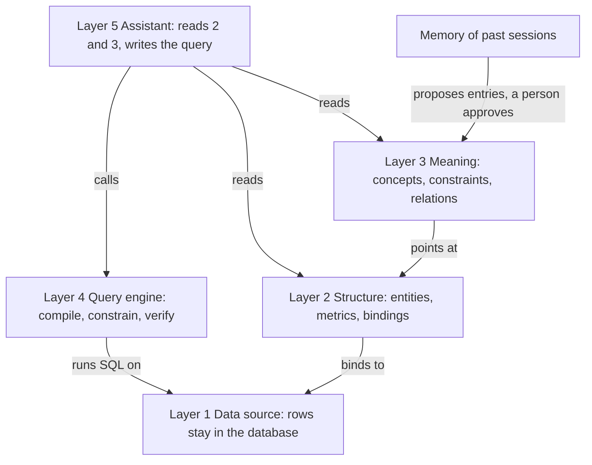
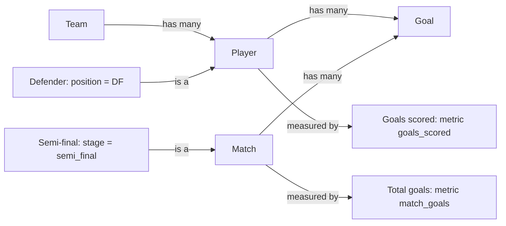
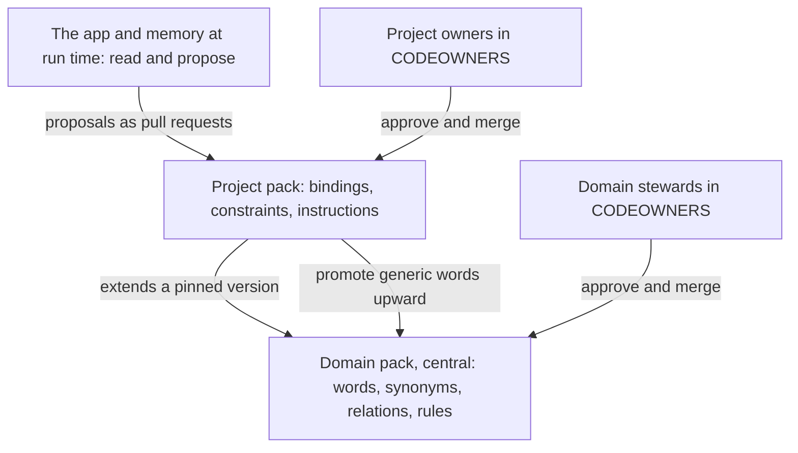
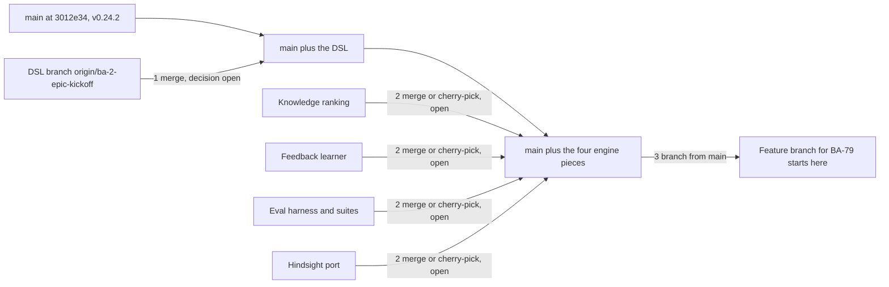

# BA-4 — Knowledge Store: execution plan (functional)

- **Jira:** [BA-124](https://halo-powered.atlassian.net/browse/BA-124) — Knowledge Store — Execution plan
- **Epic:** [BA-4](https://halo-powered.atlassian.net/browse/BA-4) — Knowledge Store
- **Roadmap:** feature 1.3.6, Milestone 1.3 in [roadmap.md](../../roadmap.md)
- **Epic spec:** [specs/epics/BA-4/spec.md](../../specs/epics/BA-4/spec.md)
- **Status:** Draft, for team review
- **Source:** the artifact [Knowledge Store Ontology](https://claude.ai/artifact/Q4DtSwSqv7yi8VBqjrn9BN), version 3, 2026-10-07
- **Baseline:** `main` at 3012e34 (v0.24.2), checked 2026-10-07
- **Companions:** [BA-4-technical.md](BA-4-technical.md) (data shapes, schemas, endpoints, flows, migration, agent rules, screens) · [../research/BA-4.md](../research/BA-4.md) (the research behind the plan)

## 1. How to read this plan, and how to check progress against it

This plan says what each step delivers, what a user can do after it, in what order, what it depends on, how to tell it is done, and what already exists. Technical detail (data shapes, schemas, endpoints, flows, migration, agent rules, screens) is in [BA-4-technical.md](BA-4-technical.md). The reasoning, the market comparison and the sources are in [../research/BA-4.md](../research/BA-4.md).

**The one rule.** This plan is written against what is on `main` only. Anything that exists only on another branch counts as not shipped. It is listed in section 3 as a prerequisite with a decision to make (merge, cherry-pick or rebuild), never assumed. The source artifact's Step 0 says "merge the DSL branch and the engine branches"; in this plan those merges are open decisions, recorded in Step 0, not actions taken. No merge was done while writing this plan.

**Baseline.** Every "status on main" statement below was checked on 2026-10-07 against `main` at commit 3012e34 (v0.24.2). The source artifact was written from v0.20.6 plus the branches it names; where the two differ, this plan follows `main`.

**Status check notes.** At each review, re-run these checks and compare the result with section 7:

| Check | Command or file | What it tells |
|---|---|---|
| Knowledge code on `main` | `git log --oneline main -- backend/src/modules/knowledge frontend/src/app/features/knowledge` | Whether anything landed since the baseline |
| Agents | `ls backend/src/mastra/agents` | Baseline: assistant, eval-judge, knowledge-bootstrap, sql-fixer, sql-verifier, visualization. A `query-verifier` or `query-fixer` means the DSL engine landed |
| Concept collections | `grep -rn -e knowledge_concepts -e knowledge_relations backend/src` | Baseline: no match. A match means Step 1 started |
| Logical references | `grep -rn "resolveRef" backend/src` | Baseline: no match. A match means the DSL branch is on `main` |
| Eval harness | `ls backend/src/mastra/evals` and the question count in `assistant.evals.ts` | Baseline: 24 World Cup questions, no category labels, no arms |
| ADRs | `grep -n "ADR-" specs/system/architecture.md` | Baseline: ADR-0001 to ADR-0006. The pack ADR of Step 0 takes the next free number |
| Branches | `git branch -a --list "*ba-2*" --list "*engine*" --list "*expert*" --list "*hindsight*"` | Which prerequisites still live only on a branch, and whether the local ones were pushed |
| Specs | [knowledge](../../specs/capabilities/knowledge/spec.md) (rules R1 to R28 and its "not built" list), [sessions-chat](../../specs/capabilities/sessions-chat/spec.md), [agents-evals](../../specs/capabilities/agents-evals/spec.md), [verified-queries](../../specs/capabilities/verified-queries/spec.md), [metrics](../../specs/capabilities/metrics/spec.md); [architecture](../../specs/system/architecture.md), [data-model](../../specs/system/data-model.md), [api](../../specs/system/api.md), [agents](../../specs/system/agents.md), [ui](../../specs/system/ui.md) | What `main` describes as shipped. Specs change on the same branch as the code, so `main` always describes the shipped app |

Then write the date and the result in the **Last check** column of the inventory table (section 7). The **On main at baseline** column stays as it was, so the drift since 2026-10-07 stays visible. When the team re-baselines the plan, update the Baseline line in the header and that column together, in one change.

## 2. The design in one page

### The five layers

The five layers. The ontology (layer 3) never names a table; it points at the structure (layer 2), which is the only layer that knows where the rows are. Memory sits beside layer 3 and proposes entries; a person approves them.

| Layer | In the app | On `main` at baseline | Gap for this epic |
|---|---|---|---|
| 5 · Assistant | The `assistant` agent; beside it, a relevance ranking, a feedback learner and Hindsight memory | Yes, the agent. The three pieces beside it: no, on branches (section 3) | Reads text snippets; cannot apply a concept |
| 4 · Query engine | Logical query compiler, `query-verifier`, `query-fixer` | No, on branch `origin/ba-2-epic-kickoff`. `main` has `sql-verifier` and `sql-fixer`, which work on SQL text | Not merged; applies no constraints yet |
| 3 · Meaning | Knowledge snippets: terms, default filters, instructions as text; one 2,000-character block, newest first | Yes | Missing mappings, constraints, relations, relevance |
| 2 · Structure | Data Model DSL: one versioned model per dataset, logical references, `resolveRef` | No, on branch `origin/ba-2-epic-kickoff` | Not merged |
| 1 · Data source | Connectors (PostgreSQL, Databricks, REST) and the World Cup sample database | Yes | None |

### What layer 3 gains

Layer 3 has to gain three things: a **link** from each word to the structure it means, a **condition** that says which rows the word selects, and **relations** between words. Everything else (scope, enabled flag, drafts, provenance) is kept.

- **Concept** (new). A business word. Name, description, synonyms, scope, one or more **mappings** (logical references into layer 2), zero or more **constraints**, example questions, source, enabled, and a status that turns `stale` when a mapping no longer resolves. A concept has two halves with different owners. The **words** (name, description, synonyms, relations, rules in words, example questions) describe a business domain and can be shared by every project in that domain. The **binding** (mappings and constraints with real values) belongs to one project, because only that project knows which column holds the word.
- **Relation** (new). A typed link between two concepts: `is_a`, `has_many`, `measured_by`. A `has_many` link names the layer-2 relationship it follows, so the join is never defined twice.
- **Constraint** (a field on a concept). A condition over layer-2 attributes, in the same predicate grammar the data model already uses for metrics. `apply: on_match` defines the word (Defender). `apply: always` is today's default filter.
- **Instruction** (kept). Today's instruction snippet, unchanged, with an optional list of the concepts it is about.

**The rule for what goes where.** If a change alters which rows a query returns without changing what any word means, it belongs to the data model. If it changes what a word means, it belongs to the Knowledge Store.

The World Cup ontology after bootstrap and review. Team, Player, Goal and Match map to DSL entities; Defender and Semi-final are subsets defined by a constraint; Goals scored and Total goals map to DSL metrics. The *has many* edges name the DSL relationship they use; they do not define a join of their own. This is the graph Step 1's "done when" refers to.

### Knowledge as code, in packs

One rule shapes the whole execution: **business meaning is code**. It lives in a git repository, it changes only through a pull request that named people approve, a check validates it before anyone reviews it, and the app reads it but never writes it. This is how Looker, dbt, Cube and Snowflake treat their semantic layers, how Palantir reviews ontology changes, and how public ontologies such as FIBO are maintained (sources in [../research/BA-4.md](../research/BA-4.md)).

Two levels of repository, because words and mappings have different owners:

Words are shared, mappings are local. A domain pack says what "Defender" means and how people say it; a project pack says which column holds it in this project. The app sits below both and only proposes.

| | Domain pack (central) | Project pack |
|---|---|---|
| Holds | Concept names, descriptions, synonyms, relations (is-a, has-many, measured-by), rules in words, example questions | Mappings to this project's logical references, constraints with real values, instructions, verified queries, concepts only this project has |
| Knows about | The business domain | One project's datasets |
| Example | **Member**: synonyms insured, policyholder, beneficiary. Member has many Claims. **Active member** is a Member. | Client A: Member → `members`, Active member → `members.status = 'active'`. Client B: Member → `policy_holders`, Active member → `policy_holders.end_date IS NULL`. |
| Who approves | Domain stewards in CODEOWNERS | Project owners in CODEOWNERS |
| CI checks | Shape; no two concepts share a synonym; no mappings present | Shape; every mapping and constraint attribute resolves against the pack's own data model |
| When | After the beta; the format allows it from day one | Step 1 |

A project pack is a folder with one file per kind of content per dataset: the data model (exported by the app), concepts, relations, instructions, verified queries and a memory seed, plus a CODEOWNERS file and the CI workflow that runs the validator on every pull request. The World Cup pack ships inside the app repository as the sample everyone can try; real projects get their own repository. The file layout and an example concept are in [BA-4-technical.md](BA-4-technical.md).

How the app uses a pack:

- **Point.** In the project settings a person enters the pack's repository URL, branch and a read token, or a local folder path. The app pulls on start and on demand and shows the pack version it loaded.
- **Read.** The loader validates the files (the same check CI runs), resolves every mapping against the data model, and fills the concept store. Concepts that fail resolution load as `stale` and are not injected.
- **Propose.** Drafts from the bootstrap, from memory and from reviewer feedback stay on the person's machine. "Propose change" turns the selected drafts into a branch and a pull request (with the person's token) or, for someone without repository rights, into a YAML diff they can hand to an owner.
- **Never write.** Nothing in the app edits the merged pack. An accepted proposal reaches everyone on their next pull.

The desktop app stays single-user and keeps sessions local; the pack is what becomes shared. Memory is shared only once the Hindsight team server exists (a later story).

### Memory proposes, never writes

Memory is not the ontology. It is text, it is per datasource, it names physical tables, and it is lower trust by design. What it is very good at is the thing an ontology cannot do for itself: **noticing**. People paraphrase, switch languages, approve and correct. Those signals are the raw material for new concepts, synonyms and constraints. The rule, kept from the memory branch: memory never writes to the Knowledge Store. Promotion stays a human action.

Figure: a loop. A person approves or corrects an answer. The signal goes to the Hindsight memory bank, which consolidates facts into observations and a learned glossary. Two outputs: recall straight into the next answer's context as low-trust memory items; and candidate concepts, synonyms and constraints proposed to the bootstrap as disabled drafts. A reviewer accepts a draft, it becomes a concept in the Knowledge Store, and the next answer uses it with provenance. The top path (recall) exists on branch `feat/hindsight-memory`, not on `main`. The bottom path (observations become drafts, a reviewer decides) is new work in Steps 1 and 3.

Three concrete ways the bottom path pays off, each tied to a case from the eval set:

- **Synonyms from paraphrases and other languages.** The memory branch's smoke test produced "máximo goleador" and "top scorer" for the same approved SQL. That pair is a synonym candidate for the concept Top scorer.
- **Corrections become constraint candidates.** The reviewer note "penalty shoot-outs count as draws" is exactly the constraint of the concept Draw. As a memory it helps only when recalled; as a constraint it is enforced on every query.
- **Pitfalls become instructions.** The `known-pitfalls` mental model collects things like "do not use `winner_team_id` to count wins". Those are instruction drafts, linked to the concept Match.

### Today and after this epic

What changes at run time, in one view. The full data model stays in the prompt; the concept block says where to look, and the engine enforces what can be enforced.

| | Today | After this epic |
|---|---|---|
| The block | The knowledge block lists the newest snippets that fit in 2,000 characters. | The block lists the concepts that match the question and their neighbours, ranked. |
| A word | "Defender" is a sentence. The assistant must find `players.position` and write `= 'DF'` on its own. | "Defender" carries `players.position = 'DF'` and the path to Goals. The engine applies it. |
| A standing filter | A default filter is a request in the prompt. Nothing checks that it was applied. | An `always` constraint is added by the compiler; a matched constraint is checked by the verifier, and the fixer repairs a miss. |
| Provenance | Provenance names the snippets that were in the block. | Provenance names the concepts and the exact references used: "Defender → players.position = DF (model v3)". |

## 3. Prerequisites that are not on `main`

Merging is not part of this document, and no merge was done while writing it. Each row is a decision for the team, recorded as open in Step 0. Branch names are as they existed in the workspace on 2026-10-07; the three `feat/` branches are local and not on origin.

| Piece | Built where | What the plan needs from it | Decision to make | Blocks |
|---|---|---|---|---|
| Data Model DSL: one versioned model per dataset, logical references, `resolveRef`, `listRefs`, drift check | `origin/ba-2-epic-kickoff` (epic [BA-2](../../specs/epics/BA-2/spec.md), roadmap 1.2.1). The artifact counted it 5 commits ahead and 44 behind `main` on 2026-10-06 | The mapping target: every concept mapping and constraint attribute is checked with `resolveRef`; the drift check marks concepts stale when the model changes; `listRefs` feeds the editor's autocomplete | Merge into `main` (expect conflicts in `changelog.md`, `retrospective.md` and the specs), or rebuild on `main` under BA-2 | Step 1 and everything after it |
| Logical query layer: compiler for three dialects, `query-verifier`, `query-fixer` | `origin/ba-2-epic-kickoff` | The compiler adds `always` constraints; the verifier checks that a matched concept's constraint is in the query; the fixer repairs a miss | The same decision as the row above; they land together | Step 2 |
| Relevance ranking by token overlap, kind prior, default-filter floor | local branch `feat/engine-eval-loop` | Its tokenizer and scoring, pointed at concepts; phrase matching for multi-word synonyms added | Merge, cherry-pick or rebuild (the matching rules are small; see [BA-4-technical.md](BA-4-technical.md)) | Step 2 |
| The 38-question categorised World Cup suite, and the harness that runs the production turn with named arms of engine levers | local branch `feat/engine-eval-loop` | The `knowledge: off / on` arm and the per-concept attribution column are added to it. `main` has a harness with 24 questions, no categories and no arms | Merge, cherry-pick or rebuild; and agree with [BA-9](../../specs/epics/BA-9/spec.md) (Milestone 1.1) who owns the suite | Step 2's "done when" |
| Feedback learner: a reviewer comment becomes a knowledge draft with provenance | local branch `feat/business-expert-learning` | It emits concept edit drafts (new synonym, new constraint, new instruction linked to a concept) instead of enabled snippets | Merge, cherry-pick or rebuild | Step 3 |
| Hindsight memory: `LearningStore` port, memory lever off by default, three mental models (`known-pitfalls`, `table-guide`, `learned-glossary`), ADR-0013 on that branch | local branch `feat/hindsight-memory` | The `learned-glossary` and `known-pitfalls` mental models feed the bootstrap as drafts; observations with enough evidence land in the pending queue; memory items are badged in the answer | Merge, cherry-pick or defer. Steps 1 to 3 work without memory, because the lever is off by default. Decide where the server runs before the lever is ever on | The memory input of Step 1 and the memory drafts of Step 3, both optional |
| Eval baseline: [BA-9](../../specs/epics/BA-9/spec.md) Golden Dataset and Evals (Milestone 1.1, feature 1.1.1) | Not a branch: an epic whose feature 1.1.1 has no stories yet | The knowledge on / off comparison with per-category results that Step 2's "done when" needs; 1.1.1's Acceptance names it | Split BA-9 into stories and sequence 1.1.1 before Step 2, or let Step 2 ship the arm on the existing harness and have BA-9 adopt it | Step 2's "done when" |

The order the artifact proposes for the merges, kept here as a proposal:

Nothing in steps 1 to 3 can start on `main` before the first merge, because `resolveRef` and the compiler live on the DSL branch.

## 4. The steps in order

| Step | Jira | Roadmap | Depends on | Proposed date in the artifact |
|---|---|---|---|---|
| 0 · Paperwork and merges | BA-123, BA-124, (BA-78) | 1.3.5, 1.3.6, (1.3.1) | — | This week (the week of 2026-10-07) |
| 1 · Ontology model, storage, migration and bootstrap | BA-79 | 1.3.2 | Step 0: the DSL on `main` | By October 16 |
| 2 · Retrieval, enforcement and evals | BA-80 | 1.3.3 | Step 1; the eval harness; BA-9 | By October 16 |
| 3 · Curation screen, feedback and provenance | BA-81 | 1.3.4 | Step 2 | By October 23 |
| Later · After the beta | Stories to create under BA-4 | — | Steps 1 to 3 done | After the beta |

**Dates.** The Jira timeline governs: Milestone 1.3 runs from September 30 to October 16 (the Release 1 table in [roadmap.md](../../roadmap.md)). The dates in the last column are the artifact's proposal. Step 3's proposed date falls one week after the Jira window ends; the team decides whether the story or the window moves. Each step depends on the one before it; Step 1 also depends on the Data Model DSL being on `main`. The central domain repository, the team memory server and learning from conversations come after the beta (see *Later*).

Figure: the artifact draws this table as a timeline of four steps with arrows for the dependencies (Step 1 needs the DSL merged; Step 2 needs Step 1 and the eval harness; Step 3 needs Step 2). The table above carries the same information.

### Step 0 · Paperwork and merges

**Goal.** Everything later steps depend on is on `main` and agreed in writing.

**What a user can do afterwards.** Nothing new in the app. The team can start Step 1 from `main` with the design agreed in writing and every prerequisite decided.

**What gets done — paperwork.**

- Land the research as [../research/BA-4.md](../research/BA-4.md) (BA-123) on its own branch, with the roadmap entry. Done on branch `docs/BA-123-knowledge-store-research` (PR #60).
- Write this plan and its technical companion (BA-124). Done by this file and [BA-4-technical.md](BA-4-technical.md).
- The remaining BA-124 deliverables, not done by this file:
  - The epic spec [specs/epics/BA-4/spec.md](../../specs/epics/BA-4/spec.md) set to `Status: Confirmed` by the user. At the baseline it is `Status: Draft` with confirmation waived on 2026-10-04 (the one-time exception in [CLAUDE.md](../../CLAUDE.md)); the roadmap's Acceptance for 1.3.6 asks for `Confirmed`.
  - The ADR "knowledge as code in packs": words shared by domain, bindings per project; the app reads and proposes, named people merge; logical references as the only mapping target; no graph database; memory proposes, never writes. It needs a fresh number: `main` uses ADR-0001 to ADR-0006, the BA-2 branch reuses 0006 and 0007, the engine branches take 0008 to 0013. The next free number on `main` is 0007, which the BA-2 branch already uses, so the number is assigned when the ADR is written, after the DSL decision below.
  - The roadmap feature texts of 1.3.2 to 1.3.4 aligned with this plan (section 6).
- The BA-78 decision. BA-78 (October 1) and BA-123 (October 6) ask for the same research; BA-124 asks for the plan that BA-78's "done when" also requires. The artifact proposes keeping BA-123 and BA-124 as the research/plan pair and either closing BA-78 as covered or keeping it only for the ADR. That Jira change is the team's decision.
- Create the pack template repository: the folder layout of the pack, a CODEOWNERS file, and the GitHub Actions workflow that runs the validator on every pull request. Agree with the epic owner which GitHub organisation hosts project packs.

**What gets done — merge decisions (open, not taken).**

- The DSL branch `origin/ba-2-epic-kickoff` into `main`: merge, or rebuild on `main`. It is 5 commits ahead and 44 behind, so expect conflicts in `changelog.md`, `retrospective.md` and the specs.
- The engine branches: merge them, or cherry-pick the ranking, the feedback learner, the eval harness and the Hindsight port. Step 2 reuses all four. They are local branches, so pushing them to origin is part of the decision.
- Record each decision here, in section 3, and in the matching roadmap feature, then re-run the status checks of section 1.

**Depends on.** Nothing.

**Done when** the docs are merged, the epic spec is Confirmed and the DSL is on `main` with the E2E suite green.

**Status on `main` at baseline.** Not started. The research document and this plan are not on `main`. The epic spec is Draft with confirmation waived. The ADRs stop at 0006. No pack template repository exists. The DSL branch is unmerged. The engine branches are local only.

### Step 1 · Ontology model, storage, migration and bootstrap (BA-79, 1.3.2)

**Goal.** Concepts and relations exist as records, every mapping is checked against the data model, today's snippets are migrated, and the bootstrap drafts an ontology for a dataset in one run.

**What a user can do afterwards.**

- Point the app at a project pack: a repository URL, branch and read token, or a local folder. The app pulls on start and on demand and shows the pack version it loaded. A failed pull keeps the last good version.
- Generate suggestions for a dataset and receive concepts, constraints and relations as drafts instead of text snippets. Drafts arrive disabled, as today, in the person's local queue; they reach the pack only through a proposal. For the World Cup dataset the drafts form the graph of section 2: one concept per entity (Player, Team, Match, Goal), one per value people are likely to call by another word (`DF` becomes Defender, `semi_final` becomes Semi-final), one per metric (Goals scored), and the relations between them.
- Keep using today's snippets. A one-time migration turns each term into a concept, each default filter into an `always` constraint, keeps each instruction (with links to the concepts it is about), and writes the result as pack files into a local pack folder in the app's data directory, so an install with no repository yet keeps working exactly as before. When the project gets a repository, the owner pushes that folder as the first pull request. No snippet is deleted; a re-run is harmless. Only two things can need a reviewer: a term naming a table no entity binds, and a filter the small parser cannot read. Both are marked stale.
- See a concept turn `stale` when the data model changes under it. A stale concept is not injected into any answer.
- Validate a pack folder from the command line with the same check CI and the app run.
- Read the ontology through the API: a dataset's concepts with their words, binding, relations and pack version; and every logical reference of the dataset's current model, for autocomplete.
- Turn selected drafts into a pull request, or into a YAML diff for someone without repository rights, through the API. The "Propose" button in the screen comes in Step 3.

Until Step 3 there is no screen for concepts. Drafts are reviewed through the API and the pack files; the existing Knowledge screen keeps editing instructions.

**What gets done.**

- Two new record types, concept and relation, stored like every other collection. The pack files are the source of truth; the loader fills the records, and drafts live in the same place marked as drafts. Pack concepts are read-only; editing one creates a draft copy that overrides it locally until proposed.
- One check, run in three places: in CI on every pull request, in the app when it loads a pack, and in the app when a person saves a draft. A concept can only point at something that exists in the data model. When a new model version is saved, every concept of that dataset is re-checked and the ones that fail are marked stale.
- Endpoints for packs (show, set, sync), concepts and relations (list; create, edit and discard drafts), the bootstrap stream, proposals (pull request or YAML export) and references (autocomplete). Today's `/knowledge` routes keep working for instructions, which also become a pack file; terms and filters are read-only after migration. Routes and shapes: [BA-4-technical.md](BA-4-technical.md).
- The migration of today's snippets, as described above. The filter parser is deliberately small: it reads simple comparisons, `IN`, `IS [NOT] NULL` and `AND`, and nothing else; anything else keeps the SQL text and is marked stale.
- The bootstrap agent, extended. It reads the rendered data model (entity names, attributes with roles and sample values, relationships, metrics), the enum-like sample values and, when the memory lever is on, the `learned-glossary` and `known-pitfalls` mental models. It returns concepts, constraints and relations instead of text. Its rules, in plain words: one concept per entity, named in business English; one sub-concept per enum value that people are likely to call by another word, none for plain values; one concept per metric; a `has_many` relation per declared relationship; synonyms only for abbreviations and codes, never for ordinary column names; never invent a rule the data does not show. Every reference it outputs is resolved before the draft is saved; an unresolvable draft is dropped and counted in the progress event.
- The World Cup sample pack inside the app repository, the pack validator as a CLI command, and the pack template repository from Step 0.
- Verified queries gain an optional link to the concepts a thumbs-up answer used (small).

Figure: the save flow. A request to create a concept arrives; the shape is validated; each mapping and each constraint attribute is checked against the dataset's current model version; if any reference does not resolve, the request is rejected with the reference named; otherwise the concept is stored with the model version. A second flow: when a new model version is saved, the drift check re-resolves every concept of that dataset and marks the ones that fail as stale. A concept can only point at something that exists; the check runs in CI, on load, on draft, and again whenever the data model changes.

Figure: the migration flow, by snippet kind. A term becomes a concept: title and synonyms copied; each physical entity name is looked up among the data model bindings; found becomes a mapping, not found marks the concept stale. A default filter becomes a constraint with `apply: always`: the SQL predicate is parsed; simple shapes become predicates; anything else keeps the SQL text in an escape hatch and is marked stale. An instruction stays an instruction and gains concept links. Scope, enabled, source and dates are copied.

**Depends on.** Step 0: the DSL on `main` (`resolveRef`, `listRefs`, the drift check and the predicate grammar). The pack template repository and the GitHub organisation decision, for the pull-request path; the local-folder path and the YAML export work without them. Optionally the Hindsight port, for the bootstrap's memory input.

**Done when** the World Cup dataset bootstraps into the graph shown in 2.6; the sample pack in the app repository validates with the CLI and loads on a fresh install; and `GET /knowledge/concepts?datasetId=World%20Cup` returns Defender with its words, binding, relations and pack version. (The graph of the artifact's 2.6 is the one in section 2 of this plan.)

**Status on `main` at baseline.**

- Have: knowledge snippets of kinds instruction, term and default_filter; global or dataset scope; synonyms; entities as physical table names; an enabled flag; source user or mined; create, edit, enable/disable and delete (`backend/src/modules/knowledge/`, `frontend/src/app/features/knowledge/`, rules R1 to R28 of the [knowledge spec](../../specs/capabilities/knowledge/spec.md)); the `knowledge-bootstrap` agent drafting up to 15 disabled snippets from a schema snapshot and sample rows; verified queries.
- Missing: concept and relation records and collections; mapping validation and stale marking; the snippet migration; the pack format, loader and sync; the CLI validator and the template repository; the proposals endpoints; verified queries linked to concepts; the extended bootstrap. The data model the mappings point at is on the BA-2 branch, not on `main`. No source file on `main` mentions concept, ontology or Hindsight.

### Step 2 · Retrieval, enforcement and evals (BA-80, 1.3.3)

**Goal.** Each question gets the concepts it needs, the engine applies their constraints, and the eval suite proves the gain.

**What a user can do afterwards.**

- Ask a question and have the assistant receive the concepts that match it and their neighbours one link away, ranked, instead of the newest snippets. For "How many goals did defenders score in 2022?": "defenders" matches Defender by synonym; "goals" matches Goal and Goals scored; expansion adds Player (the parent of Defender) and the path from Player to Goal. The block the assistant receives says what Defender is, where it lives and how it joins to goals. Default filters (`always` constraints) are never dropped from the block.
- Rely on a standing filter without the assistant remembering it: the compiler adds every `always` constraint whose attribute belongs to an entity in the query, before compiling.
- Get a wrong query caught: for every matched concept with an `on_match` constraint, the verifier checks that the logical query contains an equivalent condition. A miss is reported as a structured error and the fixer loop runs once with it.
- Have each answer record the concepts it used with the exact references, whether the constraint was applied, and the pack and model versions. Step 3 shows this in the answer panel; the trust signals of [BA-12](../../specs/epics/BA-12/spec.md) show it too.
- Run the World Cup suite with knowledge off and knowledge on from the Evals tab and read, per category, whether the meaning-dependent questions improved and whether any category got worse; and, for each passed question, which concepts were in its block. That is the per-concept attribution the roadmap asks for; it tells a reviewer which concept earned its place.

The questions this step must fix, six of the fourteen that depend on a business word, with the concept each needs:

- "How many goals did defenders score?" — Defender is a Player, constraint `players.position = 'DF'`; goals exclude own goals.
- "How many goals were scored in the 2022 semi-finals?" — Semi-final is a Match, constraint `matches.stage = 'semi_final'`; Match is measured by Total goals.
- "How many goals did Mario Mandzukic score at the 2018 World Cup?" — Goals scored maps to the metric that counts goals where `goal_type <> 'own_goal'`; Player is measured by Goals scored.
- "Which knockout matches went to a penalty shootout, and who advanced?" — Penalty shootout is a Match, constraint `matches.home_penalties` not null; Knockout match is a Match, constraint `matches.stage <> 'group'`.
- "How many goals were scored in extra time?" — Extra-time goal is a Goal, constraint `goals.minute > 90`.
- "How many matches did Argentina draw at the 2022 World Cup?" — Draw is a Match, constraint `home_goals = away_goals` (a comparison between two attributes: open question in section 8).

The other categories in the suite (joining ids to names, ratio traps, empty columns) are structural. They belong to layers 2 and 4, not to this epic.

**What gets done.**

- Matching and expansion, once per question, before the model is called, inside the knowledge service. Matching is cheap and deterministic: a concept scores when its name or a synonym appears as a phrase in the question, when it shares words with the question, when its description or examples share words with the question, and when the session's previous tool call named an entity it maps to. Expansion adds the `is_a` parent, every concept it is `measured_by`, and the `has_many` neighbours that are also matched or whose entity the question names; every `always` constraint is always added; the block is cut to about 1,200 characters, best first. Embeddings are not in this step: the World Cup suite has paraphrase variants for every question; if the eval shows that synonym and word matching miss them, embeddings are the next lever, measured the same way.
- A focus block replaces the snippet block, with three parts: the concepts in this question, the constraints that apply to every query on this dataset, and the instructions. The full data model stays in the prompt.
- Two small additions to the engine pieces from the DSL branch: the compiler's constraint pass and the verifier's constraint rule, with one fixer run on a miss.
- A retrieval log per turn (what matched, with scores; what was expanded; which `always` constraints applied; block size; model version) and an extended per-answer knowledge record. Shapes: [BA-4-technical.md](BA-4-technical.md).
- The eval lever `knowledge: off | on` and the report column with per-concept attribution. Today knowledge is always on when snippets exist, so the off arm is new. The suite is run twice:

| Category (questions) | Arm: knowledge off | Arm: knowledge on | Concepts attributed |
|---|---|---|---|
| value-vocabulary (3) | measured | measured | Defender, Semi-final, Third place |
| domain-semantics (4) | measured | measured | Goals scored, Penalty shootout, Extra-time goal, Draw |
| metric-definition (1) | measured | measured | Goals scored |
| control, multi-step-join, id-vs-name, ties, … (30) | measured | measured | must not get worse |

The categories are those of the 38-question suite on the engine branch; the 24 questions on `main` carry no category labels.

Figure: the run-time flow for "How many goals did defenders score?". Match concepts by synonyms and tokens (Defender, Goal, Goals scored); expand one hop (Defender is a Player, Player has many Goal, Player is measured by Goals scored); render a focus block with references and constraints; the assistant writes a logical query; the compiler applies `always` constraints and compiles SQL; the verifier checks that matched constraints are present; the answer records the concepts used. The matched concepts guide the assistant and the compiler enforces what can be enforced; the last step is the provenance that Step 3 and the trust signals of BA-12 display.

**Depends on.** Step 1. The compiler and verifier on `main` (the DSL decision of Step 0). The harness with arms and the categorised suite on `main` (the engine-branch decision of Step 0), or their rebuild. [BA-9](../../specs/epics/BA-9/spec.md) for the baseline that the comparison is read against.

**Done when** the suite runs with both arms, the fourteen meaning-dependent questions improve, and no category gets worse.

**Status on `main` at baseline.**

- Have: an eval harness (`backend/src/mastra/evals/`, eval runs and reports in `backend/src/modules/agents/`, the Agents → Evals tab) with 24 World Cup questions and no category labels; `sql-verifier` and `sql-fixer`, which work on SQL text; the per-turn block of 2,000 characters, dataset-scoped first then newest first; per-answer provenance "Knowledge in context" naming the snippets in the block.
- Missing: question-relevance retrieval (the knowledge spec lists it as not built; the ranking is on the local engine branch); the focus block; constraint enforcement (the compiler and the logical-query verifier and fixer are on the DSL branch); the retrieval log; the knowledge off / on arm; per-concept attribution; the 38-question categorised suite and the harness with arms (local engine branch).

### Step 3 · Curation screen, feedback and provenance (BA-81, 1.3.4)

**Goal.** An analyst can see, fix and approve the ontology, drafts from memory and feedback arrive in one queue, and every answer shows the concepts it used.

**What a user can do afterwards.**

- Open a **Concepts** view next to the snippet list on the Knowledge screen. On the left, a list of concepts with status chips (active, stale, pending) and a filter row (dataset, status, source). On the right, the selected concept: name, description, synonyms as chips, mappings with an autocomplete of logical references, constraints as attribute, operator, value rows with an apply toggle, relations listed as "is a Player" and "measured by Goals scored", example questions, and an enabled toggle. At the bottom, one pending drafts queue mixing bootstrap, memory and feedback drafts, with Accept and Reject.
- Fix a wrong answer. Edit the concept by hand, or accept a draft; test it in own sessions (the person's own sessions use the draft); then click **Propose**. The app turns the proposal into a branch and a pull request, or into a YAML diff for someone without repository rights. Owners review on GitHub; after the merge, **Sync** reloads the pack, and the next answer cites the fixed concept with the new pack version. The screen never saves into the pack: the only way into the pack is a merged pull request, and the app makes proposing a one-click action so the rule costs nobody time.
- Be warned about conflicts before they reach the pack:

| Conflict | Example | What the screen does |
|---|---|---|
| One synonym on two concepts | "goals" on Goal and on Goals scored | Warns on save; the matcher prefers the concept with the higher score, and the warning names both |
| Two `always` constraints that cannot both hold | `stage = 'final'` and `stage = 'group'` | Blocks save until one is changed |
| A stale mapping | Draw → `matches.is_draw`, attribute not in model v4 | Chip "stale", concept not injected, fix with autocomplete |
| A constraint whose value is not in the sample values | `position = 'DEF'` | Warns, shows the sampled values (`GK, DF, MF, FW`) |

- Give a thumbs-down with a comment and find a concept edit draft in the queue: a new synonym, a new constraint, or a new instruction linked to a concept, disabled, with provenance to the session, the message, the block commented on and the comment itself. Example: the comment "Penalty shoot-outs are not wins. A match decided on penalties is a draw." becomes a constraint draft on the concept Draw.
- Find memory observations with enough evidence (three or more facts) in the same queue. Until such a draft is merged, a question that uses the observed word is answered from memory and badged "Memory".
- Read "Knowledge in context" as a short explanation a person can check: per concept, what it resolved to, whether its constraint was applied or the concept was used, and the pack and model versions; memory items are listed as observations, marked not curated.

**What gets done.**

- Save becomes Propose. A person drafts (by hand, or by accepting drafts from the bootstrap, from memory or from reviewer feedback), tests the drafts in their own sessions, and then proposes. "Add" puts a draft into the next proposal, "Reject" discards it, and "Propose" opens the pull request.
- The Concepts view: one list, one editor, one queue. Gherkin and the Playwright spec are written first, as the house rule requires: a Feature "Knowledge concepts" with the scenarios "An owner fixes a wrong answer through a proposal" and "A memory observation reaches the pack only through a proposal". The E2E uses a local pack folder, so no GitHub is needed. The scenario text is in [BA-4-technical.md](BA-4-technical.md) and goes into the [knowledge spec](../../specs/capabilities/knowledge/spec.md) Flows before any code.
- The conflict warnings of the table above.
- Feedback and memory as drafts. The feedback learner today (on its branch) writes a snippet, enabled at once; in this step it emits a concept edit draft instead, disabled. Memory observations with enough evidence are pulled into the same queue through the bootstrap's memory input. Adding a draft to a proposal and merging that pull request is the one path into the pack.
- Provenance in the answer: "Knowledge in context" gains the concept shape from Step 2.

Figure: the propose flow, in six boxes. Draft: by hand or accepted from bootstrap, memory or feedback, stored locally. Test: the person's own sessions use the draft. Propose: the app writes pack files to a branch and opens a pull request, or exports a diff. CI validates: shape, and every mapping resolves. Owners review and merge. Sync: every app pulls and reloads; the answer panel shows the new pack version.

Figure: the wireframe of the Concepts view is the layout described under "What a user can do afterwards" (list with status chips and filters on the left, the editor on the right, the pending queue at the bottom). Screen detail: [BA-4-technical.md](BA-4-technical.md).

**Depends on.** Step 2. The proposals API from Step 1. The feedback learner and the Hindsight port on `main` (the engine-branch decision of Step 0); without memory, the queue holds bootstrap and feedback drafts only. [BA-12](../../specs/epics/BA-12/spec.md) (Milestone 1.4) for the trust signals that also display the provenance.

**Done when** an analyst fixes a wrong answer by editing a concept and the next answer cites it.

**Status on `main` at baseline.**

- Have: the Knowledge screen (snippet list; filters by kind and dataset; the Pending suggestions view with Accept and Reject; the new/edit panel; the Generate suggestions panel with live progress); "Knowledge in context" on each answer, listing the snippets in the block; answer feedback as a thumbs-up that saves a verified query and a thumbs-down that removes it, with no comment field.
- Missing: the concept editor, relations, stale and pending views, conflict warnings; Propose and Sync; a thumbs-down comment that becomes a draft (the feedback learner is on a local branch); memory drafts and the "Memory" badge (local branch); concept provenance with applied / used and versions.

### Later · After the beta

Stories to create under BA-4 when the four steps are done. Three pieces of the long-term vision are deliberately not in Steps 0 to 3. The format in Step 1 is designed so that none of them needs a migration.

| Later story | What it adds | Why not now | Depends on |
|---|---|---|---|
| **Central domain repository** | One repository (or one per domain) of domain packs: health, wealth, careers, sports. Anyone opens a PR, domain stewards approve, CI checks shape and duplicate synonyms. A project pack pins a version (`extends: health@1.4`); bumping it pulls new words in, and CI lists the concepts that still need a binding. A project can promote a generic concept upward by PR. | It needs two projects in the same domain to be worth anything. The beta has one sample dataset. | Step 1's words-versus-binding format |
| **Hindsight team server** | One memory server for the team instead of one per machine, so approvals and corrections in one person's sessions help everyone. Where it runs (team server or per machine) is the open decision recorded in ADR-0013 (on the memory branch). | Infrastructure and an LLM key per server; a decision for the operator. | The memory lever on the branch |
| **Learning from conversations** (what the meeting called TCL) | A lever value `memory: observe` that also retains ordinary turns: the question, the concepts and entities used, the final logical query, and what the person did next. A follow-up that builds on the answer counts as acceptance, the same question rephrased as failure, "no, I meant…" as a correction. Observations need more evidence than today (five turns, not three) before they become drafts, row values stay redacted, and the result is measured as an eval arm before it is on by default. | Implicit signals are noisy. Without a shared server it would learn only from one person. | The team server; the eval arm from Step 2 |

The research line behind "learning from conversations" is called test-time continual learning (a NeurIPS 2026 workshop carries that name). What John meant by TCL should be confirmed with him; if it is something else, this row changes.

## 5. How it should work after the epic

One project, from an empty database to answers everyone trusts. This is the whole thing in plain words, as a story with four people in it: two **project owners** (the people allowed to approve), an **analyst** who asks questions all day, and a **new colleague** who joins later and writes in Spanish. The dataset is the World Cup sample, so every step can be tried in the app.

| Moment | What happens | Pack version |
|---|---|---|
| Day 1 | An owner connects the database, the app drafts the model and concepts, two owners review and merge | v1 |
| Day 2 | The analyst points her app at the pack and gets correct answers with provenance | v1 |
| Day 3 | A question about the third-place play-off fails; a thumbs-down with a comment becomes a draft, a proposal, a pull request | v2 |
| Week 3 | Memory notices the word "semis" and proposes a synonym | v3 |
| Month 2 | A generic concept is promoted to the sports domain pack and a second project reuses it | sports pack bumped |

Five moments in the life of one project. Nothing about the data changes; only the meaning grows, one reviewed change at a time.

### 5.1 The story

**Day 1, morning. The first owner connects the database.** She adds the World Cup Postgres as a datasource and creates the dataset. The app reads the twelve tables and writes the data model on its own: entities, attributes with sample values, the relationships it finds in the foreign keys, and metrics. It then drafts the ontology: one concept per entity (Player, Team, Match, Goal), one per value people are likely to call by another word (`DF` becomes Defender, `semi_final` becomes Semi-final), one per metric (Goals scored), and the relations between them. Twenty-two drafts appear in her Pending queue, all switched off.

**Day 1, afternoon. Two owners review.** She reads the drafts. Most are right. She fixes two: the draft "Goals scored" does not exclude own goals, so she adds the condition; the draft "Draw" compares two columns, which the format cannot do, so she asks for a derived attribute in the data model instead. She clicks Propose. The app creates the project's pack repository from the template, puts the model and the twenty-two concepts in it, and opens the first pull request, "Initial ontology for World Cup". The check runs: every mapping resolves, no two concepts share a synonym. The second owner reads the diff, approves, merges. Pack version 1 exists. Nobody wrote YAML by hand.

**Day 2. The analyst starts asking.** She opens the app, enters the pack's address in the project settings, and sees "pack v1, model v1, 22 concepts". She asks: "How many goals did defenders score in the 2022 World Cup?" The app matches "defenders" to Defender, adds Player and Goals scored one link away, and writes the concept block. The assistant writes a logical query over `goals` joined to `players`; the compiler keeps the Defender condition and the metric's own-goal exclusion; the verifier confirms the condition is present. The answer is one number and one sentence, and under it "Knowledge in context" reads: *Defender → players.position = 'DF' (pack v1) · Goals scored → metric:goals_scored, own goals excluded*. She can see why the number is what it is.

**Day 3. A question fails, and the fix takes ten minutes.** She asks "Who won the third-place play-off in 2022?" No concept matches "third-place play-off". The assistant answers from the data model alone, picks `stage = 'third_place'` correctly this time, but the answer panel says "no concept matched", so she knows it was a guess. She gives it a thumbs-up and writes a comment: "third-place play-off is the stage third_place". The feedback learner turns the comment into a draft concept, Third place, with the right mapping and condition. She clicks Propose; the pull request has a one-file diff; the owner approves it from her phone. Pack version 2. From the next pull, everyone's app knows the word.

**Week 3. Memory notices what people say.** The team's memory server has been retaining approvals and corrections. Five different people have approved answers to questions that said "semis" where the pack says Semi-final. The observation "semis means the semi-final stage" reaches five pieces of evidence and shows up in the owner's Pending queue as a synonym draft. She proposes it with two other drafts in one pull request. Pack version 3. The new colleague, who writes in Spanish, asks "¿Cuántos goles hubo en las semis de 2022?" and gets the right answer, because the synonym is in the pack and the memory also recalled an approved Spanish answer from last week.

**Month 2. A word turns out to be generic.** A second project starts on a women's league dataset. Its owner notices that Knockout match, Defender, Goals scored and Draw mean the same thing there. The first owner opens a pull request upward, to the central sports domain pack, with the words of those concepts and none of the mappings. A domain steward approves. The second project's pack now says `extends: sports@0.2` and only has to add its own bindings: in that database, position is spelled out as `Defender` in a column called `role`. Same words, a different column, no duplicated work.

Week 3 and Month 2 use the Hindsight team server and the central domain repository, which are *Later* stories; Day 1 to Day 3 use only Steps 1 to 3.

### 5.2 Five situations and what happens

**1 · A wrong number because a word is missing**

- **Situation:** An analyst asks "How many goals were scored in the semi-finals of 2018?" before Semi-final exists as a concept. The assistant guesses `stage = 'semi'`, finds no rows, and answers 0.
- **What they do:** Thumbs-down with the comment "semi-finals are stage semi_final".
- **What the app does:** Drafts the concept Semi-final with mapping `matches.stage` and condition `eq semi_final`, checked against the model. She proposes; CI passes; an owner approves. The answer panel on the failed answer had already said "no concept matched", so nobody mistook the 0 for a fact.
- **Result:** Ten minutes from wrong answer to a merged fix that every team member gets.

**2 · The database changes under the ontology**

- **Situation:** The data team renames `matches.stage` to `matches.match_stage`. The app's next scan records the drift and a new model version.
- **What the app does:** Re-resolves every concept. Semi-final, Knockout match, Third place and Penalty shootout now point at an attribute that no longer exists. All four turn `stale`, stop being injected, and appear under the Stale filter with the dead reference named. Answers about stages fall back to the model alone and say so.
- **What they do:** An owner opens the four concepts, picks `matches.match_stage` from the autocomplete, and proposes one pull request. CI confirms every mapping resolves against the new model.
- **Result:** No silent wrong answers during the gap, and one reviewed change to recover.

**3 · A new colleague asks in another language**

- **Situation:** Someone asks "¿Quién fue el máximo goleador del Mundial 2018?" The pack has Top scorer with English synonyms only.
- **What the app does:** Memory recalls an approved answer to the English question from another session, so the answer is right and badged "Memory, not curated". Over the following weeks the observation "máximo goleador means top scorer" collects evidence and becomes a synonym draft.
- **What they do:** An owner accepts the draft into a proposal; it merges.
- **Result:** The Spanish word is now in the pack, matched by the concept matcher directly, with provenance, without waiting for memory.

**4 · Two clients, one domain**

- **Situation:** Two health-insurance projects both talk about "active members". Client A stores them as `members.status = 'active'`; Client B has no status column and uses `policy_holders.end_date IS NULL`.
- **What the packs do:** The health domain pack holds the words once: Member (insured, policyholder, beneficiary), Active member is a Member, Member has many Claims. Each project pack pins `health@1.4` and adds its own binding for Active member.
- **What they do:** When Client A's owner adds the synonym "enrollee", she proposes it upward to the domain pack, because it is a word, not a column. A domain steward approves. Client B gets it on the next version bump.
- **Result:** The vocabulary is written once and approved by the people who own the domain; the columns stay with the people who own the data.

**5 · A filter that applies to every query, and the one time it should not**

- **Situation:** A client's pack has the concept Account with the constraint `accounts.account_type ne 'test'`, `apply: always`. A user asks "How many accounts were created last month?"
- **What the app does:** The compiler adds the condition before compiling; the assistant did not have to remember it. The answer ends with "excludes test accounts, as configured", and "Knowledge in context" shows the constraint as applied.
- **The exception:** The user then asks "Include the test accounts this time: how many in total?" The assistant marks the constraint as explicitly lifted for this query; the verifier accepts the lift because the question asked for it; the answer says "test accounts included on request".
- **Result:** A standing rule nobody can forget, and a visible, deliberate way around it when the question asks.

## 6. Roadmap and Jira mapping

| Step | Roadmap feature | Jira story | What the roadmap feature's Acceptance says |
|---|---|---|---|
| 0 | 1.3.5 — Knowledge Store — Research | [BA-123](https://halo-powered.atlassian.net/browse/BA-123) | `docs/research/BA-4.md` exists and the user has reviewed it. |
| 0 | 1.3.6 — Knowledge Store — Execution plan | [BA-124](https://halo-powered.atlassian.net/browse/BA-124) | `docs/plans/BA-4.md` exists, the epic spec is `Status: Confirmed`, and every story of the epic has a feature in this milestone. |
| 0 | 1.3.1 — Research and ontology design | [BA-78](https://halo-powered.atlassian.net/browse/BA-78) | The decision record is merged in `docs/` (as an ADR in `specs/system/architecture.md`) and the model is agreed. |
| 1 | 1.3.2 — Ontology model, knowledge graph and bootstrap | [BA-79](https://halo-powered.atlassian.net/browse/BA-79) | A dataset can be bootstrapped into a reviewed ontology, and the graph returns a concept with its metric, mappings and example queries. |
| 2 | 1.3.3 — Ontology-grounded retrieval and SQL generation, measured by evals | [BA-80](https://halo-powered.atlassian.net/browse/BA-80) | A golden-dataset eval (1.1.1) runs with knowledge on and off, with per-concept attribution, and shows the accuracy difference with no category getting worse. |
| 3 | 1.3.4 — Curation UI, feedback learning and provenance | [BA-81](https://halo-powered.atlassian.net/browse/BA-81) | An analyst can fix a wrong answer by editing a concept, and the next answer cites it. |
| Later | No features yet; one per story once the stories are created | — | — |

The roadmap feature texts of 1.3.2 to 1.3.4 predate this plan (imported from Jira on 2026-10-01) and should be aligned when the plan is confirmed. The differences seen at the baseline:

- 1.3.2 says the migration uses "the `LEGACY_*` pattern in `database.module.ts`"; the plan migrates snippets into a local pack folder and keeps every snippet row with a `migratedTo` field, so nothing is deleted.
- 1.3.2 asks to "link metrics, verified queries and dataset relationships to concepts"; the plan covers this as `measured_by` relations, `has_many` relations that name the DSL relationship, and an optional concepts link on verified queries.
- 1.3.2's Notes say "depends on 1.3.1"; in the plan Step 1 depends on Step 0, which includes the BA-78 decision and the DSL being on `main`.
- 1.3.3 lists embeddings among the matching methods; the plan defers embeddings until the eval shows that synonym and word matching miss the paraphrase variants.
- 1.3.3 names `sql-verifier` and `sql-fixer`; the plan's checks run on the logical query, in the `query-verifier` and `query-fixer` of the DSL branch.
- 1.3.4 does not mention Propose, Sync, or the pack as the source of truth, which the plan adds.
- The *Later* stories (central domain repository, Hindsight team server, learning from conversations) have no roadmap features yet.

## 7. Inventory: have, need, done, not now

One row per capability the epic needs. **Artifact status** and **Where** are the artifact's words ("Have" means code exists; "Where" says whether it is on `main` or on a branch). **On main at baseline** is this plan's check of 2026-10-07. **Last check** is updated at each review (section 1).

| Capability | Artifact status | Where | On main at baseline | Still needed | Story | Last check |
|---|---|---|---|---|---|---|
| Snippet CRUD, scope, enable/disable, Knowledge screen | Complete | `main` | Yes | Nothing for now; becomes the instruction editor plus a concept editor in Step 3 | — | 2026-10-07: as stated |
| Bootstrap agent drafting snippets from schema and samples, disabled by default | Have | `main` | Yes | Extend the output schema to concepts, mappings, constraints and relations; read the rendered model instead of the raw snapshot | BA-79 | 2026-10-07: as stated |
| Per-answer provenance ("Knowledge in context") | Have | `main` | Yes | Record concept id, name and resolved references | BA-80 | 2026-10-07: as stated |
| Data Model DSL, logical references, `resolveRef`, `listRefs`, drift check | Have | `ba-2-epic-kickoff` | No, on branch `origin/ba-2-epic-kickoff` | Merge into `main` | Step 0 | 2026-10-07: as stated |
| Logical query layer, three-dialect compiler, `query-verifier`, `query-fixer` | Have | `ba-2-epic-kickoff` | No, on branch `origin/ba-2-epic-kickoff` | Merge; add the constraint injection and the constraint check | Step 0, BA-80 | 2026-10-07: as stated |
| Relevance ranking by token overlap, kind prior, default-filter floor | Have | `feat/engine-eval-loop` | No, on local branch `feat/engine-eval-loop` | Point it at concepts; add phrase matching for multi-word synonyms | BA-80 | 2026-10-07: as stated |
| Eval harness running the production turn, 38-question World Cup suite with categories | Have | `feat/engine-eval-loop` | No, on local branch `feat/engine-eval-loop`. `main` has a harness with 24 questions, no categories, no arms | Knowledge on/off arm (today knowledge is always on when snippets exist), per-concept attribution in the report | BA-80 (needs BA-9) | 2026-10-07: as stated |
| Feedback learner agent (thumbs-down comment to a knowledge draft) | Have | `feat/business-expert-learning` | No, on local branch `feat/business-expert-learning` | Emit concept edit drafts (new synonym, new constraint) instead of enabled snippets | BA-81 | 2026-10-07: as stated |
| Hindsight memory: retain user signals, recall per question, three mental models, memory lever off by default | Have | `feat/hindsight-memory` | No, on local branch `feat/hindsight-memory` | Feed `learned-glossary` and `known-pitfalls` into the bootstrap as drafts; show observations in the pending queue; decide where the server runs | BA-79, BA-81 | 2026-10-07: as stated |
| Concept and relation schemas and collections | Need | — | No, not built | New: schemas, collection entries, repositories, endpoints | BA-79 | 2026-10-07: as stated |
| Mapping validation and stale marking | Need | — | No, not built | New: call `resolveRef` on save; re-resolve in the drift check | BA-79 | 2026-10-07: as stated |
| Snippet migration (Step 1) | Need | — | No, not built | New: startup migration with a predicate parser for simple SQL shapes | BA-79 | 2026-10-07: as stated |
| Focus block replacing the snippet block | Need | — | No, not built | New renderer; retrieval log per turn | BA-80 | 2026-10-07: as stated |
| Constraint enforcement in compiler and verifier | Need | — | No, not built (the compiler and verifier themselves are on the DSL branch) | New: inject `apply: always`; verifier rule for matched constraints | BA-80 | 2026-10-07: as stated |
| Concept editor, relations, stale and pending views, conflict warnings | Need | — | No, not built | New UI; Gherkin and E2E first | BA-81 | 2026-10-07: as stated |
| Verified queries linked to concepts | Need (small) | — | No, not built (verified queries exist on `main`) | Optional `concepts[]` on a verified query; set when a thumbs-up answer used concepts | BA-79 | 2026-10-07: as stated |
| Knowledge pack: file format (words separate from binding), loader, sync from a repository or local folder, pack version in provenance | Need | — | No, not built | New: schemas for the YAML files, loader, pack endpoints and sync; the World Cup sample pack in the app repo | BA-79 | 2026-10-07: as stated |
| Pack validator as a CLI command, pack template repository with CODEOWNERS and the CI workflow | Need | — | No, not built | New: `knowledge validate` wrapping the same check the app runs; template repo agreed with the epic owner | Step 0, BA-79 | 2026-10-07: as stated |
| Propose change: drafts to a branch and pull request, or an exported YAML diff | Need | — | No, not built | New: proposals endpoints; GitHub token stored encrypted; "Propose" in the screen | BA-81 (API in BA-79) | 2026-10-07: as stated |
| Central repository of domain packs (health, wealth, careers, sports) with stewards and version pins | Not now | — | No, not built | After the beta; the words/binding split makes it a new repository, not a migration | later | 2026-10-07: as stated |
| Hindsight team server (shared memory for a team) | Need, later | — | No, not built | Operator decision recorded in ADR-0013 (on the memory branch); needed before learning from conversations | later (plan H5) | 2026-10-07: as stated |
| Learning from ordinary conversations (`memory: observe`, what the meeting called TCL) | Not now | — | No, not built | After the team server; measured as an eval arm first; confirm the term with John | later | 2026-10-07: as stated |
| Embedding-based concept matching | Not now | — | No, not built | Only if the eval shows synonym and token matching miss paraphrases | later | 2026-10-07: as stated |
| Graph database or SPARQL engine | Not needed | — | No, not built, not needed | One-hop expansion is a query on the relations collection | — | 2026-10-07: as stated |
| Datasource-level scope for concepts | Not now | — | No. The stored snippet shape may carry a datasource id, but it is not used for selection (knowledge spec R9) | Dataset scope covers the beta; keep the field as today | — | 2026-10-07: as stated |
| Import of Cortex Analyst YAML, Databricks metric views or Ossie files | Not now | — | No, not built | Interchange is a later milestone; the model shape keeps it possible | backlog | 2026-10-07: as stated |
| Relation types beyond is-a, has-many, measured-by | Not now | — | No, not built | `type` is a string; add when a failing case needs one | — | 2026-10-07: as stated |
| `column` field on snippets (engine branch) | Not needed | `feat/engine-eval-loop` | No, on local branch `feat/engine-eval-loop` | Replaced by attribute mappings | — | 2026-10-07: as stated |

The epic spec's open question, "which of BA-79 to BA-81 is genuinely new versus an extension of what exists", is answered by this table: the first three rows are extended, everything from "Concept and relation schemas" down is new.

## 8. Open questions and risks

### Open questions for the review

1. **Conditions between two attributes.** "Draw" is `home_goals = away_goals`. The predicate grammar compares an attribute to a value. Proposal: add a derived attribute `matches.is_draw` to the data model and map the concept to it, so the pack stays free of expressions.
2. **Values without synonyms.** The data model already samples enum values. A value gets a concept only when people use another word for it.
3. **Which GitHub organisation hosts the packs**, who the first project owners are, and later who the domain stewards are. CODEOWNERS can only name people who exist in that organisation. This is also the Step 0 decision for the pack template repository.
4. **How the desktop app authenticates to GitHub** when it opens a pull request: a fine-grained personal token stored encrypted like the LLM key, or a GitHub App installed on the organisation. The export-a-diff path works without either.
5. **Where Hindsight runs in production.** The branch runs it in Docker for development. A team server or a per-machine install is a later decision (plan phase H5), and the memory lever stays off until it is made.
6. **What John meant by TCL.** The *Later* table assumes test-time continual learning: learning from ordinary conversations without explicit feedback. Confirm before the story is written.
7. **The BA-78 overlap.** Close BA-78 as covered by BA-123 and BA-124, or keep it only for the ADR. Its roadmap feature 1.3.1 changes with it.
8. **The ADR number.** `main` ends at ADR-0006; the BA-2 branch already uses 0007 (and reuses 0006); the engine branches take 0008 to 0013. The pack ADR takes the next free number on `main` at the time it is written, after the DSL decision, so that two ADRs never share a number.
9. **The count of meaning-dependent questions.** Step 2's "done when" names fourteen questions that depend on a business word; the category table attributes concepts to eight of them (3 + 4 + 1). Confirm the count against the suite before the arm is read.

### Risks

- **The DSL is not on `main`.** Step 1 cannot start on `main` before it lands. The branch is 44 commits behind, so the merge has conflicts to resolve in `changelog.md`, `retrospective.md` and the specs, and the E2E suite has to be green afterwards (Step 0's "done when").
- **BA-9 has no stories**, so the knowledge on/off eval has no agreed baseline yet. Step 2's "done when" is measured on a suite that is itself only on a local branch; until BA-9 is split, the comparison is against whatever harness Step 2 lands.
- **The engine branches are local only** (`feat/engine-eval-loop`, `feat/business-expert-learning`, `feat/hindsight-memory` are not on origin). Until they are pushed, a lost machine loses the ranking, the categorised suite, the feedback learner and the Hindsight port.
- **Hindsight hosting is undecided.** The memory lever stays off, so everything in Steps 1 and 3 that depends on memory is optional, and Week 3 of the story in section 5 cannot happen before the team server exists.
- **Dates.** The Jira window for Milestone 1.3 ends on October 16; the artifact proposes Step 3 by October 23. The team decides whether the story or the window moves.
- **Feature number 1.3.6 is used twice.** The branch `feat/hindsight-memory` numbers its memory feature 1.3.6 and keeps its evidence under `evidence/1.3.6/`; PR #59 gave 1.3.6 to BA-124, this plan. Whichever merges second renumbers its feature and its evidence folder.
