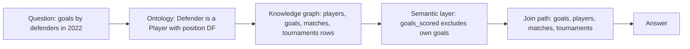
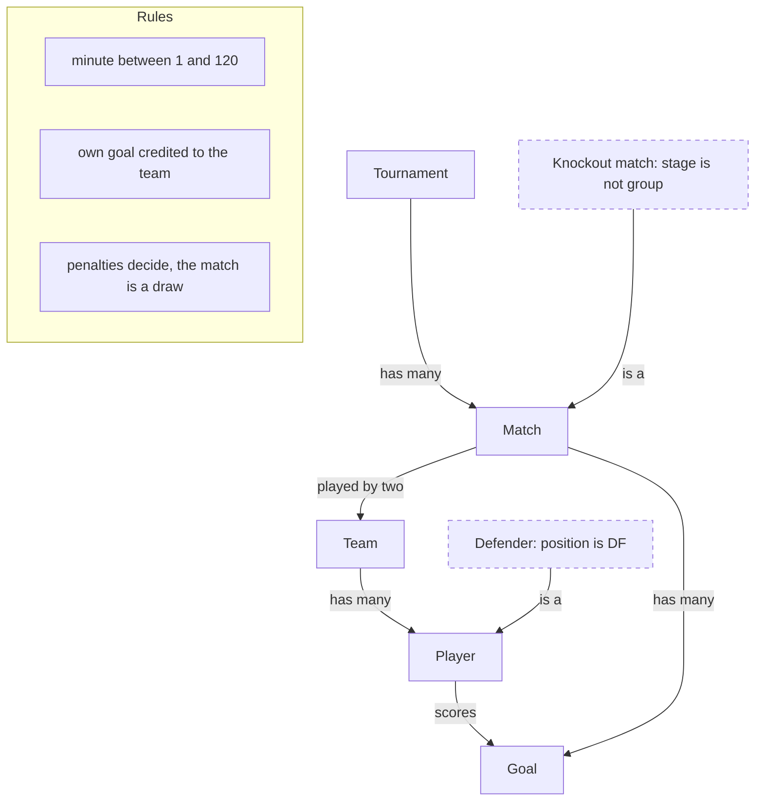
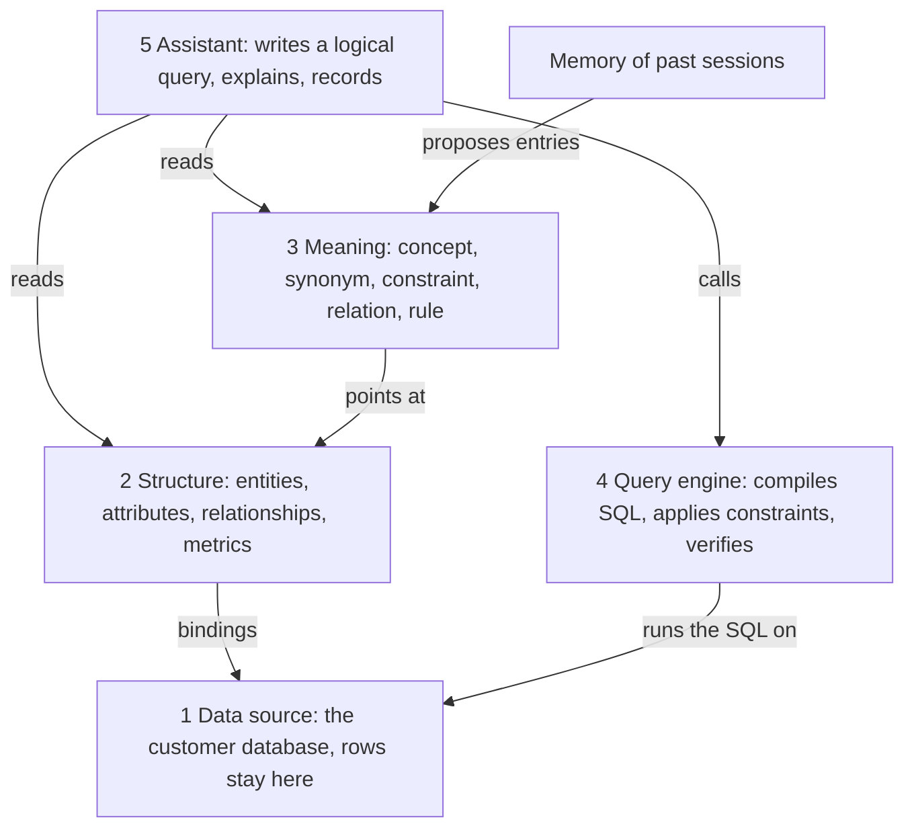
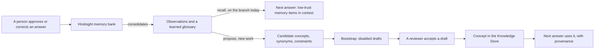
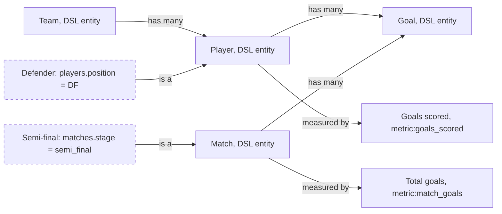

# BA-4 — Knowledge Store: research

- **Jira:** [BA-123](https://halo-powered.atlassian.net/browse/BA-123) (research story) · serves the decision record asked by [BA-78](https://halo-powered.atlassian.net/browse/BA-78) · **Epic:** [BA-4](https://halo-powered.atlassian.net/browse/BA-4) · **Roadmap:** feature 1.3.5 in [roadmap.md](../../roadmap.md) · **Epic spec:** [specs/epics/BA-4/spec.md](../../specs/epics/BA-4/spec.md)
- **Status:** Draft, for team review
- **Source:** converted from the artifact [Knowledge Store Ontology](https://claude.ai/artifact/Q4DtSwSqv7yi8VBqjrn9BN), version 3 of 2026-10-07. Every external link in it was opened on 2026-10-06 or 2026-10-07 as stated in its sources section.
- **Repository baseline:** `main` at commit 3012e34 (v0.24.2, 2026-10-07) plus the branches named in section 3. The artifact said v0.20.6; the releases since then (developer observability, BA-111; the app-secret fix, BA-106) do not touch the knowledge store, so the inventory in section 3 was re-checked against main on 2026-10-07 and still holds.
- **Companion documents:** the execution plan `docs/plans/BA-4.md` and its technical companion `docs/plans/BA-4-technical.md` (story [BA-124](https://halo-powered.atlassian.net/browse/BA-124)).
- **About BA-78:** BA-78 (1 Oct) and BA-123 (6 Oct) ask for the same research, and BA-124 asks for the plan that BA-78's "done when" also requires. This file is the research for BA-123 and the decision record for BA-78. Closing BA-78 as covered, or keeping it only for the ADR, is a Jira decision for the team.

**What this file covers.** Section 2 is the theory and the market: what an ontology, a knowledge graph and a semantic layer are, and how Snowflake, Databricks, dbt, Cube, Looker, Palantir and the research line build them today. No code. One example, the World Cup dataset, runs through every section. Section 3 applies it to this application: which layers already exist and where they live, where the eval questions fail, the design that closes the gap, and how memory (Hindsight) feeds it. Sections 4 and 5 hold further reading and every source used. Section 6, the appendix, holds the detailed vendor comparison and the measured evidence. The execution plan and the plain-words story of how the app should work afterwards are in the companion documents (section 7).

## 1. Summary: findings, options and recommendation

### Findings

- A database stores facts, not what they mean. Fourteen of the thirty-eight questions in the World Cup eval suite fail because the question uses a business word whose meaning is not in the schema (section 3.4).
- Four of the five layers exist in the app, on `main` or on a branch. Layer 3, meaning, is still a glossary: a term is text only, with nothing linking "Defender" to `players.position` or `DF`, and snippets are picked by date, not by the question (section 3.3).
- Meaning first. Telling the model what words mean and which values they select is the largest single gain (BIRD +20 points; a 4 KB definitions document +17 to +23 points).
- Complex schemas are where raw SQL collapses. In the insurance benchmark, zero-shot SQL scored 0% on every question that needed more than four normalised tables. The World Cup schema has twelve tables.
- Check the query, do not only guide it. Using the ontology to validate the query and repair it moved the same benchmark from 54.2% to 72.6%.
- Synonyms are a measured failure and a measured fix (−21 points when words are swapped; +14 back with synonym annotations).
- Example queries keep working (+10 points on Spider with five similar examples; from about 3% to about 80% starting from a bare schema in Vanna's experiment).
- The same six patterns appear in all seven systems compared: a business name with an expression and a description per field; joins with explicit or inferred cardinality; named, reusable filters with synonyms; free-text standing rules used sparingly; verified example queries retrieved by similarity; drafts from metadata and usage that a person accepts. That convergence is the strongest argument for the design in section 3.6.

### Options considered

| Option | What it is | Verdict | Why |
|---|---|---|---|
| (a) Keep text snippets and improve selection only | Today's term, default filter and instruction snippets, with the engine branch's relevance ranking in place of newest-first selection | Not enough | A term stays text: nothing links "Defender" to `players.position` or to the value `DF`, so the assistant still has to find the column and write the filter itself, and nothing checks that a default filter was applied (sections 3.3 and 3.6). |
| (b) Concepts bound to logical references of the Data Model DSL, with constraints and typed relations, kept as "knowledge as code" packs in git | Each business word carries mappings into layer 2, a condition in the predicate grammar the data model already uses, and `is_a`, `has_many` and `measured_by` relations. Words are shared by domain, bindings belong to one project, and the pack changes only by pull request | Recommended | Closes both gaps of the glossary. Every mapping is checked by `resolveRef`; the compiler and the verifier can enforce constraints; it is the same six patterns every system in the comparison converged on (section 3.6, appendix). |
| (c) Copy rows into node and edge tables, with a graph database or SPARQL engine | The Snowflake article's design: a node table, an edge table, generated views | Not needed | Users' data lives in their own databases and the data model already describes every join path. What is stored as a graph is the vocabulary: tens of nodes per dataset, changed only when a reviewer approves an edit. One-hop expansion is a query on the relations collection (section 2.2 callout; the have / need table in `docs/plans/BA-4.md` lists the graph database as not needed). |
| (d) Embedding-based concept matching now | Match questions to concepts by vector similarity instead of synonyms and word overlap | Later, only if evals show a miss | The World Cup suite has paraphrase variants for every question. If the eval shows that synonym and word matching miss them, embeddings are the next lever, measured the same way. |
| (e) Memory system: Hindsight, chosen on the branch, against Mem0, Zep/Graphiti and Letta | A memory server that retains user signals (approvals, corrections, reviewer comments) and recalls them per question, as the input side of the ontology | Hindsight | Evidence-backed consolidated observations on plain Postgres. Mem0's open-source edition dropped graph memory in 2026; Zep/Graphiti has typed entities and edges, closer to a formal ontology, but needs a graph database; Letta has no graph. If typed relations ever need to be learned automatically, Graphiti is the one to look at (section 3.5). |
| (f) Learning from ordinary conversations (what the meeting called TCL) | Retain ordinary turns, not only explicit approvals and corrections, as evidence for drafts | After the beta | Implicit signals are noisy, and without a shared memory server it would learn only from one person. It is measured as an eval arm before it is on by default (section 3.5; the "Later" table in `docs/plans/BA-4.md`). |

### Recommendation

Turn the glossary into an ontology, and keep business meaning as code. Layer 3 gains three things: a link from each word to the structure it means, a condition that says which rows the word selects, and relations between words; scope, enabled flag, drafts and provenance are kept. A **concept** is a business word with two halves. The *words* (name, description, synonyms, relations, rules in words, example questions) describe a business domain and can be shared by every project in that domain. The *binding* (mappings to logical references of the Data Model DSL, and constraints with real values) belongs to one project, because only that project knows which column holds the word. A **constraint** is a condition over layer-2 attributes in the same predicate grammar the data model already uses for metrics: `apply: on_match` defines the word (Defender), `apply: always` is today's default filter. A **relation** is a typed link between two concepts, `is_a`, `has_many` or `measured_by`; a `has_many` link names the layer-2 relationship it follows, so the join is never defined twice. Today's **instruction** snippet is kept unchanged, with an optional list of the concepts it is about. The rule for what goes where: if a change alters which rows a query returns without changing what any word means, it belongs to the data model; if it changes what a word means, it belongs to the Knowledge Store. One more rule shapes the execution: business meaning is code. It lives in packs in a git repository, it changes only through a pull request that named people approve, a check validates it before anyone reviews it, and the app reads it and proposes changes but never writes it. The design is in section 3.6 of this file; the steps, data shapes, endpoints, flows and screens are in `docs/plans/BA-4.md` and `docs/plans/BA-4-technical.md`.

## 2. Theory and the market

### A database stores facts. It does not store what they mean.

Our sample database has a table `players` with a column `position`. The column holds four codes: `GK`, `DF`, `MF`, `FW`. A user asks:

> "How many goals did defenders score in the 2022 World Cup?"

The word "defender" appears nowhere in the database. To answer, the assistant has to know three things that are not written down anywhere:

- A defender is a player whose `position` is `DF`.
- Goals are rows in the `goals` table, linked to a player through `scorer_player_id` and to a tournament through `matches`.
- An own goal is stored as a goal row too, but it does not count for the player who scored it.

If the assistant guesses one of the three wrong, the number is wrong and looks right. Thirty-eight test questions in our own eval set are built this way, and fourteen of them fail for exactly this reason: the question uses a business word whose meaning is not in the schema.

Three ideas from data architecture name the three missing pieces. They are often mixed up, so each gets one line first and one section after.

| Idea | In one line | Definition | World Cup example |
|---|---|---|---|
| **Ontology** | Defines what can exist | The agreed vocabulary of a business: the kinds of things, the sub-kinds, the relations allowed between them, and the rules they obey. It changes rarely and on purpose. | A Defender is a Player. A Player scores Goals. A goal's minute is 1 to 120. |
| **Knowledge graph** | Records what does exist | The recorded facts, written as things and the links between them, following the vocabulary. It changes every day. | Modrić is a Player. Modrić plays for Croatia. Croatia played France in the 2018 final. |
| **Semantic layer** | Measures what exists | The definitions used at query time: how a measure is computed, which join path connects two things, which filters apply. It turns a business question into correct SQL. | goals_scored = count of goals where goal_type ≠ own_goal. |



The same question touches all three. The ontology resolves the word, the knowledge graph holds the rows, the semantic layer knows how to count and how to join.

### 2.1 Ontology

An ontology is a written agreement about the things a business talks about. It has four parts:

- **Kinds of things** (classes): Player, Team, Match, Goal, Tournament, Venue.
- **Sub-kinds** (one kind is a narrower case of another): a Defender is a Player. A Knockout match is a Match. A Penalty shootout is a Match.
- **Allowed relations** between kinds, with how many: a Team has many Players. A Match has many Goals. A Goal is scored by one Player for one Team.
- **Rules**: a goal's minute is between 1 and 120. An own goal is credited to the team, not the player. A match decided on penalties is a draw.

Written as sentences, the World Cup ontology fits in a paragraph. A Tournament has many Matches. A Match is played by two Teams at one Venue in one Stage. A Team has many Players. A Player scores Goals and receives Cards. A Defender, a Goalkeeper, a Midfielder and a Forward are Players, told apart by their position. Knockout matches are every Match whose stage is not the group stage.



The World Cup ontology. Solid boxes are kinds, dashed boxes are sub-kinds defined by a condition, arrows are the relations allowed between them. None of this names a table.

An ontology is not a data model. A data model says how the data is stored; an ontology says what it means. The two answer different questions and are kept by different people.

| Question | Data model | Ontology |
|---|---|---|
| What is it for? | Storing and retrieving rows efficiently | Agreeing what the rows mean |
| What are the things? | Tables and columns: `players`, `position` | Kinds and sub-kinds: Player, Defender |
| How are things related? | Foreign keys: `goals.scorer_player_id → players.id` | Named relations with meaning and count: a Player scores many Goals |
| What rules hold? | `CHECK (minute BETWEEN 1 AND 120)` | "An own goal does not count for the scorer" |
| How does it change? | A migration | A new entry, reviewed by a person |
| Who reads it? | Engineers and the query compiler | Analysts and the assistant |

### 2.2 Knowledge graph

A knowledge graph is the collection of recorded facts, written as **nodes** (one node per thing) and **edges** (one edge per link between two things), where every node has a kind from the ontology and every edge has an allowed relation. Luka Modrić is a node of kind Player. Croatia is a node of kind Team. The edge "plays for" connects them. The 2018 final is a node of kind Match, with edges "played by" to France and to Croatia.

A relational database already holds these facts as rows and foreign keys. A graph adds value when a question walks several links, or when many kinds of things need the same treatment. "Which teams did Croatia face on the way to the 2018 final?" walks Match → Team → Match → Team, four times. In SQL that is four joins written by hand; in a graph it is one path.

| Question type | Relational joins | Knowledge graph |
|---|---|---|
| One known link ("goals in match 64") | One join, fast | One edge, fast |
| Several links in a row ("teams Croatia faced on the way to the final") | A join per hop, written by hand | One path query |
| Links nobody planned for ("what connects Modrić to Mbappé?") | Not discoverable | Found by walking the graph |
| Many kinds of things in one question ("everyone involved in match 64") | A UNION per table | One node table, filtered by kind |
| A new kind of thing ("Referee") | A new table and a migration | A new node kind, no schema change |

> **A design choice to state early.** Our users' data lives in their own databases, and the structure of that data is already described by our data model, including every join path. We will **not** copy rows into a node table and an edge table, as the Snowflake article does. What we store as a graph is the **vocabulary itself**: the concepts (Defender, Goals scored, Knockout match) and the relations between them. That graph has tens of nodes per dataset, changes only when a reviewer approves an edit, and needs no refresh job. The two things we want from a graph are the third and fifth rows of the table above: finding what is one link away from a matched concept, and adding a new concept without a migration.

### 2.3 Semantic layer

A semantic layer is the set of definitions a query engine needs so that a business question always produces the same, correct SQL. It is read at query time. Its parts, each with the World Cup version:

| Element | What it is | World Cup example |
|---|---|---|
| Logical table | A business entity mapped to a physical table | Matches → `world_cup.matches` |
| Dimension | An attribute to group or filter by | `stage`, `group_letter`, `tournament_year` |
| Fact | A row-level number | `attendance`, `minute`, `possession_pct` |
| Metric | An aggregated measure with one agreed definition | goals_scored = `COUNT(goals) WHERE goal_type <> 'own_goal'` |
| Relationship | The join path between two logical tables, with how many rows match | `goals.match_id → matches.id`, many to one |
| Filter | A named, reusable condition | Knockout = `stage <> 'group'` |
| Verified query | A question with SQL a person approved | "Who won the 2022 World Cup?" → the approved SQL |
| Instruction | A rule in plain words for the query generator | "A match decided on penalties counts as a draw." |

The semantic layer is where correctness is enforced. When a metric has one definition, two analysts cannot get two different "goals scored". When the join path is declared, a query cannot double count goals by joining the wrong way. When a question falls outside the definitions, a good semantic layer returns an error rather than a plausible wrong number.

### 2.4 How the three fit together

Stacked, the three ideas and the two things around them form five layers. The semantic layer is split in two because the definitions and the engine that applies them are different pieces of software.



The five layers. The ontology (layer 3) never names a table; it points at the structure (layer 2), which is the only layer that knows where the rows are. Memory sits beside layer 3 and proposes entries; a person approves them.

Different questions are answered by different layers. This is the test of whether the layers are separated well.

| Question | Layers involved |
|---|---|
| "What does 'defender' mean in this data?" | Layer 3: the concept Defender, its synonyms and its condition |
| "Which tables and columns exist?" | Layer 2: entities and attributes |
| "What is the average attendance by stage?" | Layer 2 (metric avg_attendance, dimension stage) compiled by layer 4 |
| "How many goals did defenders score in 2022?" | Layer 3 (Defender, Goals scored) + layer 2 (the join path) + layer 4 |
| "Which matches went to a penalty shootout?" | Layer 3 (the condition `home_penalties IS NOT NULL`) + layer 4 |
| "Who won the 2022 World Cup?" | A verified query, when one exists; otherwise layer 2 + layer 4 |
| "Last time I asked this in Spanish you corrected me. Remember?" | Memory, recalled into layer 5's context (section 3.5) |

### 2.5 How the market builds this today

Seven systems were compared from their official documentation, engineering blogs and papers (every page opened on 2026-10-06; the full comparison with verbatim snippets is in the appendix). In plain terms, this is what each one does.

#### Snowflake (Cortex Analyst, semantic views)

The whole semantic layer is one typed object in the database: logical tables, dimensions, facts, metrics, relationships, named filters, verified queries and custom instructions. Every field can carry `synonyms`. Cardinality is inferred from declared keys. The current advice is to add synonyms by hand, only for words the model would not know.

The Snowflake article builds an ontology on top of this with two tables (nodes, edges), generated views and three semantic views; its Part 2 (14 Sep 2026) has the SQL.

#### Databricks (Genie Agents, Genie Ontology)

An agent holds a "knowledge store" of snippets: column descriptions and synonyms, join specifications with cardinality, SQL expressions (filters, measures, fields) with synonyms and instructions, example queries, one free-text instruction block. Hard limits: 50 tables, 100 instructions, 200 snippets. Genie Ontology (June 2026) adds an inferred layer mined from queries and dashboards, scored by usage and freshness, with the curated layer in Unity Catalog metric views.

#### dbt Semantic Layer (MetricFlow)

Entities (primary, foreign, unique) are the join keys; dimensions and metrics are defined once in YAML; MetricFlow finds the join path and refuses fan-out joins. No synonym field; words go in descriptions. An MCP server lets an LLM list metrics and run them. Their 2026 benchmark: free text-to-SQL 90.0% → structured query 98.2% for one model, 84.1% → 100% for another.

#### Cube

Cubes with measures, dimensions, segments (reusable filters) and joins with explicit cardinality; views on top. An LLM-only field `meta.ai_context` (2,000 characters) carries synonyms in prose. Agent rules, certified queries and eval questions live as files next to the model. Their position in 2026: a glossary or ontology is "descriptive context", the semantic layer is "executable context", and agents need both.

#### Looker (LookML) and Palantir (Foundry Ontology)

LookML: explores, views, dimensions, measures, joins with a `relationship` cardinality; Gemini answers over it with golden queries and glossaries. Palantir: object types, properties, link types with cardinality, and interfaces for *is-a*; the LLM gets "query objects" tools. Palantir is the closest to the concept-and-relation model in section 3.6.

#### Research: knowledge graphs for text-to-SQL

data.world's benchmark put an OWL ontology with R2RML mappings between GPT-4 and an insurance schema: accuracy went from 16.7% to 54.2%, and to 72.6% when the ontology was also used to check the generated query and repair it. The BIRD benchmark adds a per-question "evidence" hint (synonyms, rules, value mappings) and gains about 20 points for GPT-4. Replacing schema words with synonyms costs 21 points; annotating the schema with synonyms wins 14 back.

The same six patterns appear in every one of them. That convergence is the strongest argument for the design in section 3.6.

| Pattern in every system | How they write it | What it is for |
|---|---|---|
| Business name + expression + description per field | `name`, `expr` / `sql`, `description` | One agreed meaning per measure and dimension |
| Joins with explicit or inferred cardinality | `relationship: many_to_one`, keys | Stop double counting |
| Named, reusable filters with synonyms | Genie Filter, Snowflake `filters`, Cube segments | A business word that selects rows |
| Free-text standing rules, used sparingly | General instructions, `custom_instructions`, agent rules | What cannot be written as a definition |
| Verified or certified example queries, retrieved by similarity | Trusted assets, Verified Query Repository, certified queries, golden queries | Few-shot grounding; the biggest cheap win |
| Draft from metadata and usage, a person accepts | Genie Code, Semantic View Autopilot, Genie Ontology, Cube evals | Setup in minutes, trust kept with people |

### 2.6 What the research measured

Six controlled measurements, each the same model on the same questions with and without a meaning layer. The full table with twelve studies and their sources is in the appendix (section 6).

| Study | Without the meaning layer | With it | Accuracy without | Accuracy with |
|---|---|---|---|---|
| Insurance benchmark, 43 questions, GPT-4 zero-shot (data.world, 2023) | SQL on the raw schema | SPARQL over an OWL ontology with R2RML mappings | 16.7% | 54.2% |
| Same benchmark, one step further (2024) | Ontology as query target | Ontology also checks the query and the error is fed back for repair, up to 3 times | 54.2% | 72.6% |
| BIRD test set, GPT-4 | Schema only | Schema plus a per-question "evidence" hint (synonyms, domain rules, value mappings) | 34.9% | 54.9% |
| Spider-Syn, RAT-SQL + BERT | Questions with schema words replaced by synonyms | The same, with hand-written synonym annotations on the schema (the original Spider score was 69.7%) | 48.2% | 62.6% |
| Spider dev, DAIL-SQL with GPT-4 | Zero-shot | Five example question-SQL pairs chosen by similarity | 72.3% | 82.4% |
| dbt benchmark 2026, Claude Sonnet 4.6, 11 questions × 20 runs | Free text-to-SQL | A structured query over the dbt Semantic Layer; failures become errors instead of plausible wrong numbers | 90.0% | 98.2% |

Execution accuracy, percent of questions answered correctly. Sources and exact figures are in the twelve-study table in the appendix; the six studies use different question sets, so compare the gap within a row, not the values across rows.

- **Meaning first.** Telling the model what words mean and which values they select is the largest single gain (BIRD +20 points; a 4 KB definitions document +17 to +23 points).
- **Complex schemas are where raw SQL collapses.** In the insurance benchmark, zero-shot SQL scored 0% on every question that needed more than four normalised tables. The World Cup schema has twelve tables.
- **Check the query, do not only guide it.** Using the ontology to validate the query and repair it moved the same benchmark from 54.2% to 72.6%.
- **Synonyms are a measured failure and a measured fix** (−21 points when words are swapped; +14 back with synonym annotations).
- **Example queries keep working** (+10 points on Spider with five similar examples; from about 3% to about 80% starting from a bare schema in Vanna's experiment).

## 3. Applied to this application

**Four of the five layers exist. One is still a glossary.** Code lives in three places: `main`, the Data Model DSL branch `ba-2-epic-kickoff` (finished, not merged), and three engine branches that share most of their history: `feat/engine-eval-loop`, `feat/business-expert-learning` and `feat/hindsight-memory`.

The "Where" column in the tables of this section says where each piece is: `main` (shipped to users), a branch name (built and tested, not merged), or `not built`.

### 3.1 The five layers in our app

| Layer | In our app | Where | What it does today | Gap for this epic |
|---|---|---|---|---|
| 5 · Assistant | The `assistant` agent, plus ranking, feedback learner and Hindsight memory beside it | `main` (the agent); the engine branches (ranking, feedback learner, memory) | Plans, reads the knowledge block, writes queries, explains, records what it used | Reads text snippets; cannot apply a concept |
| 4 · Query engine | Logical query compiler, `query-verifier`, `query-fixer` | `ba-2-epic-kickoff` | Compiles a logical query to Postgres, Databricks SQL or SQLite; joins and metrics right by construction | Not merged; applies no constraints yet |
| 3 · Meaning | Knowledge snippets | `main` | Terms, default filters, instructions as text; 2,000-character block, newest first | `not built`: mappings, constraints, relations, relevance |
| 2 · Structure | Data Model DSL | `ba-2-epic-kickoff` | One versioned model per dataset; logical references; `resolveRef` | Not merged (5 commits ahead, 44 behind) |
| 1 · Data source | Connectors and the World Cup sample database | `main` | Postgres, Databricks SQL, REST; twelve tables and three views in the sample | None |

### 3.2 Layer 2 in detail: the Data Model DSL

Epic BA-2 built one versioned model per dataset. It is bootstrapped from the database automatically, edited as YAML or through forms, and never overwritten by a re-scan. This is the `goals` entity in the World Cup model, with one relationship and one metric:

```yaml
entities:
  - name: goals
    key: [id]
    bindings:
      - { kind: sql, datasource: pg-world-cup, table: world_cup.world_cup.goals }
    attributes:
      - { name: scorer_player_id, type: integer, role: key }
      - { name: minute,           type: integer, role: measure,   samples: [108, 36, 23] }
      - { name: goal_type,        type: string,  role: dimension, samples: [open_play, penalty, own_goal] }
relationships:
  - { from: goals.scorer_player_id, to: players.id, cardinality: many_to_one, source: declared }
metrics:
  - name: goals_scored
    label: Goals scored
    entity: goals
    agg: count
    where: { attr: goals.goal_type, op: ne, value: own_goal }
```

Every element has a stable address, a **logical reference**: `goals`, `goals.goal_type`, `metric:goals_scored`, `rel:goals.scorer_player_id->players.id`. The function `resolveRef` checks that an address exists in a given model version, and the branch exposes it as an endpoint. The BA-2 decision record calls these references "the Knowledge Store's mapping target". The model has `description` and `label` fields and, on purpose, no synonyms.

### 3.3 Layer 3 in detail: the knowledge snippets we have

Today the Knowledge Store is a list of **snippets**; rules R1 to R28 of the [knowledge capability spec](../../specs/capabilities/knowledge/spec.md) describe them. Each has a kind, a title, a body, an optional dataset scope, optional synonyms, an enabled flag, and a source (`user` or `mined`). Three kinds exist:

- **term**: "Defender: a player whose position code is DF." Synonyms: defenders, back line.
- **default_filter**: "Exclude test accounts: `account_type <> 'test'`, apply to every query."
- **instruction**: "Attendance is missing for the 2018 group stage; say so instead of re-querying."

A bootstrap agent drafts up to 15 snippets from the schema and sample rows; drafts arrive disabled and a person accepts them. On every chat turn, the enabled snippets in scope are written into one 2,000-character block, newest first, and the assistant is told the block outranks what it infers from column names. Each answer records which snippets were in the block, shown in the chat under "Knowledge in context".

This is a glossary, not yet an ontology. Two things are missing:

- A term is **text only**. Nothing links "Defender" to the attribute `players.position` or to the value `DF`. The assistant reads the sentence and still has to find the column and write the filter itself.
- **The snippets are picked by date, not by the question.** All snippets share one space of 2,000 characters in the prompt. The app fills it starting with the most recently edited snippet and stops at the first one that does not fit. It never reads the question to decide what goes in. Example: someone asks about defenders. The "Defender" term was written last month. Yesterday someone added a long instruction about attendance figures. The attendance instruction goes in first and takes most of the space, the "Defender" term no longer fits, and the assistant answers without it.

Beside the snippets, three branches hold pieces this epic needs: a **relevance ranking** that scores snippets against the question by word overlap (engine branch); a **feedback learner** that turns a reviewer's comment into a snippet with provenance (learning branch); and **Hindsight memory**, covered in section 3.5. The engine branch also holds the **eval harness** that runs the real chat turn and the 38-question World Cup suite.

### 3.4 Where it hurts: the eval questions that need meaning

The World Cup suite labels every question with what makes it hard. Fourteen questions depend on a business word. Six of them, with the meaning each needs and where that meaning would live:

**"How many goals did defenders score?"** (value-vocabulary)

- **Needs:** "defenders" = rows of `players` where `position = 'DF'`; "goals" excludes own goals.
- **Concept:** Defender *is-a* Player, constraint `players.position = 'DF'`; synonyms: defenders, DF, back line.
- **SQL today:** `… JOIN players p ON p.id = g.scorer_player_id WHERE p.position = 'DF' AND g.goal_type <> 'own_goal'`

**"How many goals were scored in the 2022 semi-finals?"** (value-vocabulary)

- **Needs:** "semi-finals" = `matches.stage = 'semi_final'`; goals in a match = `home_goals + away_goals`.
- **Concept:** Semi-final *is-a* Match, constraint `matches.stage = 'semi_final'`; Match *measured-by* Total goals (`metric:match_goals`).

**"How many goals did Mario Mandzukic score at the 2018 World Cup?"** (domain-semantics)

- **Needs:** One of his three goal rows is an own goal credited to France. A player's goals exclude `goal_type = 'own_goal'`.
- **Concept:** Goals scored maps to `metric:goals_scored` (count of goals where `goal_type <> 'own_goal'`); Player *measured-by* Goals scored.

**"Which knockout matches went to a penalty shootout, and who advanced?"** (domain-semantics)

- **Needs:** There is no shootout flag. A shootout is encoded as `home_penalties IS NOT NULL`. "Knockout" is every stage except `group`.
- **Concept:** Penalty shootout *is-a* Match, constraint `matches.home_penalties not_null`; Knockout match *is-a* Match, constraint `matches.stage ne 'group'`.

**"How many goals were scored in extra time?"** (domain-semantics)

- **Needs:** Extra time is minutes 91 to 120. It is not "every goal of a match that went to extra time".
- **Concept:** Extra-time goal *is-a* Goal, constraint `goals.minute gt 90`.

**"How many matches did Argentina draw at the 2022 World Cup?"** (domain-semantics)

- **Needs:** A match decided on penalties is still a draw. `winner_team_id` is filled for every knockout match, so "no winner" finds nothing.
- **Concept:** Draw *is-a* Match, constraint `matches.home_goals eq matches.away_goals` (attribute-to-attribute comparison: see the open questions in `docs/plans/BA-4.md`).

The other categories in the suite (joining ids to names, ratio traps, empty columns) are structural. They belong to layers 2 and 4, not to this epic.

### 3.5 Memory: how Hindsight helps, and what it must not do

#### What Hindsight is

Hindsight is an open-source memory system for AI agents (MIT licence, by Vectorize, version 0.10.2 on 2026-09-29). It runs as its own server next to our backend, stores everything in Postgres with pgvector, and offers three operations:

- **Retain**: push text in; the server extracts facts with an LLM, resolves the entities they mention (the same name written differently becomes one entity) and links memories by entity, time, meaning and cause.
- **Recall**: fetch the memories relevant to a question by meaning, keywords, graph links and time, merged and reranked, with no LLM call (50 to 500 ms).
- **Reflect**: run a reasoning loop over the memories to answer a question.

It keeps five kinds of memory: **world facts** ("an analyst approved this SQL"), **experiences** (what the agent itself did), **observations** (a belief consolidated from several facts, with the evidence behind it and a count), **mental models** (a standing answer to a question asked often, rewritten in the background) and **knowledge pages** (Markdown pages built from observations, exportable). Memories live in **banks**, isolated from each other. Published results: 91.4% on LongMemEval and 89.6% on LoCoMo in the paper, 94.6% on LongMemEval-S on the live benchmark page.

#### What the branch already built

The branch `feat/hindsight-memory` (ADR-0013, and roadmap feature 1.3.6 as numbered on that branch; on `main`, 1.3.6 is now the execution-plan story BA-124) puts Hindsight behind a port called `LearningStore` and an engine lever `memory`, off by default. With the lever on:

- **Retain only user signals**: an approval, a rejection, a reviewer's comment on a reasoning block, a disagreement of the independent cross-check, and a create, update or delete of a curated snippet. Questions and answers by themselves are never stored. SQL is stored with string literals redacted, so no row values leave the app. One bank per datasource, tagged by dataset.
- **Recall per question**, in parallel with the other context blocks, cut off after 2.5 seconds, into a block headed "Learned from past sessions (not curated; curated knowledge wins on conflict)". Each item appears in the answer badged "Memory".
- **Three mental models per datasource**: `known-pitfalls`, `table-guide`, `learned-glossary`.
- **Rule**: memory never writes to the Knowledge Store. Promotion stays a human action.

The smoke test on 2026-10-05 shows the effect. An English question about the 2018 top scorer was approved in one session. A new session asked the same thing in Spanish, "¿Quién fue el máximo goleador del Mundial 2018?", and the answer reused the approved SQL with three memory items in context. A reviewer's note that penalty shoot-outs count as draws was recalled in another new session and applied.

#### Where memory fits the five layers

Memory is not the ontology. It is text, it is per datasource, it names physical tables, and it is lower trust by design. Hindsight exposes entities with mention counts, an entity co-occurrence graph, typed observations (entity, concept, event) and exportable knowledge pages, but it has no typed relations such as *is-a* or *measured-by*, no stored synonym lists, and no link to our data model. What it is very good at is the thing an ontology cannot do for itself: **noticing**. People paraphrase, switch languages, approve and correct. Those signals are the raw material for new concepts, synonyms and constraints.



Memory as the input side of the ontology. The recall path exists on the branch today. The propose path is new work: observations become drafts, a reviewer decides, and an accepted draft becomes a concept with a mapping the engine can enforce.

Three concrete ways the propose path pays off, each tied to a case from the eval set:

- **Synonyms from paraphrases and other languages.** The smoke test produced "máximo goleador" and "top scorer" for the same approved SQL. That pair is a synonym candidate for the concept Top scorer. Today nothing turns it into a synonym; the bootstrap will.
- **Corrections become constraint candidates.** The reviewer note "penalty shoot-outs count as draws" is exactly the constraint of the concept Draw. As a memory it helps only when recalled; as a constraint it is enforced on every query.
- **Pitfalls become instructions.** The `known-pitfalls` model collects things like "do not use `winner_team_id` to count wins". Those are instruction drafts, linked to the concept Match.

| | Hindsight memory | Knowledge Store (ontology) |
|---|---|---|
| Shape | Free text: facts, experiences, observations, three summaries | Typed records: concepts, mappings, constraints, relations |
| Who writes it | The system, from user signals, with an LLM extraction step | A person, by hand or by accepting a draft |
| Trust | Lower; the prompt says curated knowledge wins | Authoritative; outranks column names |
| Link to structure | Names physical tables in text | Logical references, checked by `resolveRef` |
| How it reaches the answer | Recalled by similarity, as a text block | Matched by synonyms, applied by the compiler, checked by the verifier |
| When it changes | Every approval or correction | When a reviewer approves an edit |
| Cost | An external server plus one LLM extraction per retained signal; recall is free | Two document collections in the existing store |

Alternatives considered for the same job: Mem0 (its open-source edition dropped graph memory in 2026), Zep/Graphiti (typed entities and edges, closer to a formal ontology, needs a graph database) and Letta (no graph). The branch chose Hindsight for evidence-backed consolidated observations on plain Postgres; if typed relations ever need to be learned automatically, Graphiti is the one to look at.

### 3.6 The design: turning the glossary into an ontology

Layer 3 has to gain three things: a **link** from each word to the structure it means, a **condition** that says which rows the word selects, and **relations** between words. Everything else (scope, enabled flag, drafts, provenance) is kept.

The rule for what goes where: if a change alters which rows a query returns without changing what any word means, it belongs to the data model. If it changes what a word means, it belongs to the Knowledge Store.

| Record | Change | What it is |
|---|---|---|
| **Concept** | New | A business word. Name, description, synonyms, scope, one or more **mappings** (logical references into layer 2), zero or more **constraints**, example questions, source, enabled, and a status that turns `stale` when a mapping no longer resolves. |
| **Relation** | New | A typed link between two concepts: `is_a`, `has_many`, `measured_by`. A `has_many` link names the layer-2 relationship it follows, so the join is never defined twice. |
| **Constraint** | New field on a concept | A condition over layer-2 attributes, in the same predicate grammar the data model already uses for metrics. `apply: on_match` defines the word (Defender). `apply: always` is today's default filter. |
| **Instruction** | Kept | Today's instruction snippet, unchanged, with an optional list of the concepts it is about. |

A concept has two halves with different owners. The **words** (name, description, synonyms, relations, rules in words, example questions) describe a business domain and can be shared by every project in that domain. The **binding** (mappings and constraints with real values) belongs to one project, because only that project knows which column holds the word. `docs/plans/BA-4.md` builds the file format around this split, and the long-term central repository of domain ontologies depends on it.



The World Cup ontology after bootstrap and review. Solid boxes map to DSL entities, dashed boxes are subsets defined by a constraint, and the boxes that name a `metric:` reference map to DSL metrics. The *has many* edges name the DSL relationship they use; they do not define a join of their own.

What changes at run time, in one view. The full data model stays in the prompt; the concept block says where to look, and the engine enforces what can be enforced.

| Today | After this epic |
|---|---|
| The knowledge block lists the newest snippets that fit in 2,000 characters. | The block lists the concepts that match the question and their neighbours, ranked. |
| "Defender" is a sentence. The assistant must find `players.position` and write `= 'DF'` on its own. | "Defender" carries `players.position = 'DF'` and the path to Goals. The engine applies it. |
| A default filter is a request in the prompt. Nothing checks that it was applied. | An `always` constraint is added by the compiler; a matched constraint is checked by the verifier, and the fixer repairs a miss. |
| Provenance names the snippets that were in the block. | Provenance names the concepts and the exact references used: "Defender → players.position = DF (model v3)". |

## 4. Further reading

### Similar explanations for other platforms

The team asked whether articles like the Snowflake one exist for other providers. They do, though none has exactly its shape (the three concepts, how they relate, and how they stack on one platform). These are the closest, all opened on 2026-10-06 (Medium pages were read through the authors' feeds because Medium blocks automated readers):

- **The Snowflake article has a Part 2.** [Ontology, Knowledge Graphs & the Semantic Layer on Snowflake, The Implementation](https://snowflakewiki.medium.com/ontology-knowledge-graphs-the-semantic-layer-on-snowflake-the-implementation-c1c0d4a4cb09) (14 Sep 2026): the five layers with working SQL, node and edge tables, generated views, three semantic views and the Cortex Agent router. Snowflake Engineering's [Ontology-grounded Reasoning with Cortex Agents](https://www.snowflake.com/en/blog/engineering/ontology-grounded-cortex-agents/) (25 May 2026) is the official version of the same design.
- **Databricks.** [Building the Semantic Layer on Databricks](https://medium.com/@eliswanson/building-the-semantic-layer-on-databricks-439c7ce286f3) (Databricks staff, 6 Apr 2026) is the best practitioner explainer: what a semantic layer is, how other platforms do it, how to build it with Unity Catalog. [Operationalizing Genie Ontology in Your Data Stack](https://www.databricks.com/blog/operationalizing-genie-ontology-your-data-stack) (1 Sep 2026) gives a six-layer maturity model with five diagrams. [Data Ontology defined](https://www.databricks.com/blog/data-ontology-defined-context-layer-your-ai-agents-are-missing) (15 Sep 2026) answers "ontology vs schema vs semantic layer vs knowledge graph" in Q&A form.
- **dbt.** No ontology-versus-knowledge-graph piece; dbt frames its semantic layer as the ontology. [Semantic Layer vs Text-to-SQL: 2026 Benchmark](https://docs.getdbt.com/blog/semantic-layer-vs-text-to-sql-2026) explains the idea with two diagrams and the numbers quoted in section 2.5; [Semantic Layer: what it is and when to adopt it](https://www.getdbt.com/blog/semantic-layer-introduction) (2024) is the plain introduction.
- **Cube and AtScale.** [The Context Layer Needs a Semantic Layer](https://cube.dev/blog/the-context-layer-needs-a-semantic-layer) (Cube, 10 Jul 2026) separates descriptive context (glossaries, ontologies) from executable context (the semantic layer) and memory, with one diagram of the loop. [Semantic Layer vs Context Layer, Explained](https://www.atscale.com/blog/semantic-layer-vs-context-layer-deterministic-ai/) (AtScale, 22 Jul 2026) argues the same from the other side.
- **Vendor-neutral, the clearest definitions.** [Taxonomy vs ontology vs knowledge graph](https://neo4j.com/blog/knowledge-graph/taxonomy-vs-ontology-vs-knowledge-graph/) (Neo4j, 16 Jun 2026; one e-commerce example through three diagrams). [What is a Semantic Layer?](https://enterprise-knowledge.com/what-is-a-semantic-layer-components-and-enterprise-applications/) (Enterprise Knowledge, 2024; the five components and how they nest, with diagrams). [FAQ on Metadata, Semantics, Taxonomy, Ontology, Knowledge Graphs and Context](https://sanjmo.medium.com/faq-on-metadata-semantics-taxonomy-ontology-knowledge-graphs-and-context-c4a53bfda395) (Sanjeev Mohan, 22 May 2026). [Ontologies, Context Graphs, and Semantic Layers](https://contextandchaos.substack.com/p/ontologies-context-graphs-and-semantic) (Jessica Talisman, 22 Jan 2026; "meaning is not measurement").
- **Other platforms' ontology docs.** [Microsoft Fabric IQ, What is Ontology](https://learn.microsoft.com/en-us/fabric/iq/ontology/overview) (ontology vs Power BI semantic model, with an optional graph layer); [Build a semantic ontology to power AI assistants on AWS](https://aws.amazon.com/blogs/database/build-a-semantic-ontology-to-power-ai-assistants-on-aws-part-1/) (14 Jul 2026, three diagrams); [Palantir Ontology core concepts](https://www.palantir.com/docs/foundry/ontology/core-concepts).
- **Comparison tables from vendors** (useful tables, a pitch at the end): [timbr](https://timbr.ai/semantic-layer-vs-ontology-vs-knowledge-graph-vs-context-graph/), [Decube](https://www.decube.io/post/ontology-vs-semantic-layer), [DataHub](https://datahub.com/blog/ontology-vs-semantic-layer/).

### How the industry reviews changes to meaning (knowledge as code)

The pack model recommended in section 1 and detailed in `docs/plans/BA-4.md` follows what these tools already do. Every link was opened on 2026-10-07.

- [Looker, project version control settings](https://docs.cloud.google.com/looker/docs/git-options): LookML lives in a git repository; the setting "Pull Requests Required" means developers "must open a pull request to merge their development branch into the production branch".
- [dbt, Semantic Layer validations](https://docs.getdbt.com/docs/build/validation): semantic models are YAML in the dbt project; `dbt sl validate --select state:modified+` runs in the CI job on every pull request.
- [Cube, continuous deployment](https://docs.cube.dev/admin/deployment/continuous-deployment): a deployment is linked to a git repository; the production branch auto-deploys; "any changes made through the UI are overwritten on the next deploy", which is the rule we adopt (the app proposes, the repository decides).
- [Snowflake Engineering, Version control for semantic views with Terraform](https://www.snowflake.com/en/blog/engineering/version-control-semantic-views/) (18 Feb 2026): definitions in GitHub, plan and apply through GitHub Actions, "every pull request becomes a reviewable semantic change".
- [DataHub, Business Glossary source](https://docs.datahub.com/docs/generated/ingestion/sources/business-glossary): glossary terms, hierarchy, related terms and owners as a YAML file (path or URL), ingested after merge.
- [Palantir, Review ontology proposals](https://www.palantir.com/docs/foundry/ontologies/review-ontology-proposals/): an ontology proposal "functions like a Pull Request in a version control system", with assigned reviewers who approve or reject before the merge.
- [FIBO development process](https://spec.edmcouncil.org/fibo/page/development-process): a public finance ontology maintained on GitHub; changes arrive as pull requests and "at least two qualified reviewers must sign off" before a process team merges.
- [Databricks community, exporting Genie spaces across environments](https://community.databricks.com/t5/generative-ai/export-share-genie-space-across-dev-qa-and-prod-environments/m-p/133966): the counter-example; Genie spaces live inside the workspace, Asset Bundles do not support them yet, and users report export errors.
- Learning from conversations: [Workshop on Towards Test-Time Continual Learning Agents](https://neurips.cc/virtual/2026/workshop/137567) (NeurIPS 2026), [Evo-Memory: benchmarking LLM agent test-time learning with self-evolving memory](https://arxiv.org/pdf/2511.20857), [Learning to learn at test time](https://arxiv.org/pdf/2604.00830).

## 5. Sources used

Every link was opened on 2026-10-06 (the knowledge-as-code list in section 4, on 2026-10-07). No vendor publishes an open PDF on these features (the Databricks "Business Intelligence Meets AI" eBook is behind a form, so it is not listed); the PDFs below are the papers. Internal repository files are listed last.

### Read for version 2

- [Ontology, Knowledge Graphs & the Semantic Layer on Snowflake, The Concepts](https://medium.com/@snowflakewiki/ontology-knowledge-graphs-the-semantic-layer-on-snowflake-the-concepts-2efc606dfeb2) (Snowflake Wiki, 9 Sep 2026), read in full with its fifteen figures; and [Part 2, The Implementation](https://snowflakewiki.medium.com/ontology-knowledge-graphs-the-semantic-layer-on-snowflake-the-implementation-c1c0d4a4cb09) (14 Sep 2026). The article's own references: [Ontology on Snowflake with a Cortex Code skill](https://medium.com/snowflake/ontology-on-snowflake-from-architecture-to-deployment-with-a-cortex-code-skill-197866ce9c9f) and the video [youtube.com/watch?v=Ooan6cErKCM](https://www.youtube.com/watch?v=Ooan6cErKCM) (listed as cited by the article; not opened).
- Hindsight: [docs home](https://hindsight.vectorize.io), [Retain](https://hindsight.vectorize.io/developer/retain), [Observations](https://hindsight.vectorize.io/developer/observations), [Mental models](https://hindsight.vectorize.io/developer/mental-models), [Knowledge pages](https://hindsight.vectorize.io/developer/knowledge-pages), [Retrieval](https://hindsight.vectorize.io/developer/retrieval), [Storage](https://hindsight.vectorize.io/developer/storage), [API reference](https://hindsight.vectorize.io/api-reference), [FAQ](https://hindsight.vectorize.io/faq); [GitHub repo](https://github.com/vectorize-io/hindsight) (MIT) and [releases](https://github.com/vectorize-io/hindsight/releases); the paper [Hindsight is 20/20](https://arxiv.org/abs/2512.12818) ([HTML](https://arxiv.org/html/2512.12818v1)); [benchmarks site](https://benchmarks.hindsight.vectorize.io/); blog posts [Introducing Hindsight](https://vectorize.io/blog/introducing-hindsight-agent-memory-that-works-like-human-memory) and [What's new in 0.10.2](https://hindsight.vectorize.io/blog/2026/09/29/version-0-10-2); videos [Hindsight 0.9.0](https://www.youtube.com/watch?v=U7KFqGtoXy4) (official), [Hindsight, Agent Memory That Learns (tutorial)](https://www.youtube.com/watch?v=_fxrvOrLSvQ), [Persistent AI Memory Beyond Basic RAG](https://www.youtube.com/watch?v=4eIrLZDCOAI). Alternatives: [Mem0](https://github.com/mem0ai/mem0), [Graphiti](https://github.com/getzep/graphiti), [Letta](https://github.com/letta-ai/letta).
- The similar articles listed under Further reading (section 4), plus: [Talk to Your Data, But Make It Count](https://www.aimpointdigital.com/blog/talk-to-your-data-but-make-it-count-operationalizing-the-semantic-layer-in-databricks) (Aimpoint Digital), [Universal semantic layer: going meta](https://linkeddataorchestration.substack.com/p/universal-semantic-layer-going-meta), [Fabric IQ puts ontology back on the map](https://hackernoon.com/microsoft-fabric-iq-puts-ontology-back-on-the-map-and-back-in-the-confusion), [Gemini in Looker deep dive](https://cloud.google.com/blog/products/data-analytics/gemini-in-looker-deep-dive), [data.world GenAI Benchmark II](https://data.world/blog/genai-benchmark-ii-increased-llm-accuracy-with-ontology-based-query-checks-and-llm-repair), [Palantir Ontology: architecture and benefits](https://www.puppygraph.com/blog/palantir-ontology).
- Repository branches read for this version: `feat/hindsight-memory` (ADR-0013, knowledge spec R36 to R44, `evidence/1.3.6/smoke-memory-summary.md`, the compose `hindsight` service).

### Official documentation

| Vendor | Page | Why it was used |
|---|---|---|
| Databricks | [Tune Genie Agent quality](https://docs.databricks.com/aws/en/genie-agents/tune-quality) | Instructions, SQL expressions, synonyms, joins, the 100 and 200 limits |
| Databricks | [Curate an effective Genie Agent](https://docs.databricks.com/aws/en/genie/best-practices) | Expressions before examples before text; five-table guidance |
| Databricks | [Genie Agents concepts](https://docs.databricks.com/aws/en/genie/concepts) | Knowledge store, trusted assets, benchmarks |
| Databricks | [Create and manage a Genie Agent](https://docs.databricks.com/aws/en/genie/set-up) | 50-source limit; auto-suggested context on creation |
| Databricks | [Genie benchmarks](https://docs.databricks.com/aws/en/genie/benchmarks) | Scoring rules; evaluation kept separate from context |
| Databricks | [Prompt matching and sample values](https://docs.databricks.com/aws/en/genie/sample-values) | Value-level matching limits |
| Databricks | [Genie Ontology](https://docs.databricks.com/aws/en/genie/genie-ontology) | Inferred versus curated layers; snippet scoring |
| Databricks | [Metric view YAML reference](https://docs.databricks.com/aws/en/uc-semantics/metric-views/yaml-reference) | Governed metrics with joins, always-on `filter`, synonyms |
| Databricks | [Agent metadata in metric views](https://docs.databricks.com/aws/en/uc-semantics/agent-metadata) | Synonym limits Genie imports |
| Snowflake | [YAML specification for semantic views](https://docs.snowflake.com/en/user-guide/views-semantic/semantic-view-yaml-spec) | Full schema: synonyms, filters, relationships, instructions, verified queries |
| Snowflake | [Using SQL to create semantic views](https://docs.snowflake.com/en/user-guide/views-semantic/sql) | `CREATE SEMANTIC VIEW` with `WITH SYNONYMS` |
| Snowflake | [Semantic views overview](https://docs.snowflake.com/en/user-guide/views-semantic/overview) | Facts, dimensions and metrics defined |
| Snowflake | [Verified Query Repository](https://docs.snowflake.com/en/user-guide/snowflake-cortex/cortex-analyst/verified-query-repository) | Fields, logical-name rule, suggested queries from usage |
| Snowflake | [Best practices for modeling semantic views](https://docs.snowflake.com/en/user-guide/views-semantic/best-practices-modeling) | Token guidance, synonym restraint, descriptions first |
| Snowflake | [Semantic View Autopilot](https://docs.snowflake.com/en/user-guide/views-semantic/autopilot) | Bootstrap inputs and review flow |
| Snowflake | [Cortex Analyst overview](https://docs.snowflake.com/en/user-guide/snowflake-cortex/cortex-analyst) | Scope and known limitations |
| dbt | [Semantic models](https://docs.getdbt.com/docs/build/semantic-models) | Entities, dimensions, metrics YAML |
| dbt | [Entities](https://docs.getdbt.com/docs/build/entities) | Primary, unique, foreign, natural |
| dbt | [Dimensions](https://docs.getdbt.com/docs/build/dimensions) | `expr`, `label`, `description`, `meta` |
| dbt | [Metrics overview](https://docs.getdbt.com/docs/build/metrics-overview) | Five metric types; `filter` syntax |
| dbt | [Saved queries](https://docs.getdbt.com/docs/build/saved-queries) | `where` and exports |
| dbt | [Joins in MetricFlow](https://docs.getdbt.com/docs/build/join-logic) | Join matrix, fan-out rule, two-hop limit |
| dbt | [MCP available tools](https://docs.getdbt.com/docs/dbt-ai/mcp-available-tools) | What an LLM gets from the Semantic Layer |
| dbt | [Analyst agent](https://docs.getdbt.com/docs/dbt-ai/analyst-agent) | How the agent plans and queries |
| Cube | [Data modeling overview](https://docs.cube.dev/docs/data-modeling/overview) | Cubes, measures, dimensions, views |
| Cube | [Cube reference](https://docs.cube.dev/reference/data-modeling/cube) | `title`, `description`, `meta` |
| Cube | [Joins reference](https://docs.cube.dev/reference/data-modeling/joins) | `relationship` values and join direction |
| Cube | [Segments](https://docs.cube.dev/reference/data-modeling/segments) | Reusable WHERE predicates |
| Cube | [Views](https://docs.cube.dev/reference/data-modeling/view) | Join paths, includes, folders |
| Cube | [AI context](https://docs.cube.dev/docs/data-modeling/ai-context) | LLM-only `meta.ai_context`, 2,000-character limit |
| Cube | [Rules](https://docs.cube.dev/admin/ai/rules), [Certified queries](https://docs.cube.dev/admin/ai/certified-queries), [Evals](https://docs.cube.dev/admin/ai/evals) | File-based agent knowledge and accuracy tests |
| Cube | [MCP server](https://docs.cube.dev/docs/integrations/mcp-server) | `searchDataModel`, `runQuery`, `chat` |
| Cube | [Data access policies](https://docs.cube.dev/reference/data-modeling/data-access-policies) | Row-level constraints |
| Looker | [LookML terms and concepts](https://docs.cloud.google.com/looker/docs/lookml-terms-and-concepts) | Explore, view, dimension, measure, join |
| Looker | [The `relationship` parameter](https://docs.cloud.google.com/looker/docs/reference/param-explore-join-relationship) | Cardinality and why it matters for measures |
| Looker | [Conversational Analytics overview](https://docs.cloud.google.com/looker/docs/2606/conversational-analytics-overview) | Gemini grounded in LookML; golden queries, glossaries |
| Palantir | [Ontology core concepts](https://www.palantir.com/docs/foundry/ontology/core-concepts) | Object types, properties, link types, actions |
| Palantir | [Foundry platform summary for LLMs](https://www.palantir.com/docs/foundry/getting-started/foundry-platform-summary-llm/) | Compact definitions including link cardinality |
| Palantir | [Interfaces overview](https://www.palantir.com/docs/foundry/interfaces/interface-overview) | *is-a* modelling |
| Palantir | [Link types](https://www.palantir.com/docs/foundry/object-link-types/link-types-overview) | Relations with cardinality |
| Palantir | [AIP Logic blocks](https://www.palantir.com/docs/foundry/logic/blocks) | Ontology tools given to the LLM |
| OBDA | [Ontop guide](https://ontop-vkg.org/guide/) | Ontology + mappings → SQL rewriting |
| W3C | [R2RML: RDB to RDF Mapping Language](https://www.w3.org/TR/r2rml/) | The standard mapping language the data.world benchmark uses |
| Wren AI | [What is MDL](https://docs.getwren.ai/oss/concepts/what_is_mdl), [What is context](https://docs.getwren.ai/oss/concepts/what_is_context) | Open-source semantic model plus knowledge rules and SQL memory |
| Vanna | [How Vanna uses RAG](https://ask.vanna.ai/blog/rag.html) | DDL + documentation + question-SQL pairs |

### Articles and engineering blogs

- [How to build production-ready Genie spaces](https://www.databricks.com/blog/how-build-production-ready-genie-spaces-and-build-trust-along-way) (Databricks, 2026-02-06). Benchmark-first curation; the 0% to 100% case.
- [From data to dialogue: best-practices guide](https://www.databricks.com/blog/data-dialogue-best-practices-guide-building-high-performing-genie-spaces) (Databricks, 2026-02-05). Pre-join, and when not to use text instructions.
- [Introducing Genie One, Genie Agents and Genie Ontology](https://www.databricks.com/blog/introducing-genie-one-genie-ontology-and-genie-agents) (Databricks, 2026-06-16). The ontology launch and the 84.5% claim.
- [Best practices for creating semantic views for Cortex Analyst](https://www.snowflake.com/en/developers/guides/best-practices-semantic-views-cortex-analyst/) (Snowflake, 2026-02-03). No hard size limit; verified-query count guidance.
- [Cortex Analyst: behind the scenes](https://www.snowflake.com/en/blog/engineering/snowflake-cortex-analyst-behind-the-scenes/) (Snowflake, 2024-08-14). How the semantic model and verified queries are consumed.
- [Evaluating text-to-SQL accuracy for real-world BI](https://www.snowflake.com/en/engineering-blog/cortex-analyst-text-to-sql-accuracy-bi/) (Snowflake, 2024-08-29). The 90%+ claim and its method.
- [Snowflake's native semantic views](https://www.snowflake.com/en/blog/engineering/native-semantic-views-ai-bi/) (2025-06-03). Why the YAML moved into schema objects.
- [Cortex Analyst and Cortex Search integration](https://www.snowflake.com/en/blog/engineering/cortex-analyst-cortex-search-integration/). Value matching for high-cardinality text.
- [Semantic Layer vs text-to-SQL: 2026 benchmark](https://docs.getdbt.com/blog/semantic-layer-vs-text-to-sql-2026) (dbt, 2026-04-07). The 90 → 98.2 and 84.1 → 100 numbers.
- [Semantic Layer as the data interface for LLMs](https://roundup.getdbt.com/p/semantic-layer-as-the-data-interface) (dbt, 2023). The first 83% result against the data.world set.
- [Introducing the dbt MCP server](https://docs.getdbt.com/blog/introducing-dbt-mcp-server).
- [Semantic layers are the missing piece for AI-enabled analytics](https://cube.dev/blog/semantic-layers-the-missing-piece-for-ai-enabled-analytics) (Cube, 2023-12). The 100% claim.
- [A practical guide to Cube's AI API](https://cube.dev/blog/a-practical-guide-to-getting-started-with-cubes-ai-api). Naming and description guidance.
- [Introducing Cube Evals](https://cube.dev/blog/introducing-cube-evals) (2026-06).
- [Introducing Gemini in Looker](https://cloud.google.com/blog/products/data-analytics/introducing-gemini-in-looker-at-next24) (Google, Next '24).
- [Reducing hallucinations with the Ontology in Palantir AIP](https://blog.palantir.com/reducing-hallucinations-with-the-ontology-in-palantir-aip-288552477383) (2024-07-09). Read through a proxy; the site blocks direct fetches.
- [Vanna: AI SQL accuracy experiment](https://ask.vanna.ai/blog/ai-sql-accuracy.html) (2023-08). Schema only ≈3% versus retrieved examples ≈80%.
- [QueryGPT](https://www.uber.com/blog/query-gpt/) (Uber, 2024-09-19). Curated workspaces of tables and SQL samples.
- [Pinterest text-to-SQL, summary](https://www.zenml.io/llmops-database/text-to-sql-system-with-rag-enhanced-table-selection). 90% versus 40% table retrieval with and without documentation. The original Medium post is blocked to automated readers.
- [Practical text-to-SQL for data analytics](https://www.linkedin.com/blog/engineering/ai/practical-text-to-sql-for-data-analytics) (LinkedIn SQL Bot, 2024-12-09). A knowledge graph of tables and fields plus expert descriptions.

### Papers (abstract page and PDF)

- Sequeda, Allemang, Jacob. [A benchmark to understand the role of knowledge graphs on LLM accuracy for question answering on enterprise SQL databases](https://arxiv.org/abs/2311.07509) (2023). [PDF](https://arxiv.org/pdf/2311.07509).
- Allemang, Sequeda. [Increasing the LLM accuracy for question answering: ontologies to the rescue!](https://arxiv.org/abs/2405.11706) (2024). [PDF](https://arxiv.org/pdf/2405.11706).
- Li et al. [BIRD: can LLM already serve as a database interface?](https://arxiv.org/abs/2305.03111) (NeurIPS 2023). [PDF](https://arxiv.org/pdf/2305.03111). [Leaderboard](https://bird-bench.github.io/).
- Lei et al. [Spider 2.0: evaluating language models on real-world enterprise text-to-SQL workflows](https://arxiv.org/abs/2411.07763) (ICLR 2025). [PDF](https://arxiv.org/pdf/2411.07763). [Site](https://spider2-sql.github.io/).
- Gan et al. [Towards robustness of text-to-SQL models against synonym substitution](https://arxiv.org/abs/2106.01065) (ACL 2021). [PDF](https://arxiv.org/pdf/2106.01065).
- Pourreza, Rafiei. [DIN-SQL](https://arxiv.org/abs/2304.11015) (2023). [PDF](https://arxiv.org/pdf/2304.11015).
- Gao et al. [DAIL-SQL: text-to-SQL empowered by large language models](https://arxiv.org/abs/2308.15363) (2023). [PDF](https://arxiv.org/pdf/2308.15363).
- Wang et al. [MAC-SQL](https://arxiv.org/abs/2312.11242) (2023). [PDF](https://arxiv.org/pdf/2312.11242).
- Talaei et al. [CHESS: contextual harnessing for efficient SQL synthesis](https://arxiv.org/abs/2405.16755) (2024). [PDF](https://arxiv.org/pdf/2405.16755).
- Pourreza et al. [CHASE-SQL](https://arxiv.org/abs/2410.01943) (2024). [PDF](https://arxiv.org/pdf/2410.01943).
- Gao et al. [XiYan-SQL and M-Schema](https://arxiv.org/abs/2411.08599) (2024). [PDF](https://arxiv.org/pdf/2411.08599).
- Hong et al. [Knowledge-to-SQL (DELLM)](https://arxiv.org/abs/2402.11517) (2024). [PDF](https://arxiv.org/pdf/2402.11517).
- Rumiantsau, Fokeev. [Semantic layers for reliable LLM-powered data analytics](https://arxiv.org/abs/2604.25149) (2026).
- Liu et al. [A survey of text-to-SQL in the era of LLMs](https://arxiv.org/abs/2408.05109) (TKDE 2025). [PDF](https://arxiv.org/pdf/2408.05109).
- Hong et al. [Next-generation database interfaces: a survey of LLM-based text-to-SQL](https://arxiv.org/abs/2406.08426) (2024). [PDF](https://arxiv.org/pdf/2406.08426).

### Code

- [datadotworld/cwd-benchmark-data](https://github.com/datadotworld/cwd-benchmark-data): the OWL ontology, R2RML mappings, DDL and questions behind the 16.7% → 54.2% result.
- [ontop/ontop](https://github.com/ontop/ontop): reference OBDA engine.
- [Canner/WrenAI](https://github.com/Canner/WrenAI) and [wren-engine](https://github.com/Canner/wren-engine): open-source semantic model (MDL) for text-to-SQL.
- [vanna-ai/vanna](https://github.com/vanna-ai/vanna): RAG over DDL, documentation and SQL pairs.
- [Snowflake-Labs/semantic-model-generator](https://github.com/Snowflake-Labs/semantic-model-generator): the legacy YAML bootstrapper with its token cap.
- [xlang-ai/Spider2](https://github.com/xlang-ai/Spider2), [BIRD](https://github.com/AlibabaResearch/DAMO-ConvAI/tree/main/bird), [CHESS](https://github.com/ShayanTalaei/CHESS), [M-Schema](https://github.com/XGenerationLab/M-Schema), [DAIL-SQL](https://github.com/BeachWang/DAIL-SQL), [DIN-SQL](https://github.com/MohammadrezaPourreza/Few-shot-NL2SQL-with-prompting), [MAC-SQL](https://github.com/wbbeyourself/MAC-SQL), [XiYan-SQL](https://github.com/XGenerationLab/XiYan-SQL), [NL2SQL Handbook](https://github.com/HKUSTDial/NL2SQL_Handbook).

### Videos

- [Latest innovations in AI/BI dashboards and Genie](https://www.youtube.com/watch?v=UJm0nRUwk8Q) (Databricks, Data+AI Summit 2025). Curation features shown live.
- [Demo: generating a semantic file for Cortex Analyst](https://www.youtube.com/watch?v=eat-J-roEU8) (Snowflake Developers). The generator and the review loop.
- [Building Cortex Agents on Snowflake](https://www.youtube.com/watch?v=WP3OtjzeheE) (Snowflake Summit 2025). Semantic views feeding agents.
- [The new-look dbt Semantic Layer, powered by MetricFlow](https://www.youtube.com/watch?v=2Qo5_CIsSH4) (Coalesce 2023). Entities, dimensions and metrics explained by dbt Labs.
- [Cube: the agentic analytics platform, full demo](https://www.youtube.com/watch?v=gvDy37p7AZ0) (Cube).
- [Building agentic analytics with Cube](https://www.youtube.com/watch?v=7ZQGGepDjUQ) (Cube founders, 39 min).
- [The semantic layer and AI agents](https://www.youtube.com/watch?v=c-i3yfaoh6k) (David Jayatillake, MLOps Podcast #343).
- [The power of knowledge graphs and LLMs on structured data in the enterprise](https://www.youtube.com/watch?v=dFeH7AMRt00) (Juan Sequeda). The author presents the benchmark line of work.
- [Designing and building enterprise knowledge graphs from relational databases in the real world](https://www.youtube.com/watch?v=JohxmsHE4dI). How the ontology and mapping layer is built over a relational schema.
- [Vanna AI in 100 seconds](https://www.youtube.com/watch?v=MR8t1egprjs). The train-then-ask loop.
- [Wren AI: the context layer that teaches AI agents your database](https://www.youtube.com/watch?v=ll7dZxSwHko). MDL and knowledge rules in a demo.

### Internal sources

- `docs/plans/ba-2-data-model-dsl-alternatives.md` and `architecture.md` ADR-0006 and ADR-0007 on branch `ba-2-epic-kickoff`: the decision record that set the structure-versus-meaning boundary and the logical reference grammar.
- `backend/src/modules/data-models/dsl/references.ts` and `schema/data-model.schema.ts` on the same branch: `parseRef`, `resolveRef`, `listRefs`, the predicate grammar.
- [specs/capabilities/knowledge/spec.md](../../specs/capabilities/knowledge/spec.md), `specs/system/data-model.md` §3.9, [specs/epics/BA-4/spec.md](../../specs/epics/BA-4/spec.md), [roadmap.md](../../roadmap.md) milestone 1.3 on `main`.
- `backend/src/mastra/evals/suites/world-cup.json` and `backend/src/modules/knowledge/knowledge-ranking.ts` on `feat/engine-eval-loop`; `backend/src/mastra/agents/feedback-learner.agent.ts` and ADR-0009 on `feat/business-expert-learning` and `feat/knowledge-learning-evals`.
- `docker/postgres/init/001_world_cup.sql`: the twelve tables and three views used in the examples.
- Jira BA-4, BA-78, BA-123, BA-124 and BA-2, read on 2026-10-06.

The artifact's own provenance note: research and design for epic BA-4, version 2 written 2026-10-06 and version 3 on 2026-10-07, from the repository at v0.20.6, the branches named in section 3, Jira BA-4, BA-78, BA-123 and BA-124, the Medium article "Ontology, Knowledge Graphs & the Semantic Layer on Snowflake" by Snowflake Wiki (read with its fifteen figures), the Hindsight documentation and paper, the meeting notes on the long-term vision (a central domain repository with pull-request contributions, and learning from conversations), and the sources listed under Further reading.

## 6. Appendix: the detail behind the decisions

### A. How Databricks Genie, Snowflake Cortex Analyst, dbt, Cube, Looker, Palantir and the research line model meaning, with verbatim snippets

Seven systems were compared: the four the ticket names, plus Looker and Palantir because they are the two most-cited "semantic layer" and "ontology" designs, and the knowledge-graph research line (data.world, Ontop) because it is the only one with controlled accuracy numbers. Every claim below comes from a page that was fetched on 2026-10-06; the links are in section 5.

Naming: Databricks renamed "Genie spaces" to "Genie Agents" and added "Genie Ontology" in June 2026. Snowflake replaced the Cortex Analyst YAML file with "semantic views" (schema objects) in June 2025; the YAML spec still exists for them.

#### Side by side

| System | Unit of meaning | Synonyms | Term → table / column / SQL | Relations | Filters and standing rules | Verified queries | Bootstrap and review |
|---|---|---|---|---|---|---|---|
| **Databricks Genie** | A Genie Agent: up to 50 tables or metric views, a "knowledge store" of snippets (descriptions, synonyms, joins, SQL expressions), instructions, trusted assets, benchmarks. Governed metrics live in Unity Catalog metric views. | String lists on columns, on SQL expressions and on metric-view fields (max 10 per field, 255 chars each). | "SQL expressions" of three kinds: Filter, Measure, Field. Each has Name, Code, Synonyms, Instructions. | Join specifications with a condition and a type: many-to-one, one-to-many, one-to-one. Metric views declare `joins[].on`. | Named filters are opt-in per question. A metric view `filter:` applies to every query. One free-text "General instructions" block; docs say use text only when expressions and examples cannot do it. | Example SQL queries, parameterised; "trusted assets" are shown to the end user as such. | Genie Code drafts descriptions and example queries on creation, accept or reject. Genie Ontology (preview) extracts snippets from queries and dashboards and scores them by source, usage and freshness. |
| **Snowflake Cortex Analyst** | A semantic view: logical tables, relationships, dimensions, time dimensions, facts, metrics, filters, verified queries, custom instructions, sample values, `is_enum`. | `synonyms:` string list on tables, dimensions, facts, metrics and filters. Current guidance: add them sparingly and by hand, only for terms the model would not know. | Every field has `name` (the business word), `expr` (column or SQL), `description`, `sample_values`. Descriptions are called "the single most important element for accuracy". | `relationships[]` with left and right columns. Cardinality is inferred from declared primary and unique keys. | `filters[]` are named predicates with synonyms, selected per question. `custom_instructions` is free text, scoped to SQL generation or question categorisation. | Verified Query Repository: question, SQL over the logical names, verified_by, verified_at. Retrieved by similarity at answer time. Start with 10 to 20. | Semantic View Autopilot drafts descriptions, relationships and verified queries from metadata, query history and BI files; curators review in Semantic Studio. |
| **dbt Semantic Layer (MetricFlow)** | A semantic model per dbt model: entities (primary, unique, foreign, natural), dimensions (categorical, time), metrics (simple, ratio, cumulative, derived, conversion), saved queries. | No synonym field. `description`, `label` and a free `meta` dictionary carry alternate words. | Column by `name`, or any SQL in `expr`. | No join block. Entities with the same name across models are the edges; the entity type decides which joins are legal and blocks fan-out. Two hops maximum. | Metric `filter:` with `{{ Dimension('…') }}`; saved-query `where:`. | None as such; saved queries are the governed queries. | dbt Copilot drafts semantic models; an MCP server exposes `list_metrics`, `get_dimensions`, `query_metrics` to LLMs. |
| **Cube** | Cubes (one per table) with measures, dimensions, segments, joins; views on top; agent files for rules, certified queries and eval questions. | No synonym field. `title`, `description`, and an LLM-only `meta.ai_context` (2,000 chars) where synonyms are written in prose: "When users ask about 'sales', they mean this measure." | Every member has `sql:` and `type:`. | `joins:` with `relationship: one_to_one \| one_to_many \| many_to_one`; transitive joins are computed. | Segments are reusable WHERE predicates, opt-in. Measure `filters`. Access policies for row-level constraints. Agent rules in Markdown with `type: always`. | Certified queries in `agents/certified_queries/`; eval questions compare result sets. | A "Data Engineering agent" writes the model; evals score it. |
| **Looker LookML** | Model → Explore → views with dimensions and measures. | `label` and `description` only. | `sql:` with `${TABLE}` references. | Explore joins with `sql_on` and `relationship:` (four cardinalities); needed for symmetric aggregates. | Not covered by the pages fetched. Conversational Analytics adds "golden queries and business glossaries" to data agents. | Golden queries. | Descriptions auto-populated from BigQuery metadata. |
| **Palantir Foundry Ontology** | Object types (schema of a real-world entity), properties, link types, interfaces, action types. | Not a field; descriptions. | Dataset → object type, column → property, join → link type. | Link types with cardinality (one-to-one, one-to-many, many-to-many) and the foreign-key properties. Interfaces give *is-a*: object types implement interfaces, interfaces extend interfaces. | Dynamic security on objects; actions for writes. | Not applicable. | AIP Logic gives the LLM "Query objects" and "Apply actions" tools; the prompt is augmented with object-type metadata. |
| **Knowledge-graph research (data.world, Ontop, R2RML)** | An OWL ontology (classes, properties, relationships) plus R2RML mappings from the SQL schema to it; queries written against the ontology and rewritten to SQL. | Ontology labels. | R2RML mappings: table → class, column → property. | Object properties with domain and range. | None; rules live in the ontology. | None. | The ontology also checks the generated query (domain, range, path) and feeds the error back for repair. |

#### What each one writes, verbatim

##### Databricks: a Genie SQL expression and a metric-view measure

```text
Filter   Name: High-value orders
         Code: orders.amount > 10000
         Synonyms: large orders, big deals, significant orders
         Instructions: Apply when users ask about large or
           high-value orders. The threshold is $10,000.

# Unity Catalog metric view
measures:
  - name: total_revenue
    expr: SUM(o_totalprice)
    comment: 'Gross revenue from all orders'
    synonyms: ['revenue', 'total sales']
```

##### Snowflake: a dimension, a filter and a verified query

```yaml
dimensions:
  - name: customer_segment
    synonyms: ["segment", "market segment"]
    expr: c_mktsegment
    data_type: VARCHAR
    is_enum: true
filters:
  - name: recent_customers
    synonyms: ["active customers"]
    expr: customer_last_purchase_date
          >= DATEADD(month, -12, CURRENT_DATE())
verified_queries:
  - name: top_customers_by_revenue
    question: "Who are the top 10 customers by revenue?"
    sql: SELECT customer_name, SUM(order_total) …
```

##### dbt: an entity, a dimension with an expression, a filtered ratio

```yaml
columns:
  - name: customer_id
    entity: { type: foreign, name: customer }
  - name: quantity
    dimension:
      name: is_bulk_transaction
      type: categorical
      expr: case when quantity > 10 then true else false end
      label: "Bulk Transaction"
metrics:
  - name: frequent_purchaser_ratio
    type: ratio
    numerator:
      name: distinct_purchasers
      filter: "{{ Dimension('customer__is_frequent_purchaser') }}"
    denominator: { name: distinct_purchasers }
```

##### Cube: a join with cardinality and LLM-only context

```yaml
cubes:
  - name: orders
    sql_table: orders
    joins:
      - name: customers
        relationship: many_to_one
        sql: "{CUBE}.customer_id = {customers.id}"
    measures:
      - name: total_sale_price
        sql: sale_price
        type: sum
        meta:
          ai_context: >
            This is the primary revenue metric. When users
            ask about "sales", they mean this measure.
```

#### What this means for our model

| Pattern seen in every system | Where it already is in our stack | What BA-4 adds |
|---|---|---|
| Business name + `expr` + description per field | DSL attributes and metrics (name, type, role, description, samples) | Synonyms and example questions on a concept that points at the field |
| Joins with explicit cardinality to stop double counting | DSL relationships with cardinality; compiler fan-out guard | `has_many` relations that name the DSL relationship, so the assistant knows which path a business question takes |
| Named, opt-in filters with synonyms (Genie Filter, Snowflake filter, Cube segment) | Today's `default_filter` snippet, text only, always applied | Constraints as portable predicates with `apply: on_match` (the filter defines a word) or `apply: always` |
| Free-text standing instructions, used sparingly | Today's `instruction` snippet | Kept; linked to concepts for retrieval |
| Verified or certified queries retrieved by similarity | `verified_queries` with Jaccard matching, top 3, 3,000-char block | Optional `concepts[]` link so a verified query is retrieved with its concepts |
| Draft from metadata and query history, human accepts | `knowledge-bootstrap` agent, drafts disabled | Drafts concepts, mappings, constraints and relations instead of text |
| Hard limits on context (Genie 200 snippets, Cube 2,000 chars, Snowflake ~100k tokens) | 2,000-char block (8,000 on the learning branch) | Relevance-ranked focus block; the full model block stays |
| *is-a* through interfaces (Palantir), classes (OWL) | Nothing | `is_a` relation plus constraints (Defender is-a Player) |
| Ontology used to check the query, not only to write it (data.world) | `query-verifier` on the BA-2 branch | A verifier rule: a matched concept's constraint must appear in the query |

Two vendor warnings shape the bootstrap. Snowflake's current guidance is to add synonyms by hand and only for terms the model would not know. Databricks' guidance is to start with minimal instructions and let benchmarks drive additions. Our bootstrap therefore proposes synonyms only for enum-like values and abbreviations (`DF`, `semi_final`), never for plain English column names, and every draft stays disabled until a reviewer enables it.

### B. What the research measured: twelve before-and-after numbers with sources

| Study | What was added | Before | After | Source |
|---|---|---|---|---|
| data.world insurance benchmark, GPT-4, 43 questions | OWL ontology + R2RML mappings; question answered in SPARQL over the ontology | 16.7% | 54.2% | [arXiv 2311.07509](https://arxiv.org/abs/2311.07509) |
| Same, quadrant "complex schema" (more than 4 normalised tables) | Same | 0% | 35.7% / 38.7% | same paper, Table 3 |
| Same benchmark, 2024 follow-up | Ontology-based query check (domain, range, path) + LLM repair, 3 rounds; unanswerable becomes "unknown" | 54.2% | 72.6% | [arXiv 2405.11706](https://arxiv.org/abs/2405.11706) |
| BIRD test, GPT-4 | Per-question evidence: numeric formulas, domain knowledge, synonyms, value mappings | 34.9% | 54.9% | [arXiv 2305.03111](https://arxiv.org/abs/2305.03111), Table 2 |
| BIRD test, Claude 2 | Same | 34.6% | 49.0% | same |
| Spider-Syn, RAT-SQL + BERT | Synonym annotations on the schema (ManualMAS) | 48.2% | 62.6% | [arXiv 2106.01065](https://arxiv.org/abs/2106.01065) |
| Spider dev, DAIL-SQL, GPT-4 | 5 similar example queries in the prompt | 72.3% | 82.4% | [arXiv 2308.15363](https://arxiv.org/abs/2308.15363) |
| Contoso Retail on ClickHouse, 100 questions, three frontier models | A 4 KB hand-written document of measures, conventions and disambiguation rules | 45.5 to 50.5% | 67.7 to 68.7% | [arXiv 2604.25149](https://arxiv.org/abs/2604.25149) |
| BIRD dev, GPT-4, no human evidence | Knowledge generated by a trained model (DELLM) | 33.3% | 37.9% | [arXiv 2402.11517](https://arxiv.org/abs/2402.11517) |
| dbt 2026 benchmark, Claude Sonnet 4.6 / GPT-5.3-codex | Structured query over the Semantic Layer instead of free SQL | 90.0% / 84.1% | 98.2% / 100% | [dbt blog](https://docs.getdbt.com/blog/semantic-layer-vs-text-to-sql-2026) |
| Vanna, 60 questions, GPT-3.5 / GPT-4 | 10 retrieved question-SQL pairs instead of schema only | ≈3% | ≈80% | [Vanna blog](https://ask.vanna.ai/blog/ai-sql-accuracy.html) |
| Pinterest, table retrieval hit rate | Table documentation present vs absent | 40% | 90% | [summary of the Pinterest post](https://www.zenml.io/llmops-database/text-to-sql-system-with-rag-enhanced-table-selection) |

Vendor claims that could not be reproduced from a paper: Snowflake reports "90%+" on a 150-question internal benchmark versus 51% for single-prompt GPT-4o; Databricks reports 84.5% first-try accuracy on an internal benchmark, and a customer case that went 0% → 54% → 77% → 100% over five curation rounds; Cube reports 100% on the data.world question subset with its constrained query API. They are listed under "Articles and engineering blogs" in section 5, not as evidence.

## 7. Where the rest of the artifact went

- Part 3 of the artifact, the execution (where knowledge lives, the four steps with their data shapes, endpoints, flows, examples and screens, the "Later" table, the have / need / done / not-now table and the open questions), is in `docs/plans/BA-4.md` (functional plan) and `docs/plans/BA-4-technical.md` (technical plan), delivered by story BA-124.
- Part 4 of the artifact, how it should work after this (the story of one project from an empty database to answers everyone trusts, and the five situations), is in `docs/plans/BA-4.md`.
