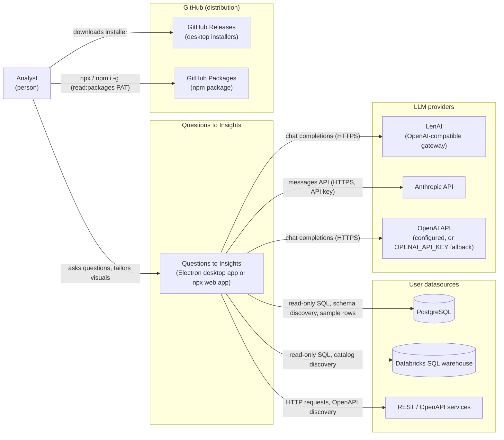
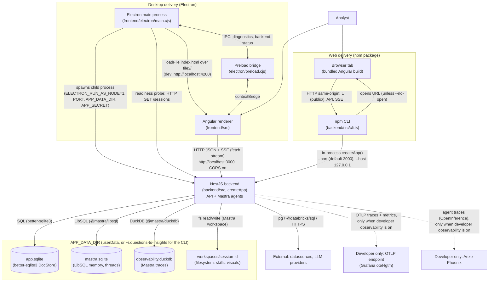
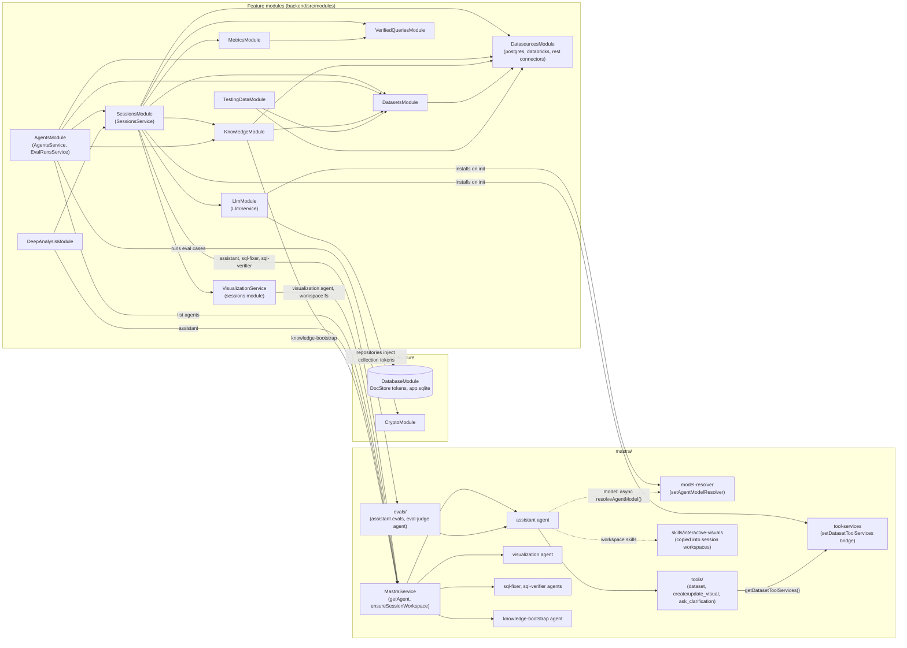
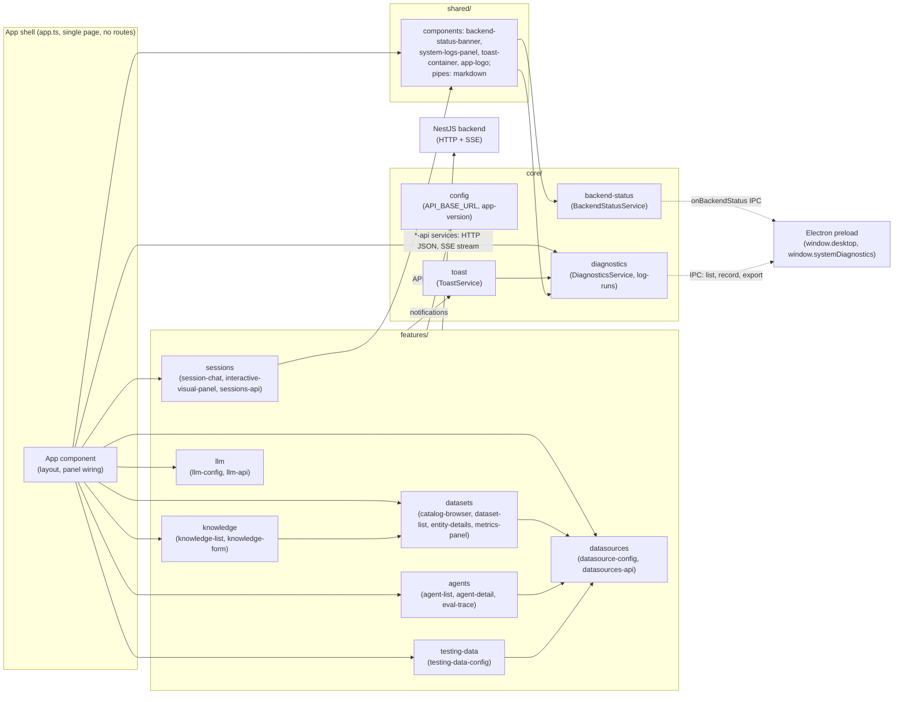
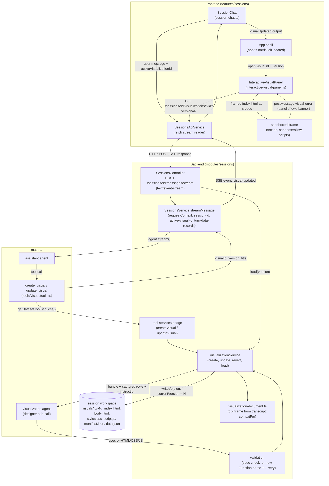

# Architecture

Architectural decisions recorded against the [C4 model](https://c4model.com/) (System Context → Containers → Components → Code). See *Architecture convention* in [CLAUDE.md](../../CLAUDE.md). This file describes the current implementation; see *Stack neutrality* in [specs/README.md](../README.md). ADRs are never edited in substance — supersede them with a new ADR.

ADR template:

```
#### ADR-NNNN — <Title>
- **Status:** Proposed | Accepted | Superseded by ADR-NNNN
- **Date:** YYYY-MM-DD
- **Context:**
- **Decision:**
- **Consequences:**
```

The ADRs below marked *retroactive* document decisions already in place when this file was created. Their operational detail lives in the other system specs: [tech-stack.md](tech-stack.md), [delivery.md](delivery.md), [data-model.md](data-model.md), [agents.md](agents.md) and [api.md](api.md).

## Level 1 — System Context



*System context: the analyst uses Questions to Insights, which queries the user's datasources (PostgreSQL, Databricks, REST/OpenAPI), calls the configured LLM provider, and is distributed through GitHub Releases and GitHub Packages.*


The user asks questions of their data in plain language; Questions to Insights answers with SQL, results, and interactive visuals. External systems: the user's datasources (PostgreSQL, Databricks SQL, REST/OpenAPI), an LLM provider (OpenAI-compatible / LenAI, Anthropic, OpenAI), GitHub (releases, GitHub Packages).

## Level 2 — Containers



*Containers: the two delivery modes (Electron spawning the backend as a child process, or the npm CLI serving backend + bundled UI to a browser) share one NestJS backend and its on-disk stores under `APP_DATA_DIR`.*


- **Electron main process** (`frontend/electron/main.cjs`) — window shell; spawns and kills the backend.
- **Angular renderer** (`frontend/src/`) — the UI.
- **NestJS backend** (`backend/src/`) — API, Mastra agents, SQLite app store, per-session workspaces.
- **npm CLI** (`backend/src/cli.ts`) — serves the same backend + bundled UI in a browser.

#### ADR-0001 — Electron desktop app with an Angular renderer and a NestJS child-process backend *(retroactive)*
- **Status:** Accepted
- **Date:** 2026-10-01
- **Context:** A single installable app is needed with no system Node dependency.
- **Decision:** Electron main spawns the NestJS backend with `ELECTRON_RUN_AS_NODE=1` on port 3000; the renderer talks to it over HTTP.
- **Consequences:** Packaging must stage backend `node_modules` as `extraResources`; native modules (better-sqlite3) must match Electron's ABI.

#### ADR-0002 — Ship the same app as an npm package served in the browser *(retroactive)*
- **Status:** Accepted
- **Date:** 2026-10-01
- **Context:** Developers want to run the app without installing a desktop build.
- **Decision:** The backend is the npm package; it bundles the Angular build and serves it same-origin via `createApp()` with a SPA fallback.
- **Consequences:** Separate default data dir (`~/.questions-to-insights`) to avoid SQLite lock contention with the desktop app; `API_BASE_URL` differs by runtime.

#### ADR-0006 — Opt-in developer observability through OpenTelemetry, Arize Phoenix and Grafana `otel-lgtm`
- **Status:** Accepted
- **Date:** 2026-10-05
- **Context:**
  - Agent traces only reach `observability.duckdb`, which has no viewer. Nest and agent logs are two unlinked streams, and HTTP, Postgres and connector calls aren't traced at all. Developers need a local view of all of it ([BA-111](https://halo-powered.atlassian.net/browse/BA-111)).
  - End-user installs must not change: no new exporters, no network traffic, the same embedded stores.
  - OpenTelemetry auto-instrumentation only patches modules loaded after the SDK starts. `APP_DATA_DIR` is already read at import time.
- **Decision:**
  - Two new external systems, used only on a developer's machine: **Arize Phoenix** for agent and LLM traces, and **Grafana `otel-lgtm`** (OTLP collector, Tempo, Loki, Prometheus) for HTTP, NestJS, Postgres and connector traces, metrics and logs. Both run from an opt-in `observability` Docker Compose profile.
  - A **Developer observability** setting (enabled flag, Phoenix endpoint, OTLP endpoint), off by default and edited in a "Developer" Settings section. It is stored as a JSON file under `APP_DATA_DIR`, not in `app.sqlite`, so the entry points can read it synchronously before any app module loads.
  - The backend entry points (`main.ts`, `cli.ts`) read the file first. Only when it is enabled do they start the OpenTelemetry Node SDK with auto-instrumentation. Then they dynamically import the app. When it is off, no OpenTelemetry or exporter module is imported.
  - When it is enabled, the Mastra `Observability` config adds a Phoenix exporter **next to** `MastraStorageExporter`, so `observability.duckdb` keeps receiving every trace.
  - Changes apply on the next backend start. The desktop app's Restart respawns the backend child process; the npm CLI asks the developer to restart it.
  - Logs go through one pino stream with trace ids. They are exported over OTLP only when the setting is on.
- **Consequences:**
  - Each export path is behind one flag read at startup, so "off" is easy to verify: no module is loaded and no request is made.
  - `main.ts` stops importing the app statically. Load order becomes a contract that the entry points own.
  - Live switching isn't possible; the UI must make the restart explicit.
  - The developer-settings file is a new persisted shape under `APP_DATA_DIR` that the data model must record. A new dependency set (OpenTelemetry SDK, Phoenix exporter, `nestjs-pino`) ships in the package but stays unloaded by default.
  - Unreachable endpoints must never fail startup or requests. Exporters drop data instead.

## Level 3 — Components

**Backend**



*Backend components: NestJS feature modules and their constructor-level dependencies, the `DocStore` behind every repository, and the `mastra/` harness reached only through `MastraService` plus the two DI bridges (`tool-services`, `model-resolver`) installed on module init.*

**Frontend**



*Frontend components: a single-page shell (`app.ts`, no routes) composes every feature directly; features call the backend through their own `*-api` services using `core/config`, and `core` services talk to Electron via the preload bridge.*


#### ADR-0003 — SQLite document store behind a `DocStore<T>` interface *(retroactive)*
- **Status:** Accepted
- **Date:** 2026-10-01
- **Context:** Small embedded persistence with flexible documents.
- **Decision:** One better-sqlite3 table per collection, JSON documents, injection token per collection (`database.module.ts`).
- **Consequences:** Renaming collections or persisted fields needs explicit migrations (`LEGACY_TABLE_NAMES`, `LEGACY_DOC_FIELDS`).

#### ADR-0004 — Mastra as the agentic harness *(retroactive)*
- **Status:** Accepted
- **Date:** 2026-10-01
- **Context:** Agents need tools, memory, and a provider-agnostic model layer.
- **Decision:** Standalone Mastra instance wrapped by `MastraService`; models resolved at call time from persisted LLM settings; LibSQL memory; one filesystem workspace per session.
- **Consequences:** The rest of the backend stays Mastra-agnostic; provider quirks are handled in `model-compat.ts`.

#### ADR-0005 — Visuals as versioned conversation participants *(retroactive)*
- **Status:** Accepted
- **Date:** 2026-10-01
- **Context:** Users tailor visuals iteratively from the chat.
- **Decision:** `create_visual` / `update_visual` tools drive a designer sub-agent; each edit writes a new `v<N>` directory; revert moves a pointer; a fixed, transcript-derived frame provides readable context.
- **Consequences:** Readability does not depend on designer-model output; storage grows per version.

## Level 4 — Code



*Visual tailoring loop: a chat turn's `create_visual`/`update_visual` tool call runs the designer agent through `VisualizationService`, writes a new `visuals/<id>/v<N>/` version in the session workspace, and the `visual-updated` SSE event makes the panel reload it into a sandboxed iframe that reports runtime errors back via `postMessage`.*


<!-- Code-level decisions (patterns, conventions with architectural weight) go here. -->
