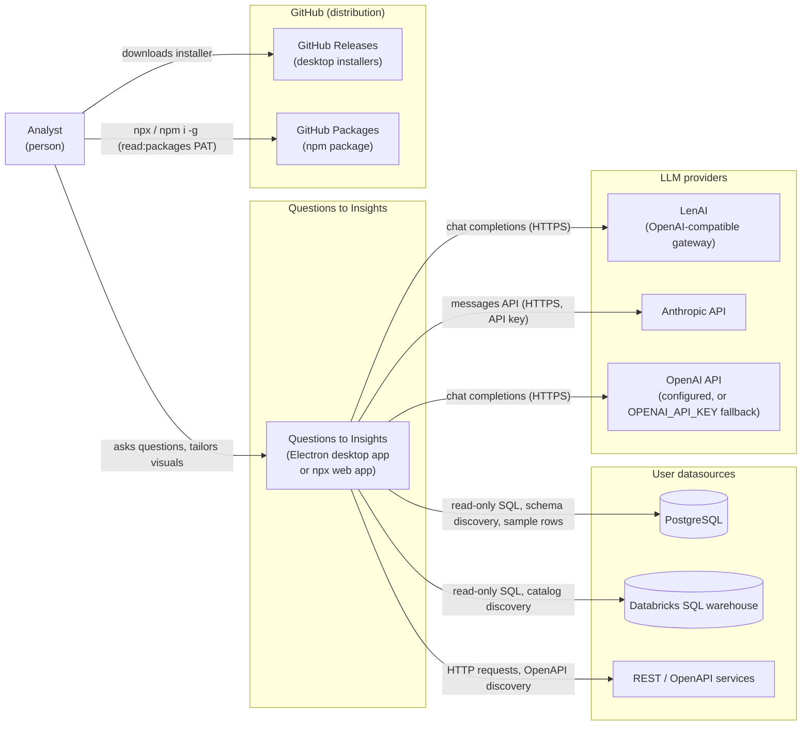
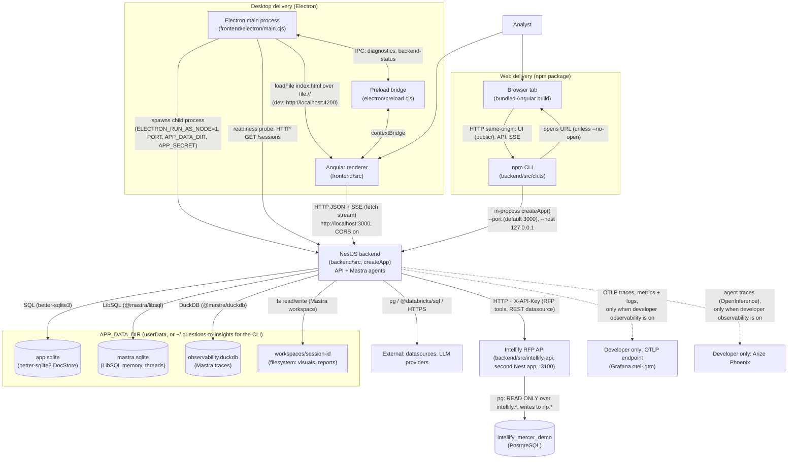
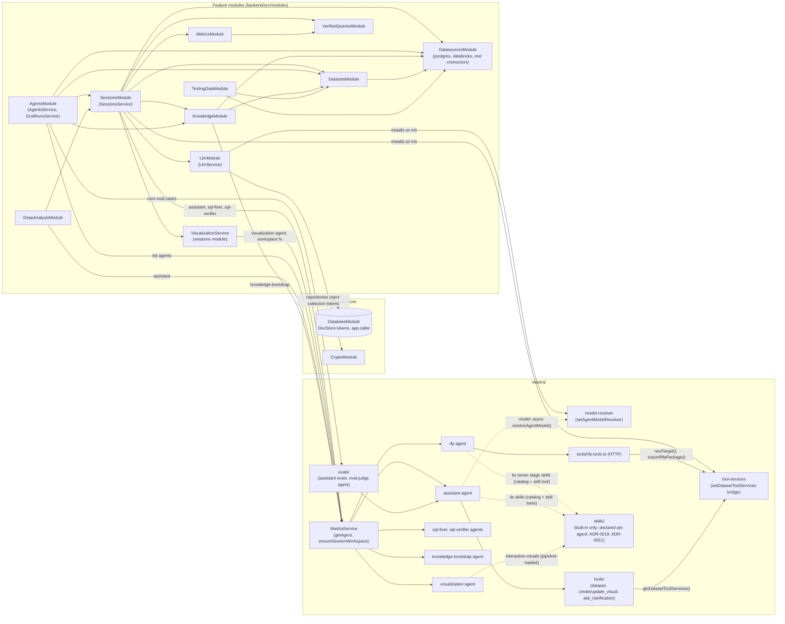
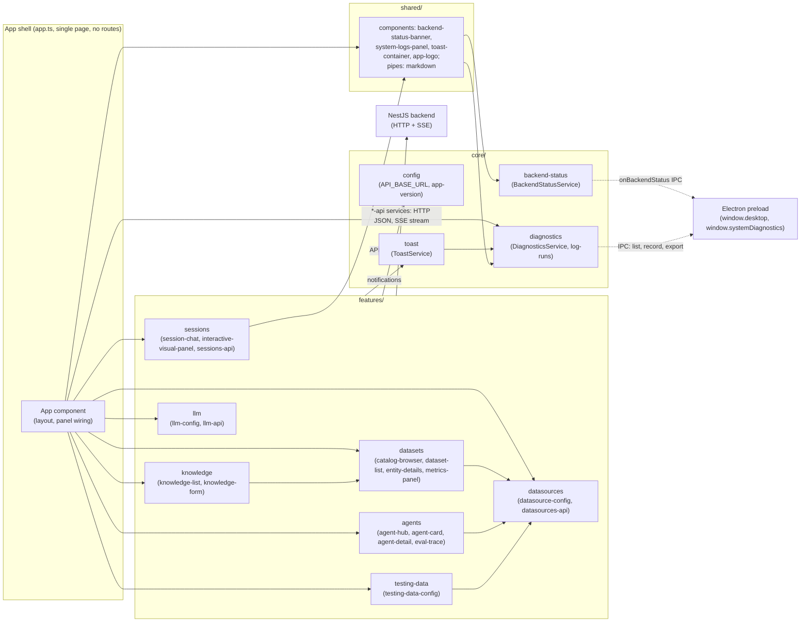
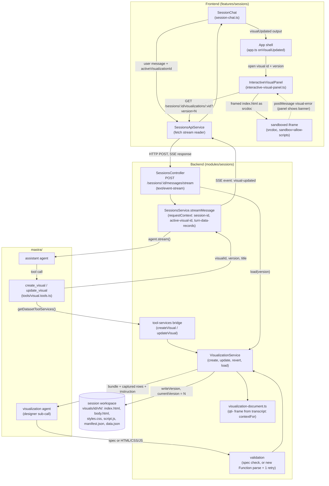

# Architecture

Architectural decisions recorded against the [C4 model](https://c4model.com/) (System Context → Containers → Components → Code). See *Architecture convention* in [CLAUDE.md](../../CLAUDE.md). This file describes the current implementation; see *Stack neutrality* in [specs/README.md](../README.md). ADRs are never edited in substance — supersede them with a new ADR.

ADR template:

```
#### ADR-NNNN — <Title>
- **Status:** Proposed | Accepted | Superseded by ADR-NNNN
- **Date:** YYYY-MM-DD
- **Context:**
- **Decision:**
- **Consequences:**
```

The ADRs below marked *retroactive* document decisions already in place when this file was created. Their operational detail lives in the other system specs: [tech-stack.md](tech-stack.md), [delivery.md](delivery.md), [data-model.md](data-model.md), [agents.md](agents.md) and [api.md](api.md).

## Level 1 — System Context


```mermaid
flowchart LR
  analyst["Analyst<br/>(person)"]

  subgraph qti["Questions to Insights"]
    system["Questions to Insights<br/>(Electron desktop app<br/>or npx web app)"]
  end

  subgraph sources["User datasources"]
    pg[("PostgreSQL")]
    dbx[("Databricks SQL warehouse")]
    rest["REST / OpenAPI services"]
  end

  subgraph llms["LLM providers"]
    lenai["LenAI<br/>(OpenAI-compatible gateway)"]
    anthropic["Anthropic API"]
    openai["OpenAI API<br/>(configured, or OPENAI_API_KEY fallback)"]
  end

  subgraph gh["GitHub (distribution)"]
    releases["GitHub Releases<br/>(desktop installers)"]
    packages["GitHub Packages<br/>(npm package)"]
  end

  analyst -->|"asks questions, tailors visuals"| system
  analyst -->|"downloads installer"| releases
  analyst -->|"npx / npm i -g (read:packages PAT)"| packages
  system -->|"read-only SQL, schema discovery, sample rows"| pg
  system -->|"read-only SQL, catalog discovery"| dbx
  system -->|"HTTP requests, OpenAPI discovery"| rest
  system -->|"chat completions (HTTPS)"| lenai
  system -->|"messages API (HTTPS, API key)"| anthropic
  system -->|"chat completions (HTTPS)"| openai
```

*System context: the analyst uses Questions to Insights, which queries the user's datasources (PostgreSQL, Databricks, REST/OpenAPI), calls the configured LLM provider, and is distributed through GitHub Releases and GitHub Packages.*


The user asks questions of their data in plain language; Questions to Insights answers with SQL, results, and interactive visuals. External systems: the user's datasources (PostgreSQL, Databricks SQL, REST/OpenAPI), an LLM provider (OpenAI-compatible / LenAI, Anthropic, OpenAI), GitHub (releases, GitHub Packages). There is one user, a built-in super admin who is always the caller and never signs in (ADR-0030).

## Level 2 — Containers


```mermaid
flowchart TB
  analyst["Analyst"]

  subgraph desktop["Desktop delivery (Electron)"]
    main["Electron main process<br/>(frontend/electron/main.cjs)"]
    preload["Preload bridge<br/>(electron/preload.cjs)"]
    renderer["Angular renderer<br/>(frontend/src)"]
  end

  subgraph web["Web delivery (npm package)"]
    browser["Browser tab<br/>(bundled Angular build)"]
    cli["npm CLI<br/>(backend/src/cli.ts)"]
  end

  backend["NestJS backend<br/>(backend/src, createApp)<br/>API + Mastra agents"]
  intellifyapi["Intellify RFP API<br/>(backend/src/intellify-api, second Nest app, :3100)"]

  subgraph data["APP_DATA_DIR (userData, or ~/.questions-to-insights for the CLI)"]
    appdb[("app.sqlite<br/>(better-sqlite3 DocStore)")]
    mastradb[("mastra.sqlite<br/>(LibSQL memory, threads)")]
    obsdb[("observability.duckdb<br/>(Mastra traces)")]
    ws["workspaces/session-id<br/>(filesystem: visuals, reports)"]
  end

  ext["External: datasources, LLM providers"]
  devtools["Developer only: OTLP endpoint<br/>(Grafana otel-lgtm)"]
  phoenix["Developer only: Arize Phoenix"]

  analyst --> renderer
  analyst --> browser
  main -->|"spawns child process<br/>(ELECTRON_RUN_AS_NODE=1, PORT, APP_DATA_DIR, APP_SECRET)"| backend
  main -->|"readiness probe: HTTP GET /sessions"| backend
  main -->|"loadFile index.html over file://<br/>(dev: http://localhost:4200)"| renderer
  main <-->|"IPC: diagnostics, backend-status"| preload
  preload <-->|"contextBridge"| renderer
  renderer -->|"HTTP JSON + SSE (fetch stream)<br/>http://localhost:3000, CORS on"| backend
  browser -->|"HTTP same-origin: UI (public/), API, SSE"| cli
  cli -->|"in-process createApp()<br/>--port (default 3000), --host 127.0.0.1"| backend
  cli -->|"opens URL (unless --no-open)"| browser
  backend -->|"SQL (better-sqlite3)"| appdb
  backend -->|"LibSQL (@mastra/libsql)"| mastradb
  backend -->|"DuckDB (@mastra/duckdb)"| obsdb
  backend -->|"fs read/write (Mastra workspace)"| ws
  backend -->|"pg / @databricks/sql / HTTPS"| ext
  backend -->|"HTTP + X-API-Key (RFP tools, REST datasource)"| intellifyapi
  intellifyapi -->|"pg: READ ONLY over intellify.*, writes to rfp.*"| intellifydb[("intellify_mercer_demo<br/>(PostgreSQL)")]
  backend -.->|"OTLP traces, metrics + logs,<br/>only when developer observability is on"| devtools
  backend -.->|"agent traces (OpenInference),<br/>only when developer observability is on"| phoenix
```

*Containers: the two delivery modes (Electron spawning the backend as a child process, or the npm CLI serving backend + bundled UI to a browser) share one NestJS backend and its on-disk stores under `APP_DATA_DIR`.*


- **Electron main process** (`frontend/electron/main.cjs`) — window shell; spawns and kills the backend.
- **Angular renderer** (`frontend/src/`) — the UI.
- **NestJS backend** (`backend/src/`) — API, Mastra agents, SQLite app store, per-session workspaces.
- **npm CLI** (`backend/src/cli.ts`) — serves the same backend + bundled UI in a browser. It binds `127.0.0.1` by default (ADR-0030). How to run it: [delivery.md](delivery.md) section 4.1.
- **Intellify RFP API** (`backend/src/intellify-api/`) — a second NestJS application in the backend package, started in-process by `createApp()` on its own port (default 3100) or alone; the app reaches it only over HTTP with an API key (ADR-0027).

#### ADR-0001 — Electron desktop app with an Angular renderer and a NestJS child-process backend *(retroactive)*
- **Status:** Accepted
- **Date:** 2026-10-01
- **Context:** A single installable app is needed with no system Node dependency.
- **Decision:** Electron main spawns the NestJS backend with `ELECTRON_RUN_AS_NODE=1` on port 3000; the renderer talks to it over HTTP.
- **Consequences:** Packaging must stage backend `node_modules` as `extraResources`; native modules (better-sqlite3) must match Electron's ABI.

#### ADR-0002 — Ship the same app as an npm package served in the browser *(retroactive)*
- **Status:** Accepted
- **Date:** 2026-10-01
- **Context:** Developers want to run the app without installing a desktop build.
- **Decision:** The backend is the npm package; it bundles the Angular build and serves it same-origin via `createApp()` with a SPA fallback.
- **Consequences:** Separate default data dir (`~/.questions-to-insights`) to avoid SQLite lock contention with the desktop app; `API_BASE_URL` differs by runtime.

#### ADR-0006 — Opt-in developer observability through OpenTelemetry, Arize Phoenix and Grafana `otel-lgtm`
- **Status:** Accepted
- **Date:** 2026-10-05
- **Context:**
  - Agent traces only reach `observability.duckdb`, which has no viewer. Nest and agent logs are two unlinked streams, and HTTP, Postgres and connector calls aren't traced at all. Developers need a local view of all of it ([BA-111](https://halo-powered.atlassian.net/browse/BA-111)).
  - End-user installs must not change: no new exporters, no network traffic, the same embedded stores.
  - OpenTelemetry auto-instrumentation only patches modules loaded after the SDK starts. `APP_DATA_DIR` is already read at import time.
- **Decision:**
  - Two new external systems, used only on a developer's machine: **Arize Phoenix** for agent and LLM traces, and **Grafana `otel-lgtm`** (OTLP collector, Tempo, Loki, Prometheus) for HTTP, NestJS, Postgres and connector traces, metrics and logs. Both run from an opt-in `observability` Docker Compose profile.
  - A **Developer observability** setting (enabled flag, Phoenix endpoint, OTLP endpoint), off by default and edited in a "Developer" Settings section. It is stored as a JSON file under `APP_DATA_DIR`, not in `app.sqlite`, so the entry points can read it synchronously before any app module loads.
  - The backend entry points (`main.ts`, `cli.ts`) read the file first. Only when it is enabled do they start the OpenTelemetry Node SDK with auto-instrumentation. Then they dynamically import the app. When it is off, no OpenTelemetry or exporter module is imported.
  - When it is enabled, the Mastra `Observability` config adds a Phoenix exporter **next to** `MastraStorageExporter`, so `observability.duckdb` keeps receiving every trace.
  - Changes apply on the next backend start. The desktop app's Restart respawns the backend child process; the npm CLI asks the developer to restart it.
  - Logs go through one pino stream with trace ids. They are exported over OTLP only when the setting is on.
- **Consequences:**
  - Each export path is behind one flag read at startup, so "off" is easy to verify: no module is loaded and no request is made.
  - `main.ts` stops importing the app statically. Load order becomes a contract that the entry points own.
  - Live switching isn't possible; the UI must make the restart explicit.
  - The developer-settings file is a new persisted shape under `APP_DATA_DIR` that the data model must record. A new dependency set (OpenTelemetry SDK, Phoenix exporter, `nestjs-pino`) ships in the package but stays unloaded by default.
  - Unreachable endpoints must never fail startup or requests. Exporters drop data instead.

#### ADR-0010 — Multi-user org server mode with Entra ID sign-in and server-enforced roles
- **Status:** Superseded by ADR-0030 (local mode amended by ADR-0012 before that)
- **Date:** 2026-10-10
- **Context:**
  - The vision used to rule out multi-user use ("no login, no roles and no shared server"). The Admin Panel epic ([BA-161](https://halo-powered.atlassian.net/browse/BA-161)) reverses that, from the Figma board "Agent Hub — E2E lifecycle (proposed)", section *Admin panel (draft)*.
  - Decisions taken with the user on 2026-10-10:
    - the organisation self-hosts the server, and Halo operates nothing;
    - today's single-user local mode stays;
    - only datasources and datasets are shared across users, plus one org-wide LLM configuration set by Platform admins;
    - the server keeps SQLite.
  - The backend already runs as a standalone web server through the npm CLI (ADR-0002) and stores everything behind `DocStore<T>` (ADR-0003). Neither has a notion of a user.
  - ADR-0008 tied a user agent's owner to "this machine" and deferred any sharing that needs a new container or sync format.
- **Decision:**
  - **Two modes, one build.** The same backend and renderer run in either mode, chosen at startup.
    - **Local mode** is the default and today's behaviour: no sign-in, and one implicit local user who holds every permission. The desktop app always runs in local mode.
    - **Org server mode** is enabled by server configuration: the identity provider's issuer, client id and secret, the public base URL, and the SCIM token. It is started through the npm CLI or its container image.
  - **No new container.** The org server is the existing web-mode backend, which serves the UI and the API from one origin. TLS and the public hostname are the organisation's reverse proxy's job. Users reach the org server from a browser. A desktop app connecting to a remote org server is out of scope for BA-161.
  - **Identity: OpenID Connect against Microsoft Entra ID**, authorization code flow with PKCE, run by the backend.
    - The backend issues its own session as an `HttpOnly`, `Secure`, `SameSite=Lax` cookie. No tokens are held in the renderer.
    - Generic OIDC is used, so another provider can follow without a new ADR.
  - **Directory: SCIM 2.0 inbound.** The backend exposes `/scim/v2/Users` and `/scim/v2/Groups`, protected by a bearer token, and Entra ID's provisioning service pushes to them.
    - A user who signs in before being provisioned is created just in time from their ID token claims.
    - Groups from the directory are read-only in the app.
  - **Authorization: roles and permissions in the backend.**
    - Five built-in roles: User, Maker, Data owner (scoped to one datasource), Approver and Platform admin. A fixed permission matrix maps roles to permissions.
    - A user's roles are the union of direct assignments and group-to-role mappings.
    - Every route declares the permission it needs, and one global guard checks it. The renderer reads the caller's permissions only to show or hide controls.
  - **Data ownership.**
    - Private documents gain an `ownerId`: sessions, visuals and their workspaces, memory threads, agents, knowledge, verified queries, metrics and eval runs. Repositories scope every read and write to the caller.
    - Datasources and datasets are org-wide, with no owner filter.
    - In local mode, every document belongs to the local user, so existing data needs no rewrite: a missing `ownerId` reads as the local user.
  - **Storage stays SQLite (ADR-0003).** New collections hold users, groups, group memberships, role assignments, group-to-role mappings, sign-in sessions and activity events. Activity events feed the admin overview's active-user counts and recent activity.
- **Consequences:**
  - ADR-0008's "owner is this machine" becomes "owner is a user". Agent ownership can be transferred. Sharing agents beyond their owner stays out of scope, for a later Requests/Registry epic.
  - Every repository must apply the owner scope. A missed one leaks one user's data to another, so an API test per collection must prove isolation between two users.
  - SQLite has a single writer, which limits concurrency. That is acceptable for one organisation's server at expected team sizes. Moving to PostgreSQL behind `DocStore<T>` would need its own ADR.
  - The server now accepts traffic beyond `127.0.0.1`, so the web-mode binding (non-functional N3) gains an org-server setting. CSRF protection and secure cookies become requirements.
  - The agent memory store (Mastra) must also be scoped per user. In org server mode the LLM configuration is org-wide and only Platform admins can change it, coordinated with [BA-159](https://halo-powered.atlassian.net/browse/BA-159).
  - The E2E harness needs a local OIDC stub and a SCIM client to drive org server mode without a real Entra ID tenant.

#### ADR-0011 — Backend-run OIDC with `openid-client`, an opaque session cookie and an Origin check
- **Status:** Superseded by ADR-0030
- **Date:** 2026-10-10
- **Context:**
  - ADR-0010 puts sign-in in the backend, and Entra ID is the first provider.
  - The backend compiles to CommonJS and Jest can't load ESM-only packages (see the BA-152 retrospective).
  - The renderer calls the API with `HttpClient` and with raw `fetch` for streams. It sends no custom header today.
  - `openid-client@5` is already present through `@databricks/sql`, but that version is maintenance-only.
- **Decision:**
  - **OIDC client:** `openid-client@6`, imported lazily (`await import()`), the same way `cli.ts` and `main.ts` load ESM. It sits behind an `OidcClient` interface so unit tests mock it. The flow is the authorization code flow with PKCE, `state` and `nonce`, held during the round trip in a short-lived `HttpOnly` cookie.
  - **Session:**
    - The backend keeps no JWT. A session is an opaque 32-byte random id stored in an `auth_sessions` collection (SQLite, ADR-0003) and sent as an `HttpOnly; SameSite=Lax; Path=/` cookie.
    - The cookie is `Secure` unless the public base URL is `http://` (development and E2E only).
    - Behind the organisation's TLS proxy the app sets `trust proxy`.
  - **CSRF:** `SameSite=Lax`, plus a check that every non-GET request in org mode carries an `Origin` (or `Referer`) matching the public base URL. SCIM is exempt, because it uses a bearer token and no cookie.
  - **SCIM:** a hand-written controller covering the subset Entra ID's provisioning service sends. No library.
  - **Current user:** propagated with `AsyncLocalStorage`, so tool calls, SSE streams and background jobs started inside a request run as the caller without request-scoped providers.
- **Consequences:**
  - One new runtime dependency (`openid-client`). The E2E tests use a hand-rolled OIDC stub on `node:http` and `node:crypto` instead of a full provider.
  - A session can be revoked at once by deleting its document. Every request in org mode costs one store read.
  - Background jobs must capture the owner when they start, and re-enter it if they outlive the request.

#### ADR-0012 — Local mode signs in as one of five seeded personas, with a bearer-token auth session
- **Status:** Superseded by ADR-0030
- **Date:** 2026-10-11
- **Context:**
  - ADR-0010 kept local mode as "no sign-in, and one implicit local user who holds every permission". So local mode and the desktop app had no roles, no owner scoping and no Admin area: nobody could try what a User, a Maker or an Approver sees without standing up an org server.
  - In local mode no document carried an `ownerId`, and owner scoping was skipped ("a missing `ownerId` reads as the local user").
  - The desktop renderer is loaded from `file://`, so ADR-0011's `SameSite=Lax` session cookie set by `http://localhost:3000` never reaches the backend on its requests.
  - The user delegated the decisions on 2026-10-11, after PR #69 shipped the org server: local and org mode should behave the same.
- **Decision:**
  - **Five seeded personas.** In local mode the backend ensures five directory users with fixed ids: Demo User (`local`), Uma User (`local-uma`), Mark Maker (`local-mark`), Dana Data Owner (`local-dana`) and Avery Approver (`local-avery`). Mark, Avery and Dana get their roles once; Dana is Data owner of every datasource. Demo User is always a Platform admin, as a bootstrap admin.
  - **A sign-in page without a password.** It lists the active directory users; choosing one starts an auth session. There's no automatic sign-in.
  - **Same session, different transport.** Local auth sessions are the same `auth_sessions` documents as on an org server, but the token is answered in the sign-in response, kept in browser storage and sent as `Authorization: Bearer <token>`. The cookie is org-only, and local mode has no `Origin` check. A local session has no idle timeout and ends at Sign out or 30 days after sign-in.
  - **Same enforcement.** Roles, the permission guard and owner scoping apply in local mode exactly as on an org server. Migration M13 gives every ownerless document to Demo User (`ownerId: "local"`), so existing data stays with the user who had it.
  - **One mechanism for desktop and web.** The desktop app and the npx web app in local mode sign in the same way, so the web E2E suite covers the desktop path. The desktop app's readiness probe becomes `GET /me`, ready on 200 or 401.
- **Consequences:**
  - Local mode is not a security boundary: anyone who can reach the local backend can sign in as any persona. It's a way to see each role, not to protect data (non-functional N67).
  - `GET /me` answers 401 when nobody is signed in, in both modes. For Demo User it reports Platform admin with source `bootstrap`.
  - Nothing runs as the local user by default any more. Code outside a request, such as the eval CLI, must run as Demo User explicitly.
  - A data folder used in local mode and then opened by an org server shows none of its private items there: they belong to `local`, which is no org user.

#### ADR-0027 — The Intellify RFP API: a second NestJS service in the backend package, API-key protected, with its own `rfp` schema
- **Status:** Accepted
- **Date:** 2026-10-14
- **Context:**
  - The RFP Builder agent (ADR-0028) must reach the Intellify data model (the `intellify` fixture, BA-212) only through a REST API that we build, and must save the state of an RFP so a consultant can resume it.
  - The app reaches external data only through datasources (ADR-0005's connectors; the REST kind reads OpenAPI specs and sends an API key header), and its SQL path is read-only by design (datasources R33-R35). The RFP needs writes.
  - The backend already runs as one NestJS application in three deliveries (Electron child process, npm CLI, org server; ADR-0001, ADR-0002). A second process would need supervision in each.
- **Decision:**
  - **A second NestJS application** lives at `backend/src/intellify-api/`, compiled by the same build, with its own module tree, port (`INTELLIFY_API_PORT`, default 3100), authentication (`X-API-Key`), error shape, OpenAPI document (`GET /openapi.json`) and PostgreSQL pool. It imports nothing from the app's modules and the app calls it only over HTTP.
  - **Embedded by default, standalone on demand.** `createApp()` starts it in-process after the app listens unless `INTELLIFY_API=off`; `node dist/intellify-api/main.js` runs it alone. The only in-process link is a value (`IntellifyApiInfo`: URL and key) that the Testing Data loader uses to register the API as a REST datasource.
  - **Reads are read-only, writes are confined.** Reads over `intellify.*` run in `READ ONLY` transactions. Writes go only to a new `rfp` schema in the same database (`rfp.rfps`, `rfp_lines`, `rfp_carriers`, `rfp_requirements`, `rfp_timeline`, `rfp.schema_migrations`), created by versioned SQL migrations the API applies at start under an advisory lock. No foreign key crosses the schemas, because the Intellify loader drops `intellify` with CASCADE.
  - **The package is a projection of the record.** The API renders the RFP document (Markdown, and PDF with pdfkit), the exhibits (CSV) and a zip from the stored record and the live Intellify data, so any client gets the same package.
- **Consequences:**
  - Two new dependencies (`@nestjs/swagger`, `pdfkit`), both pure JavaScript; the packaged desktop app grows accordingly.
  - A new container in the C4 model and a new external database coordinate set (`INTELLIFY_DB_*`); data-model.md documents the `rfp` schema and api.md the API's routes, since `check-specs.py` covers every controller under `backend/src`.
  - The API key is the whole access boundary: records carry `created_by` as an attribute only. Per-user access would need the app's auth to be forwarded, which is deferred.
  - A missing or stopped database degrades the API (503, `/health` down) without stopping the app.

## Level 3 — Components

**Backend**


```mermaid
flowchart LR
  subgraph modules["Feature modules (backend/src/modules)"]
    sessions["SessionsModule<br/>(SessionsService)"]
    visualization["VisualizationService<br/>(sessions module)"]
    agentsmod["AgentsModule<br/>(AgentsService, EvalRunsService)"]
    deep["DeepAnalysisModule"]
    knowledge["KnowledgeModule"]
    datasets["DatasetsModule"]
    datasources["DatasourcesModule<br/>(postgres, databricks, rest connectors)"]
    testing["TestingDataModule"]
    metrics["MetricsModule"]
    verified["VerifiedQueriesModule"]
    llm["LlmModule<br/>(LlmService)"]
  end

  subgraph infra["infrastructure"]
    docstore[("DatabaseModule<br/>DocStore tokens, app.sqlite")]
    crypto["CryptoModule"]
  end

  subgraph mastra["mastra/"]
    mastrasvc["MastraService<br/>(getAgent, ensureSessionWorkspace)"]
    toolsvc["tool-services<br/>(setDatasetToolServices bridge)"]
    resolver["model-resolver<br/>(setAgentModelResolver)"]
    assistant["assistant agent"]
    designer["visualization agent"]
    sqlagents["sql-fixer, sql-verifier agents"]
    bootstrap["knowledge-bootstrap agent"]
    rfpagent["rfp agent"]
    tools["tools/<br/>(dataset, create/update_visual, ask_clarification)"]
    rfptools["tools/rfp.tools.ts (HTTP)"]
    skills["skills/<br/>(built-in only; declared per agent; ADR-0018, ADR-0021)"]
    evals["evals/<br/>(assistant evals, eval-judge agent)"]
  end

  sessions --> visualization
  sessions --> datasets
  sessions --> datasources
  sessions --> llm
  sessions --> verified
  sessions --> metrics
  sessions --> knowledge
  sessions -->|"assistant, sql-fixer, sql-verifier"| mastrasvc
  sessions -->|"installs on init"| toolsvc
  visualization -->|"visualization agent, workspace fs"| mastrasvc
  agentsmod --> sessions
  agentsmod --> knowledge
  agentsmod --> datasources
  agentsmod --> datasets
  agentsmod -->|"list agents"| mastrasvc
  agentsmod -->|"runs eval cases"| evals
  deep --> sessions
  deep -->|"assistant"| mastrasvc
  knowledge --> datasets
  knowledge --> datasources
  knowledge -->|"knowledge-bootstrap"| mastrasvc
  datasets --> datasources
  testing --> datasources
  testing --> datasets
  metrics --> verified
  llm --> crypto
  llm -->|"installs on init"| resolver
  modules -->|"repositories inject collection tokens"| docstore

  mastrasvc --> assistant
  mastrasvc --> designer
  mastrasvc --> sqlagents
  mastrasvc --> bootstrap
  mastrasvc --> rfpagent
  rfpagent --> rfptools
  rfpagent -.->|"its seven stage skills (catalog + skill tool)"| skills
  rfptools -->|"restTarget(), exportRfpPackage()"| toolsvc
  assistant --> tools
  assistant -.->|"its skills (catalog + skill tools)"| skills
  designer -.->|"interactive-visuals (pipeline-loaded)"| skills
  tools -->|"getDatasetToolServices()"| toolsvc
  evals --> assistant
  assistant -.->|"model: async resolveAgentModel()"| resolver
```

*Backend components: NestJS feature modules and their constructor-level dependencies, the `DocStore` behind every repository, and the `mastra/` harness reached only through `MastraService` plus the two DI bridges (`tool-services`, `model-resolver`) installed on module init.*

**Frontend**


```mermaid
flowchart LR
  subgraph shell["App shell (app.ts, single page, no routes)"]
    app["App component<br/>(layout, panel wiring)"]
  end

  subgraph features["features/"]
    sessions["sessions<br/>(session-chat, interactive-visual-panel, sessions-api)"]
    datasets["datasets<br/>(catalog-browser, dataset-list, entity-details, metrics-panel)"]
    datasources["datasources<br/>(datasource-config, datasources-api)"]
    knowledge["knowledge<br/>(knowledge-list, knowledge-form)"]
    llm["llm<br/>(llm-config, llm-api)"]
    agents["agents<br/>(agent-hub, agent-card, agent-detail, eval-trace)"]
    testing["testing-data<br/>(testing-data-config)"]
  end

  subgraph core["core/"]
    config["config<br/>(API_BASE_URL, app-version)"]
    toast["toast<br/>(ToastService)"]
    diagnostics["diagnostics<br/>(DiagnosticsService, log-runs)"]
    status["backend-status<br/>(BackendStatusService)"]
  end

  subgraph shared["shared/"]
    sharedui["components: backend-status-banner,<br/>system-logs-panel, toast-container, app-logo;<br/>pipes: markdown"]
  end

  backend["NestJS backend<br/>(HTTP + SSE)"]
  desktop["Electron preload<br/>(window.desktop, window.systemDiagnostics)"]

  app --> sessions
  app --> datasets
  app --> datasources
  app --> knowledge
  app --> llm
  app --> agents
  app --> testing
  app --> sharedui
  app --> diagnostics
  datasets --> datasources
  knowledge --> datasets
  agents --> datasources
  testing --> datasources
  sessions --> sharedui
  features -->|"API_BASE_URL"| config
  features -->|"notifications"| toast
  toast --> diagnostics
  sharedui --> status
  sharedui --> diagnostics
  features -->|"*-api services: HTTP JSON, SSE stream"| backend
  status -.->|"onBackendStatus IPC"| desktop
  diagnostics -.->|"IPC: list, record, export"| desktop
```

*Frontend components: a single-page shell (`app.ts`, no routes) composes every feature directly; features call the backend through their own `*-api` services using `core/config`, and `core` services talk to Electron via the preload bridge.*


#### ADR-0003 — SQLite document store behind a `DocStore<T>` interface *(retroactive)*
- **Status:** Accepted
- **Date:** 2026-10-01
- **Context:** Small embedded persistence with flexible documents.
- **Decision:** One better-sqlite3 table per collection, JSON documents, injection token per collection (`database.module.ts`).
- **Consequences:** Renaming collections or persisted fields needs explicit migrations (`LEGACY_TABLE_NAMES`, `LEGACY_DOC_FIELDS`).

#### ADR-0004 — Mastra as the agentic harness *(retroactive)*
- **Status:** Accepted
- **Date:** 2026-10-01
- **Context:** Agents need tools, memory, and a provider-agnostic model layer.
- **Decision:** Standalone Mastra instance wrapped by `MastraService`; models resolved at call time from persisted LLM settings; LibSQL memory; one filesystem workspace per session.
- **Consequences:** The rest of the backend stays Mastra-agnostic; provider quirks are handled in `model-compat.ts`.

#### ADR-0005 — Visuals as versioned conversation participants *(retroactive)*
- **Status:** Accepted
- **Date:** 2026-10-01
- **Context:** Users tailor visuals iteratively from the chat.
- **Decision:** `create_visual` / `update_visual` tools drive a designer sub-agent; each edit writes a new `v<N>` directory; revert moves a pointer; a fixed, transcript-derived frame provides readable context.
- **Consequences:** Readability does not depend on designer-model output; storage grows per version.

#### ADR-0007 — Themeable renderer: semantic design tokens, a bundled webfont and a System / Light / Dark preference
- **Status:** Accepted; its *Preference* storage and default superseded by ADR-0009
- **Date:** 2026-10-09
- **Context:**
  - The renderer is dark-only. Its colours are hardcoded per component as Tailwind arbitrary values (`bg-[#232323]`, `zinc-*`), and it has no theme file and no CSS variables ([ui.md](ui.md) §6).
  - The Agentic Hub look and feel ([BA-141](https://halo-powered.atlassian.net/browse/BA-141)) needs a light theme and a navy dark theme derived from it, switchable at runtime. With hardcoded values, each theme would need a second class on every element.
  - The renderer loads over `file://` in the desktop app and must work offline, so it can't fetch fonts from a CDN.
- **Decision:**
  - **Semantic tokens.** Colours, radii and shadows become CSS custom properties named by role (surface, card, text, border, primary, status), not by value. A `data-theme="light" | "dark"` attribute on the root element selects one of two token sets. The tokens are mapped into Tailwind v4 through `@theme`, so components use role utilities (`bg-surface`, `text-muted`), never hex values or palette shades.
  - **Preference.** System (the default), Light or Dark, stored on the renderer like the right-panel width. System follows `prefers-color-scheme` and updates live when the OS changes. The resolved theme is set before first paint, so there is no flash of the wrong theme. The Electron window background matches the resolved theme.
  - **Webfont.** One open-licence sans-serif family is bundled with the renderer as local assets and loaded with `@font-face`. The system font stack stays as the fallback.
- **Consequences:**
  - Every component that uses hardcoded colours must move to tokens. The BA-141 stories do this screen by screen, and finished screens must have no arbitrary colour values left.
  - Both themes have to pass the axe scan, and visual baselines are captured per theme.
  - The renderer bundle grows by the font files.
  - The theme preference is a new persisted renderer key that [data-model.md](data-model.md) must record.
  - The theme is per renderer origin, so the desktop app and the npm CLI's browser tab can hold different preferences.

#### ADR-0008 — User-built agents are stored configurations of the assistant
- **Status:** Accepted; which tools and skills a user agent gets is narrowed by ADR-0022; the core prompt it layers on becomes editable by ADR-0026; narrowed by ADR-0028 (sessions may bind to a built-in agent)
- **Date:** 2026-10-09
- **Context:**
  - The Agent Hub ([BA-150](https://halo-powered.atlassian.net/browse/BA-150)) lets users build their own agents: a name, a description, instructions, datasets, starter questions and an optional model override. Each one is drafted, published and chatted with.
  - Mastra agents are registered in code at startup (ADR-0004, `src/mastra/index.ts`). Registering an agent per user definition at runtime would mean re-registering on every edit and would bypass the assistant's tools, memory and guards.
  - The assistant's safety comes from code that must hold whatever the prompt says: the read-only SQL guard, grounding checks, SQL repair and trust signals. Its prompt must still start with the fixed identity line, and an E2E asserts this.
  - The app is local-first with no accounts, so "owner" can only mean "this machine".
- **Decision:**
  - A user agent is a **document** in a new `agents` collection, not a Mastra agent. Each document holds a `draft` and an optional `live` version of the configuration, plus `pinned`. Pin state for the built-in agents is stored separately, keyed by registry key.
  - A session started from an agent stores the agent id. Each turn runs the existing `assistant` and applies the agent's **Live** configuration:
    - its instructions as an extra, labelled per-turn system context block after the base prompt and the knowledge block;
    - its datasets as the session's datasets;
    - its model or reasoning-effort override through the turn's request context, read by `resolveAgentModel()`.
  - A preview chat applies the **draft** the same way, against a thread that is not stored as a session.
  - The built-in agents stay in the code registry. The hub merges them (Official: `assistant`; System: the helpers) with the user agents from the collection.
- **Consequences:**
  - User agents inherit every assistant tool, guard and fix automatically. They can't add tools or relax the guard.
  - Editing a Live agent never changes a running session until it is published. Deleting an agent leaves sessions pointing at a missing id, so they fall back to the plain assistant.
  - Adds a collection, and an optional field on `sessions` (no migration: absent means the plain assistant).
  - Sharing across machines, teams and owners would need a new container or a sync format. That is deferred and would supersede the "this machine" ownership here.


#### ADR-0009 — UI preferences live in the backend, with a browser cache for the first paint
- **Status:** Accepted; the per-user document (ADR-0010) removed by ADR-0030
- **Date:** 2026-10-10
- **Context:**
  - ADR-0007 stored the theme choice in the renderer's browser storage, defaulting to System, and the navigation drawer was never remembered (app-shell R2).
  - The user wants the app to open in the Light theme with the drawer expanded, and any change the user makes to either to be stored in the database ([BA-168](https://halo-powered.atlassian.net/browse/BA-168)).
  - Browser storage is per renderer origin and per port, so the desktop app, a CLI tab on another port and a fresh browser profile each lose the choice.
  - The theme must still apply before the first paint (app-shell R42), which a backend round trip can't guarantee.
- **Decision:**
  - **Source of truth.** One `ui-preferences` document in the existing `settings` collection holds the theme choice and the drawer state, read and written through `GET` / `PUT /ui-preferences`. It belongs to the data directory, so every renderer on that data shares it.
  - **Defaults.** Nothing stored means Light and an expanded drawer. System stays a choice, no longer the default.
  - **First-paint cache.** The renderer keeps a browser-storage copy of the theme (and of the drawer state) and applies it before boot, then reconciles with the backend once it answers; the backend wins.
  - **One-time move.** A theme chosen before this change, found in browser storage while the backend has none, is written to the backend once.
- **Consequences:**
  - A new `settings` key and two endpoints; no new collection and no table migration.
  - A renderer whose cache disagrees with the backend (another renderer changed the choice) shows its cached theme for one frame, then switches.
  - Existing users who never chose a theme move from System to Light.

#### ADR-0018 — Agent know-how as app-owned skills with progressive disclosure, declared per agent
- **Status:** Accepted; partly superseded by ADR-0019 (where skills come from, and scripts) and ADR-0020 (how on-demand skills are listed and read). ADR-0021 supersedes ADR-0019, so skills again come only from the bundle.
- **Date:** 2026-10-13
- **Context:**
  - The `assistant` sends one ~160-line system prompt on every call. It mixes rules every question needs (grounding, SQL safety) with rules only some turns need: curated knowledge, visuals, dialects. Deep analysis inlines its own phase prompts in `DeepAnalysisService`, and the designer gets the whole `interactive-visuals` skill (spec mode and freeform) on every call.
  - Mastra (ADR-0004) implements Agent Skills. A `SKILL.md` front matter holds a `name` and `description`, and the framework injects only those into an `<available_skills>` catalog. A `skill` tool loads a skill's body and `skill_read` loads any file in its folder. An agent can declare its own skills (`skills`, paths on disk, resolved per request), and they merge with the skills of its workspace.
  - Today the one skill is copied into every session workspace and discovered from there. Every agent bound to the workspace, the assistant included, sees it in its catalog, although only the designer pipeline uses it.
  - Loading by the model is probabilistic. A rule that must hold on a given turn can't depend on the model noticing it.
  - The user asked on 2026-10-13 for the SKILL.md, `phases/`, `references/` and `scripts/` layout. The workspace has no sandbox, and the packaged app ships no interpreter.
- **Decision:**
  - **App-owned skills in the bundle.** Skills live in `backend/src/mastra/skills/<name>/` and the build copies them to `dist/`. A skill is a `SKILL.md` (front matter `name` equal to the folder and a `description` that starts with "Use when", then a short phase map or router) plus the `phases/*.md` and `references/*.md` files it links.
  - **Declared per agent.** Each agent lists its skills by name in one table in code. Session workspaces no longer seed or discover skills, so an agent sees only its own catalog. Copies already in old workspaces are ignored.
  - **Two loading modes.** A skill is *on demand* when only the model can tell it applies: it is listed in the agent's catalog and loaded with `skill` / `skill_read`. A skill is *harness-loaded* when code knows the condition, such as a knowledge block being present, a deep-analysis phase or the designer's mode. The code then sends the needed body or file as a system message, and the skill is kept out of the catalog.
  - **No scripts the model runs.** Checks that have to be exact stay in TypeScript (the read-only guard, the result guards, visual-spec validation). A skill names the tool or guard that applies its rule. `scripts/` is not part of the layout.
  - **Fail at startup.** The backend validates every skill when it loads: front matter, the "Use when" description, name equal to the folder, and every linked file present. An invalid skill or a missing skills folder stops the backend before it serves.
- **Consequences:**
  - The assistant's every-turn prompt shrinks to the rules every data question needs. What a turn sends depends on the turn, and the specs say which skill reaches which call ([agents.md](agents.md) section 7).
  - On-demand skills add a tool round trip when they load, and they can fail to trigger. That's why only rules the model must judge go on demand, and evals measure them.
  - Editing a skill is a prompt change. It ships with the build and is covered by the same evals and E2E as an edit to an agent's instructions.
  - Mastra's skill catalog, tools and agent-level `skills` are framework behaviour (1.66). A Mastra upgrade re-runs the request-recording E2E that asserts what each call carries.

#### ADR-0019 — Built-in, user and project skill levels that override by name; scripts reserved for built-in skills
- **Status:** Superseded by ADR-0021 (built-in skills only). Before that, partly superseded by ADR-0020 (the script runner is built)
- **Date:** 2026-10-14
- **Context:**
  - ADR-0018 made every skill app-owned: the only skills an agent can get ship in the build, and nobody can add or adjust one without a release.
  - The user asked on 2026-10-14 for the layout of Agent Skills tools: user-level skills, and project-level skills that override them by name, each a `SKILL.md` with `phases/`, `reference/` and `scripts/`.
  - The backend runs as the desktop app, the npx CLI or a multi-user org server, so "user" and "project" need one meaning that holds in all three. The app has no organization record: one org server is one organization.
  - A script is code the model runs on the backend host. A folder anyone can drop files into would make that arbitrary code execution, on the org server as the server's own account.
- **Decision:**
  - **Three levels, later overrides earlier by name:** built-in (the bundle) < user (`<data dir>/skills/`) < project (the folder `QUESTIONS_TO_INSIGHTS_PROJECT_SKILLS_DIR` names, e.g. a checkout of the organization's skills repo). The levels mean the same in every mode. On the org server both folders are server-wide; there are no per-person skills.
  - **Read at startup.** The backend reads all three levels once when it starts. The app never writes the user or project folders.
  - **Targeting.** A new user or project skill is on demand, for the agents its optional `agents` front-matter key names (default `assistant`). Only an agent that can load a skill on demand may be named. An override keeps the agents and the loading mode of the skill it replaces.
  - **Failure isolation.** A broken built-in skill still stops the backend. A broken user or project skill is skipped, logged and shown on the agent page. An override of a harness-loaded built-in must carry every phase and reference file the built-in has, each with the same placeholders; otherwise it is skipped and the built-in stays.
  - **Scripts only for built-in skills, not built yet.** `scripts/` is reserved for built-in skills, which ship with reviewed code. They would run through one tool: arguments only (no shell), only files in the skill's `scripts/` folder, a timeout, and the output returned verbatim. No built-in skill needs a script today, so the runner is not built. User and project skills are text only: their `scripts/` is never run.
  - **Read-only Skills tab.** The agent page shows each agent's skills, the level each comes from, what it overrides, its files and their contents, and the skipped skills with their problems.
- **Consequences:**
  - A user or administrator can change an agent's instructions without a release. Such a change has no eval or review gate in the app: the Skills tab is the only place it shows, and an override of a harness-loaded skill changes chat, deep analysis or visuals for every session.
  - The first on-demand skill added at the user or project level gives the assistant the skill catalog, its usage note and the skill tools on every turn (about 1,000 characters, agents.md 7.3).
  - Eval runs and user agents run on the assistant, so they get its user and project skills too.
  - Picking up a changed skill needs a restart.
  - Adding the script runner later is one story inside the rules above.

#### ADR-0020 — A sectioned assistant prompt with the app's own skill catalog, read through `read_file`; built-in scripts run through `run_skill_script`
- **Status:** Superseded by ADR-0025 (the sectioned prompt's identity, `## Tools` and `## Working rules` stay). Its mentions of user and project skills no longer apply since ADR-0021
- **Date:** 2026-10-14
- **Context:**
  - Under ADR-0018 the framework renders the on-demand catalog, with its own usage note and a `<source>` tag, and offers `skill`, `skill_search` and `skill_read`. Neither the wording nor the tools are ours to shape.
  - The user asked on 2026-10-14 for the system prompt of Agent Skills tools: identity, `## Tools`, `## Working rules` and `## Skills`. The Skills section has fixed instructions and an `<available_skills>` list giving each skill's name, description and the path to its `SKILL.md`. The model reads skills with a file tool and runs bundled scripts instead of reading them.
  - ADR-0019 reserved scripts for built-in skills behind a restricted runner but didn't build it. A shell would run as the backend's account, for every user on the org server. The packaged app ships Node (the backend's own runtime), not Python.
- **Decision:**
  - **Sectioned prompt.** The assistant's prompt is the identity paragraph, then `## Tools` (one line per tool, generated from the tools it is given), then `## Working rules` (the existing rules, word for word), then `## Skills` when it has on-demand skills. The Skills section holds the instructions and the catalog, rendered by the app.
  - **Own catalog and `read_file`.** The assistant is no longer given framework skills, so the framework adds no catalog, usage note or skill tools. The app gives it `read_file(path)` instead: read-only, and limited to the regular files inside the folders of the skills its catalog lists.
  - **`run_skill_script`.** A built-in skill in the catalog can bundle Node scripts under `scripts/` (`.js`, `.mjs`, `.cjs`). They run through `run_skill_script(skill, script, args)`:
    - with the backend's own Node and no shell;
    - only listed files under that skill's `scripts/`, with arguments passed as an argument list;
    - with a minimal environment that carries no app secrets, the skill folder as working directory and a 30-second timeout;
    - with stdout, stderr and the exit code returned verbatim (capped).

    The tool is offered only when such a skill exists. User and project skills stay text only.
  - **`curated-knowledge` becomes on demand** (added the same day, at the user's request, before the change shipped). The built-in skill is listed in the assistant's catalog, and the knowledge block travels without its rules: the model reads them with `read_file`. `deep-analysis` stays harness-loaded, because its phase files are templates that the deep-analysis service fills and calls one by one. `interactive-visuals` stays harness-loaded, because the designer runs without tools and can't read a file.
- **Consequences:**
  - The prompt the model sees, and the one the Prompt tab shows, are the same text, catalog included. A framework upgrade can no longer change the skill wording.
  - `read_file` and `run_skill_script` are app code that touches the disk and spawns processes. Both are covered by unit tests on their limits (paths, symbolic links, size, extensions, timeout, environment).
  - No built-in skill ships a script today, so `run_skill_script` isn't offered until one does. It is tested with a fixture skill.
  - Every assistant call carries the Tools section (about 1,000 characters) and, since `curated-knowledge` is always listed, the Skills section and `read_file`.
  - Whether a knowledge rule applies now depends on the model reading the skill, which ADR-0018 avoided by loading it in code. The evals must pass at 100% before the PR (the workflow rule of 2026-10-14).

#### ADR-0021 — Built-in skills only; user and project skill levels removed
- **Status:** Accepted
- **Date:** 2026-10-14
- **Context:**
  - ADR-0019 added user (`<data dir>/skills/`) and project (`QUESTIONS_TO_INSIGHTS_PROJECT_SKILLS_DIR`) skill levels that override the built-in skills by name. Version 0.32 shipped them, with the Skills tab showing levels, overrides, warnings and skipped skills.
  - Such a skill is an unreviewed prompt change: no eval or review gate covers it, and an override of a harness-loaded skill changes chat, deep analysis or visuals for every session. On an org server it applies to every user.
  - The user decided on 2026-10-14: "delete user and project skills, for now we are going to use only the built-in skills."
- **Decision:**
  - **Built-in only.** The backend loads skills only from the bundle (`backend/src/mastra/skills/<name>/`), as ADR-0018 set out. It reads no user or project folder and no `QUESTIONS_TO_INSIGHTS_PROJECT_SKILLS_DIR`. There are no overrides by name, no skipped skills and no per-skill warnings.
  - **Fail at startup, as before.** A broken built-in skill still stops the backend.
  - **Old folders ignored.** A `<data dir>/skills/` folder left by 0.32 is neither read nor deleted, so no migration is needed.
  - **Unchanged.** Which agents get which skill and how they load (ADR-0018 as amended by ADR-0020), the sectioned prompt and catalog, `read_file` and `run_skill_script` (ADR-0020).
  - **Skills tab.** It shows each agent's skills, their loading mode, files and contents, without levels, overrides, warnings or a Skipped section. `GET /agents/:key/skills` drops the matching fields.
- **Consequences:**
  - Every skill an agent gets is reviewed in a PR and covered by the evals and E2E, like any other prompt change.
  - Changing an agent's know-how needs a release again. Someone who dropped skills into the data dir loses them silently after the update; the folder stays on disk.
  - The startup loader, the skills endpoint and the Skills tab get simpler: no targeting front matter (`agents`), no override checks, no level paths.
  - Bringing user or project skills back later needs a new ADR.

#### ADR-0022 — User agents choose their tools from the assistant's set and get skills written in the app, stored per user and copied into the Live version
- **Status:** Accepted; how tools and skills are chosen (checkboxes) is superseded by ADR-0024 (links); ownership and the Platform-admin restriction removed by ADR-0030
- **Date:** 2026-10-14
- **Context:**
  - ADR-0008 made a user agent a stored configuration of the `assistant`. It "can't add tools or relax the guard", and in practice it gets all of the assistant's tools and skills. Its only lever is a block of instructions.
  - The user asked on 2026-10-14 for agents whose builders choose their tools, write new skills and reuse them across agents.
  - The assistant's prompt and tools are built once, when its module loads (ADR-0020). Only its model is resolved per call, from the requestContext.
  - [BA-211](https://halo-powered.atlassian.net/browse/BA-211) removes the user and project skill folders (ADR-0019), so the folders are no source for a user's own skills. On the org server they were shared by everyone, and the app never writes them.
  - Measured on 2026-10-14: the prompt is 8,729 characters. `curated-knowledge` is on demand, so every call already carries the `## Skills` section (904) and `read_file`. A catalog entry costs about 160 characters.
- **Decision:**
  - **Tools are a subset of the assistant's own.** An agent's configuration names its optional tools: `sample_rows`, `ask_clarification`, and Visuals (`create_visual` with `update_visual`). `list_entities`, `describe_entity` and `run_readonly_sql` are always given. No configuration adds a tool, and none can switch off a guard enforced in code (ADR-0008 stands on that).
  - **The prompt and tools are built per call.** The `assistant` resolves `tools` and `instructions` from the requestContext, as it already does for `model`. A call with no agent configuration, or with every tool on, gets today's prompt and tools unchanged. A working rule that names a tool that is off is replaced, as a whole block, by tool-free wording.
  - **In-app skills are documents.** A new owner-scoped `skills` collection holds each skill's name, description, body and reference files, checked with the rules file skills follow (ADR-0018, ADR-0019): a `Use when` description, no name shared with a built-in skill, and every linked file present. They are text only and never run.
  - **Skills reach a call only through an agent.** An agent's draft names skills from its owner's library. Publishing copies their content into the Live version, so a Live agent changes only when it is republished, as with its instructions. The catalog of an agent's session is the built-in on-demand skills plus the agent's skills. `read_file` reads an in-app skill through a virtual location resolved from the call's agent configuration, never from the disk.
- **Consequences:**
  - ADR-0008's "user agents inherit every assistant tool" becomes "every tool their configuration selects". Its guarantee that no configuration relaxes a guard is unchanged.
  - Up to eight prompt variants exist. The plain assistant's prompt stays byte-identical (a golden test), and the most restrictive variants get eval cases that must pass at 100%.
  - The eval harness can run a case under an agent configuration.
  - A skill's content lives in a draft reference and in each Live copy, so deleting or editing a skill never breaks a Live agent. The cost is duplicated text in the `agents` collection, bounded by the skill size limits.
  - In-app skills are prompt content written by their owner and read only by that owner's agents, so they add no cross-user injection path. Sharing them waits for a later epic, as agent sharing does (ADR-0010).
  - Transferring an agent (ADR-0010) must carry its draft's skill references to the new owner.
  - In `@mastra/core` 1.66 a function-valued `tools` is not copied into the Mastra instance's tool registry, so the assistant's tools no longer appear there as standalone tools (Mastra's dev studio). No app code reads that registry.

#### ADR-0023 — Built-in skills are edited in the app as org-wide overrides stored in the database, by Platform admins
- **Status:** Accepted; ownership and the Platform-admin restriction removed by ADR-0030
- **Date:** 2026-10-14
- **Context:**
  - The user asked on 2026-10-14 for every skill to be editable in the app, the built-in ones (`curated-knowledge`, `deep-analysis`, `interactive-visuals`) included. ADR-0022 kept built-ins out of the app.
  - Built-ins shape every assistant session and two app pipelines: `deep-analysis` phase files and `interactive-visuals` references are templates the app fills, with `{{placeholders}}` (ADR-0018, ADR-0019).
  - ADR-0019 already lets a folder override a built-in by name, with checks that keep the placeholders intact. [BA-211](https://halo-powered.atlassian.net/browse/BA-211) removes those folders. On an org server the folders were server-wide and unmanaged.
  - Per-user versions of the assistant's know-how would make answers differ by user and couldn't be evaluated.
- **Decision:**
  - **Override, never edit the bundle.** Saving a built-in in the app stores an **override** in a new shared `skill_overrides` collection, keyed by the skill's name. The bundled skill stays as the fallback, and **Reset to built-in** deletes the override.
  - **It wins over the bundled skill** with that name and is read per call, so it applies to the next call without a restart. It keeps the built-in's agents and loading mode, and the built-in's file locations: the assistant's catalog changes only in the description, and `read_file` answers the built-in's paths from the override.
  - **The same checks as a folder override** (ADR-0019): a `Use when` description, a body that isn't empty, exactly the built-in's `phases/` and `reference/` files, each with the same `{{placeholders}}`. A failing save is refused, so a broken override never reaches a call.
  - **Org-wide, Platform admin only.** One override per skill serves every user and agent. Changing it needs `edit-policies`; in local mode the local user holds it.
  - **Drift is shown, not merged.** The override records a hash of the built-in it was made from. When a newer app version ships a different built-in, the library and the editor say so; the override keeps serving until it is saved again or reset.
- **Consequences:**
  - An override changes what the plain assistant, every user agent, deep analysis and the visual designer receive, and the shipped eval baseline no longer describes them. Eval runs use the current overrides, so an admin can measure an edit from the Evals tab. The editor warns that a save applies to every session at once.
  - The loader resolves the winning skill per call (a database read, cached until an override changes) instead of once at startup.
  - ADR-0021 removed the folder levels, so this is the one way to change a built-in.

#### ADR-0024 — Links in an agent's instructions decide its skills and tools; skills link tools
- **Status:** Accepted
- **Date:** 2026-10-14
- **Context:**
  - The user asked on 2026-10-14 to follow the agent-poc *Agent configurator guide*: a rich editor where `/` links skills and tools as chips, saved as `[[skill:name]]` and `[[tool:name]]`; the links decide what the agent gets; skills link tools; a Graph tab shows the chain.
  - The guide stores the prompt and skills as files, makes the whole system prompt editable and uses Mastra's `skill` tool. This app is multi-user (ADR-0010), layers an agent's instructions on a fixed core prompt (ADR-0008), keeps skills in the database (ADR-0022) and renders its own catalog read with `read_file` (ADR-0020). The user chose the guide's behaviour on this architecture.
  - ADR-0022 made an agent's tools and skills two checkbox lists, separate from its instructions.
- **Decision:**
  - **Links are the single source of truth.** An agent's instructions may contain `[[skill:<name>]]` (the owner's in-app skills) and `[[tool:<name>]]` (any assistant tool). On every save the backend derives the agent's `tools` and `skills` from them and refuses unknown links. The checkbox pickers go.
  - **Skills link tools.** An in-app skill's body may link tools, never skills. A user agent gets the always-on data tools, the optional tools its instructions link, and the optional tools its linked skills link. Linking either visual tool gives both (ADR-0022).
  - **The model never sees the syntax.** Each link becomes a plain mention (`the "x" tool`, `the "x" skill`) in the agent's context block and in a skill's body when `read_file` serves it.
  - **A linked skill can't be deleted or renamed** while a draft links it; Live agents keep their copies (ADR-0022).
  - **Rich editor:** Tiptap 3.31.3, pinned, loaded lazily so it stays out of the initial bundle.
  - **Unchanged:** database storage and ownership, the fixed core prompt, the app's catalog and `read_file`, built-in skills (every agent gets them; ADR-0023 overrides).
- **Consequences:**
  - ADR-0022's tool and skill selection is now derived from text, so an agent's behaviour is readable in one place, and the Graph and Tools tabs can show why each tool is there.
  - An agent saved before links had every tool (no `tools` list). The editor adds links for what such an agent had when it opens, so a save keeps its behaviour; until then the legacy rule holds.
  - A new frontend dependency (Tiptap and ProseMirror, about 350 kB, lazy).

#### ADR-0025 — On-demand skills reach the assistant through Mastra's agent skills, as in the agent-poc reference
- **Status:** Accepted
- **Date:** 2026-10-14
- **Context:**
  - ADR-0020 replaced Mastra's skill catalog and tools with the app's own `## Skills` section, `read_file` and `run_skill_script`, so the app owned the wording.
  - The user asked on 2026-10-14 for skills to be called as in the agent-poc reference: the agent declares `skills`, Mastra lists them in its `<available_skills>` system message, and the model calls `skill({ name })` to load one.
  - Mastra 1.66 supports this: `AgentConfig.skills` accepts inline skills from `createSkill` (instructions and reference files, no filesystem), as a function resolved per request.
  - ADR-0024 resolves links to plain mentions before the model sees them, and in-app skills live in the database (ADR-0022), with built-in overrides (ADR-0023).
- **Decision:**
  - **The `assistant` declares its on-demand skills per request** through Mastra's `skills` option: the built-in on-demand skills (with an in-app override's content when there is one) and, for a call bound to a user agent, that agent's in-app skills (Live copies, or current ones in a preview). Each is a `createSkill` with its links resolved and its reference files as `references`.
  - **Mastra renders the catalog and provides the skill tools.** The app's `## Skills` section, `read_file`, `run_skill_script` and the `/in-app-skills/` paths are removed.
  - **Harness-loaded skills don't change:** `deep-analysis` and `interactive-visuals` are still read by code and sent as system messages.
- **Consequences:**
  - Supersedes ADR-0020. The catalog's wording and the skill tools are framework behaviour again: a Mastra upgrade re-runs the evals and the request-recording E2E that asserts what each call carries.
  - The plain assistant's prompt changes (no `## Skills` section, no `read_file` line), so the golden fixture and Appendix A are regenerated, and the evals must pass at 100% on the branch.
  - No built-in skill ships a script, so dropping `run_skill_script` loses nothing today. A skill that needs exact checks still names the tool or guard that applies them (ADR-0018).

#### ADR-0026 — Every built-in agent's system prompt is editable as an org-wide override, by Platform admins
- **Status:** Accepted; ownership and the Platform-admin restriction removed by ADR-0030
- **Date:** 2026-10-14
- **Context:**
  - The user asked on 2026-10-14 for every agent to be editable, as in the agent-poc reference, whose System Prompt tab edits the agent's prompt in place. User agents already edit their instructions (ADR-0024). The built-in agents' prompts were fixed in code: the assistant's core prompt (ADR-0008 layered user agents on it) and the five System agents'.
  - ADR-0023 already edits built-in skills as org-wide overrides in the database, read per call, with Reset and drift detection.
  - The assistant's `## Tools` section is generated from the tools a call offers (ADR-0020, BA-217), and every user agent runs on the assistant.
- **Decision:**
  - **Same pattern as built-in skills.** Saving a built-in agent's prompt stores an override in a shared `agent_prompt_overrides` collection keyed by the registry key; the shipped prompt stays as the fallback and **Reset to built-in** deletes the override. Read per call; a save applies to the next call. Platform admins only (`edit-policies`). A hash of the shipped text shows drift.
  - **The assistant's editable text excludes `## Tools`**, which stays generated and is inserted before `## Working rules`. Its override may link tools as chips, as mentions only: the assistant keeps all its tools, because gating it would strip every user agent. Skills can't be linked there: the prompt is shared and in-app skills are private.
  - **System agents' overrides replace their static instructions.** Their output schemas, harness-loaded skills and per-call instruction overrides are code and don't change.
- **Consequences:**
  - Supersedes ADR-0008's fixed core prompt: the core can change without a release, for every session and user agent. The code-enforced guards (read-only SQL, dataset scoping, grounding, repair) still hold whatever a prompt says.
  - The shipped eval baseline describes the shipped prompts only; eval runs use the overrides, so an admin can measure an edit. The editor warns that a save applies at once.
  - A System agent's prompt edit can degrade a structured-output pipeline (designer, fixer, verifier, bootstrap, judge); their callers' existing fallbacks for unusable output still apply.

#### ADR-0028 — A built-in RFP Builder agent with dedicated HTTP tools, resolved through a REST datasource; sessions can bind to a built-in agent
- **Status:** Accepted
- **Date:** 2026-10-14
- **Context:**
  - The user asked for an agent that walks a Mercer benefits consultant through building a carrier RFP, built in code with its own prompt, skill and tools (not a user agent, which can only configure the assistant's tools; ADR-0022, ADR-0024).
  - Sessions bind to user agents only (ADR-0008); every turn runs the `assistant`, with its SQL repair, grounding guard and careful mode. Start chat is offered to the Official assistant (which opens the composer) and to Live user agents.
  - The BA-213 epic listed new tools as out of scope; the user amended it on 2026-10-14.
- **Decision:**
  - **A registered agent `rfp`** (`mastra/agents/rfp.agent.ts`), kind `official` in the hub, with a generated `## Tools` section and an editable prompt like the assistant's (ADR-0026), the on-demand built-in skill `rfp-process` (one reference file per stage, through the framework's skill tool; ADR-0025), conversation memory as the assistant's, and its own tools in `mastra/tools/rfp.tools.ts`: read tools over the Intellify API, write tools for the RFP record, `export_rfp_package`, and the shared `ask_clarification`. It has no SQL tool and no workspace tools.
  - **Tools resolve the API from the session's datasets:** the REST datasource bound to the session's dataset gives the base URL and the key; nothing is read from the environment or settings.
  - **Sessions bind to a built-in agent** through a new `agentKey` field (`agentId` stays for user agents). Start chat on an official agent that declares a required dataset creates the session over that dataset; the Official assistant keeps opening the composer. A turn runs the session's agent; the assistant-only passes (grounding guard, careful mode, result guards) apply only to the assistant. The session records the active RFP (`rfpId`) from the tools' results so a resumed chat starts at the right stage.
  - **The package reaches the consultant from the chat:** `export_rfp_package` stores the API's package in the session workspace (`rfp/<rfpId>/`) and the answer carries an `rfpPackage` reference with a download route, as deep-analysis reports do.
- **Consequences:**
  - ADR-0008's "every turn runs the assistant" narrows to "runs the session's agent"; its guarantees stay for assistant sessions, and the RFP agent's safety comes from having no SQL path (ADR-0027).
  - The hub has two Official agents; Start chat semantics depend on whether the agent declares a dataset.
  - The eval harness runs a case on the set's agent, and an `rfp` eval set exists; prompt, skill or tool changes to the agent must pass it at 100% over 3 runs.
  - Evals that create RFPs write to `rfp.*`; they tag records with `created_by = eval:<jobId>` and delete them afterwards.
  - Note (2026-10-14, not a new decision): the single `rfp-process` skill with one reference file per stage was split into seven on-demand stage skills, one per stage; the loading mechanism is unchanged (agents.md 7.4).

#### ADR-0029 — One built-in panel tool for every agent; panel items persisted on the session; a `## Workflow` prompt convention; a workflow status bar with its own tool
- **Status:** Accepted
- **Date:** 2026-10-14
- **Context:**
  - Only `create_visual` and `update_visual` reach the right panel (the `visual-updated` event). The RFP Builder writes the RFP document into the session workspace, but the consultant has to download it to read it; no agent can put a document, a file, a table or its progress beside the chat.
  - The user asked on 2026-10-14 for a built-in tool that lets the agents decide what the right panel shows.
  - The same day the user asked for a status bar showing where the workflow defined in the system prompt stands, and a tool for the agent to create the stepper and update it as the user interacts, with its own tool. A tracker inside the right panel is not always visible and shows nothing when the panel is closed or on another item.
- **Decision:**
  - **One always-on tool, `show_in_panel`,** in the assistant's core tools (never optional, like `run_readonly_sql`), in the RFP Builder's tools and so in every user agent (they run on the assistant). It is in the Tools library and linkable as a mention. It shows a workspace file, a Markdown document the agent composes, a query result of the turn as a table, an existing visual, or the agent's workflow phases ([agent-panel](../capabilities/agent-panel/spec.md), [agents.md](agents.md) 3.11).
  - **What an agent shows is a panel item persisted on the session** (`panelItems`, additive, no migration), with a `shownAt` that picks the latest. Visuals join the same history (derived at read time for sessions saved before) so one menu lists everything shown.
  - **A prompt's `## Workflow` section is a convention the app parses** (one parser, in the backend) to show every phase from the first turn; the agent only moves the marker (`kind: phases`). The RFP Builder's stages move into that section, and its saved stage also drives the tracker.
  - **A workflow bar with its own always-on tool, `update_workflow`,** for every agent like `show_in_panel` ([agents.md](agents.md) 3.12). The bar is pinned under the page header above the chat, so it is visible whatever the right panel shows, and it renders the same saved workflow state as the tracker. Steps from a `## Workflow` section are fixed and the agent only sets their status; an agent without the section may define its own steps (stored in the state, 2 to 12). `show_in_panel` keeps its `phases` kind and writes the same state, so both stay valid. The new `workflow` stream event carries the whole view; `update_workflow` creates no panel item and does not open the panel. The state gains `steps`, `skipped` and `waiting`, all additive, no migration.
- **Rejected:**
  - One tool per kind: five tool lines on every turn and five stream events.
  - One tool for both the panel and the bar: the bar's inputs (steps, skipped, waiting) do not belong to a panel item, and a call to move the bar would re-open the panel.
  - A tool-free panel that guesses from the chat: it would not be agent-driven.
  - Storing phase lists per session: prompt edits would not reach existing sessions.
  - Table items as pointers into a message's data: the answer is saved after the tool runs, so the pointer would dangle on an aborted turn.
- **Consequences:**
  - The assistant's and the RFP Builder's prompts change, so their eval sets must pass at 100% over 3 runs; an existing prompt override shows the drift notice (ADR-0026).
  - `visual-updated` stays for compatibility and `panel-item` is the general stream event; `workflow` is a second, whole-view event.
  - The assistant's prompt gains a Workflow block and the RFP Builder's Process rule names `update_workflow`, so the same eval sets cover it; a prompt that overrides these (ADR-0026) shows the drift notice.
  - The bar's folded state is a per-browser preference in local storage, not a backend setting.
  - Session documents grow by table snapshots, capped at 200 rows each as an answer's data already is.
  - Stack-neutral: any rebuild needs one tool, one stored item list per session, one phase parser over the prompt, one workflow state shared by two tools, the bar, and the two extra stream events.

#### ADR-0030 — One built-in super admin; authentication, authorization and the Admin area removed
- **Status:** Accepted
- **Date:** 2026-10-14
- **Context:**
  - ADR-0010 added org server mode (Entra ID OpenID Connect sign-in, SCIM provisioning, five roles, owner scoping, the Admin area), ADR-0011 its backend session and Origin check, and ADR-0012 local personas with a bearer-token session.
  - The user decided on 2026-10-14 to keep only a super admin and remove everything related to authentication and authorization (roadmap 1.14.19, [BA-232](https://halo-powered.atlassian.net/browse/BA-232)). The app is used by one person on one machine; every request paid a session read, a role resolution and an owner filter for that one user.
- **Decision:**
  - **One built-in super admin is always the caller.** A constant (`id: local`, display name "Super admin") replaces the current-user lookup. There is no sign-in page, no `/me`, no `/auth/*`, `/scim/*` or `/admin/*`, no roles, permissions, permission guard or decorators, no Origin check and no cookies, no `ORG_*` configuration and no org server mode. The Admin area is removed from the UI and from the specs. Nothing in the UI shows a user name.
  - **Data.** The seven identity collections (users, groups, group memberships, role assignments, group-to-role mappings, auth sessions, activity events) are dropped, and private data is consolidated under the super admin by migration M14 ([data-model.md](data-model.md) section 6). `ownerId` stays on documents as an inert attribute; UI preferences and built-in agent pins become one bare-keyed document each.
  - **Delivery unchanged.** The web CLI keeps binding `127.0.0.1`. The desktop readiness probe goes back to `GET /sessions` answering 200, and the CLI banner loses its `Mode:` line.
- **Consequences:**
  - **Security boundary is the host.** Anyone who can reach the port has full access, the stored LLM key and the developer settings included. The web CLI binds `127.0.0.1`; the desktop backend keeps its current bind (all interfaces) by the user's choice, so on the desktop anyone on the network who reaches its port has full access; `--host 0.0.0.0` on the CLI likewise. See [delivery.md](delivery.md) and [non-functional.md](../product/non-functional.md).
  - A data folder from an org server opened by this version shows every user's data under the one owner; identity, roles and auth sessions are deleted at first start. RFP records keep `created_by` as a label.
  - Supersedes ADR-0010, ADR-0011 and ADR-0012 and the per-user clause of ADR-0009. Narrows ADR-0022 (skills are no longer per owner), ADR-0023 and ADR-0026 ("Platform admins" becomes "the user").
  - Org-mode E2E (the Playwright `org` project, the OIDC stub, the SCIM client) is deleted. The retired dependencies `openid-client` and `cookie` go if nothing else uses them.
  - Re-introducing multi-user access later needs a new ADR; ADR-0010 to ADR-0012 stay as the record of the design that was removed.

#### ADR-0031 — Cross-session memory: Mastra's own memory first, behind a `LearningStore` port; Hindsight only if a three-arm eval shows it is better
- **Status:** Proposed
- **Date:** 2026-10-29
- **Context:**
  - The assistant's only memory today is Mastra's message history: the last 40 messages of a thread, with `thread = resource = session id` on every call, stored in `mastra.sqlite` ([agents.md](agents.md) 2.1). Nothing crosses sessions. An approval or a correction made in one session is lost in the next, and verified queries are matched by word overlap, so a paraphrase or a question in another language finds nothing.
  - The research ([docs/research/BA-4.md](../../docs/research/BA-4.md) section 3.5) and the branch `feat/hindsight-memory` (its ADR-0013, never merged) chose Hindsight behind a `LearningStore` port. Its smoke test of 2026-10-05 reused an English approval for a Spanish question in a new session and applied a reviewer's correction. It also stored the corrected SQL as a plain fact, and later consolidated an observation that mixed it with the correction.
  - Since then, the installed `@mastra/memory` 1.29.0 offers working memory and semantic recall across the threads of one resource, with no new server. Hindsight reached 1.1.0 (2026-10-21) and is still a separate server (Python, Postgres with pgvector, a model call to extract facts from each signal) with no Mastra integration. The branch is at Hindsight 0.10.2 and app v0.20.6.
  - The eval sets run every question in a new session with no memory ([agents.md](agents.md) section 8), so they cannot show what a memory does.
- **Decision:**
  - **One port.** Cross-session memory sits behind a `LearningStore` port (`retain`, `recall`, `mentalModels`, `forget`); the rest of the app depends on the port only. The rules of the research stay:
    - Only verified signals are retained: an approval, a rejection with a note, a reviewer's note, a cross-check disagreement, a Knowledge edit. They go through a persisted outbox, so a click never waits for the memory.
    - A signal carries the question, the SQL with its literal values redacted, and schema names; never row values. A correction labels the corrected SQL as not to be reused.
    - Recalled items enter the turn in their own block marked "not curated; curated knowledge wins on conflict", and are recorded in the answer's provenance with `source: 'memory'`.
    - Memory never writes to Knowledge; promoting a memory to Knowledge stays a person's decision.
    - Everything sits behind a `memory` lever, off by default.
  - **First implementation, "Mastra only".** One learning thread per datasource or per dataset (decided before the code, the same for every arm), apart from the chat threads. Signals are saved as messages with `saveMessages`, with no model call. Recall is Mastra's semantic recall over that thread, with a relevance filter of our own. Working memory holds the summary (known pitfalls, table guide, learned glossary), rewritten by a background step.
  - **Hypothesis.** "Hindsight + Mastra" (Hindsight as a second `LearningStore` implementation, Mastra keeping the chat) applies what was learned in earlier sessions better than "Mastra only", mainly when a later correction replaces an earlier approval, without adding memory to unrelated questions, at an acceptable extra cost. If it does not, the difference stays within the noise and Mastra only is enough.
  - **The eval that tests it.** A memory set where each case teaches (signals injected through the port, with no assistant turn) and then asks in a new session (a real turn). Memory is empty at the start of each attempt.
    - Three arms with the same questions, model, signals, block format and embedding model: no memory (the control), Mastra only, Hindsight + Mastra.
    - Six categories of six cases each, split into dev and held-out like the other sets. Four are learning categories (`memory-reuse`, `memory-correction`, `memory-update`, `memory-rejected`); the other two are `memory-abstain` (what was learned stays out of unrelated questions) and `memory-vs-curated` (curated knowledge wins).
    - Deterministic checks only: the result matches the reference SQL's, the final SQL is not the rejected one, no row value was retained. Three attempts per case. Cost per case and recall time are recorded.
  - **Decision rule, fixed before the first run.**
    1. An A/A run of each arm built so far measures the noise.
    2. Memory may be on by default only if Mastra only beats no memory beyond the A/A noise on the learning categories, and neither `memory-abstain` nor the existing sets get worse.
    3. The Hindsight + Mastra arm is built only if Mastra only stays below 80% on the learning categories. Above that, this set cannot show a gain from Hindsight.
    4. Hindsight + Mastra replaces Mastra only if it beats it beyond the A/A noise on the learning categories, nothing gets worse, the cost per case rises by 25% at most, and the team accepts running and upgrading the server. A tie goes to Mastra only.
    5. The winner is measured again on a Claude model before it is on by default.
  - The result moves this ADR to Accepted with the outcome written in, or a new ADR supersedes it.
- **Consequences:**
  - No new container unless Hindsight wins. If it does, a new ADR at Level 2 records where its server runs (each machine or a team server).
  - Semantic recall needs an embedding model, and Anthropic offers none: with a Claude model the app needs an OpenAI key for embeddings or a local model. Decided before the code of [BA-81](https://halo-powered.atlassian.net/browse/BA-81).
  - 36 cases show only a large difference (about 25 points). That is the size of gain that would justify running a server.
  - Work: the arm option and the two-part cases in [BA-190](https://halo-powered.atlassian.net/browse/BA-190); the cases, the Mastra-only implementation and the decision in BA-81. The runs cost about 5 to 10 USD on the improvement loop's model, more on Claude.
  - ADR-0013 on `feat/hindsight-memory` stays the record of the October design; that branch is not merged as it is.
  - Stack-neutral: any rebuild needs the port, the outbox, one learning store per datasource or dataset, the recall block, and the three-arm eval.

## Level 4 — Code


```mermaid
flowchart TB
  subgraph fe["Frontend (features/sessions)"]
    chat["SessionChat<br/>(session-chat.ts)"]
    api["SessionsApiService<br/>(fetch stream reader)"]
    shell["App shell<br/>(app.ts onVisualUpdated)"]
    panel["InteractiveVisualPanel<br/>(interactive-visual-panel.ts)"]
    iframe["sandboxed iframe<br/>(srcdoc, sandbox=allow-scripts)"]
  end

  subgraph be["Backend (modules/sessions)"]
    ctrl["SessionsController<br/>POST /sessions/:id/messages/stream<br/>(text/event-stream)"]
    svc["SessionsService.streamMessage<br/>(requestContext: session-id, active-visual-id, turn-data-records)"]
    bridge["tool-services bridge<br/>(createVisual / updateVisual)"]
    vis["VisualizationService<br/>(create, update, revert, load)"]
    validate["validation<br/>(spec check, or new Function parse + 1 retry)"]
    frame["visualization-document.ts<br/>(qti- frame from transcript: contextFor)"]
  end

  subgraph ma["mastra/"]
    assistant["assistant agent"]
    tool["create_visual / update_visual<br/>(tools/visual.tools.ts)"]
    designer["visualization agent<br/>(designer sub-call)"]
  end

  files[("session workspace<br/>visuals/id/vN/: index.html, body.html,<br/>styles.css, script.js, manifest.json, data.json")]

  chat -->|"user message + activeVisualizationId"| api
  api -->|"HTTP POST, SSE response"| ctrl
  ctrl --> svc
  svc -->|"agent.stream()"| assistant
  assistant -->|"tool call"| tool
  tool -->|"getDatasetToolServices()"| bridge
  bridge --> vis
  vis -->|"bundle + captured rows + instruction"| designer
  designer -->|"spec or HTML/CSS/JS"| validate
  validate --> vis
  vis --> frame
  vis -->|"writeVersion, currentVersion = N"| files
  tool -->|"visualId, version, title"| svc
  svc -->|"SSE event: visual-updated"| api
  api --> chat
  chat -->|"visualUpdated output"| shell
  shell -->|"open visual id + version"| panel
  panel -->|"GET /sessions/:id/visualizations/:vid?version=N"| api
  ctrl -->|"load(version)"| vis
  panel -->|"framed index.html as srcdoc"| iframe
  iframe -.->|"postMessage visual-error (panel shows banner)"| panel
```

*Visual tailoring loop: a chat turn's `create_visual`/`update_visual` tool call runs the designer agent through `VisualizationService`, writes a new `visuals/<id>/v<N>/` version in the session workspace, and the `visual-updated` SSE event makes the panel reload it into a sandboxed iframe that reports runtime errors back via `postMessage`.*


<!-- Code-level decisions (patterns, conventions with architectural weight) go here. -->
